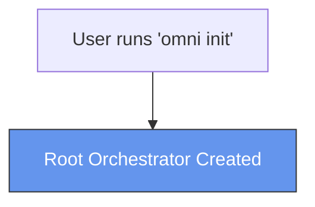
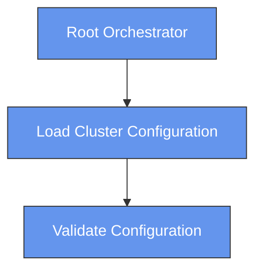
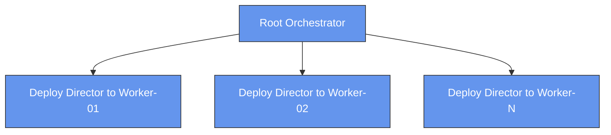
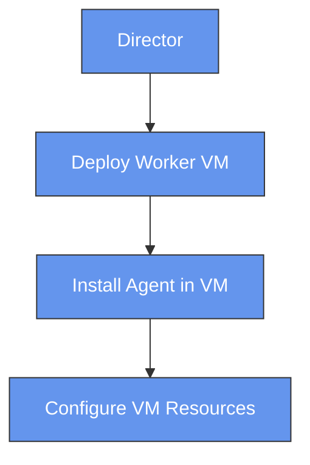
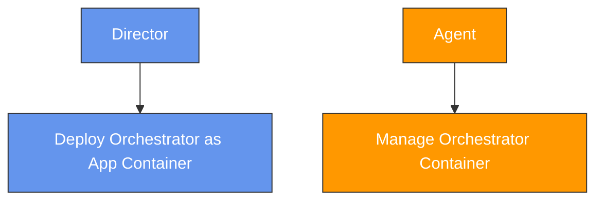
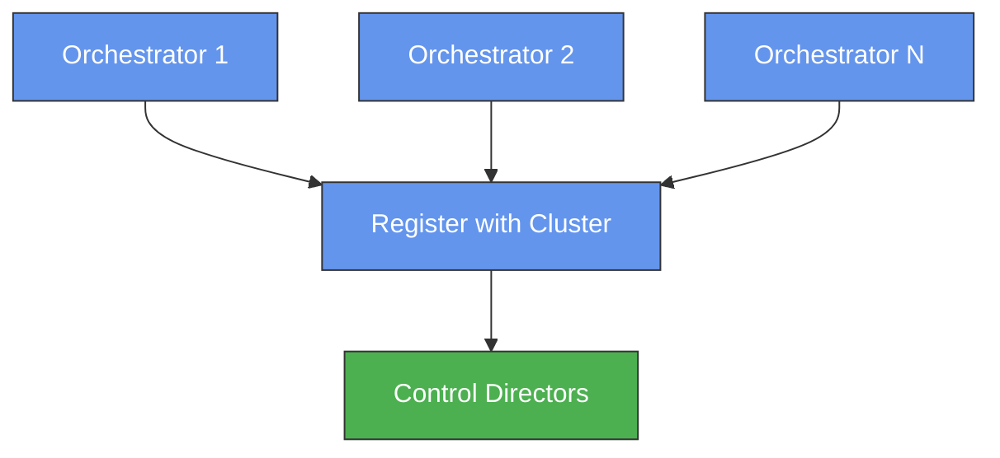
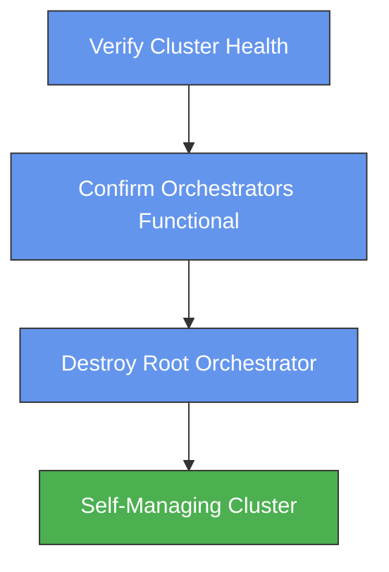
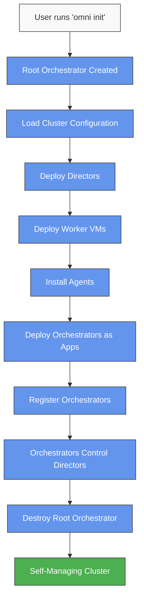
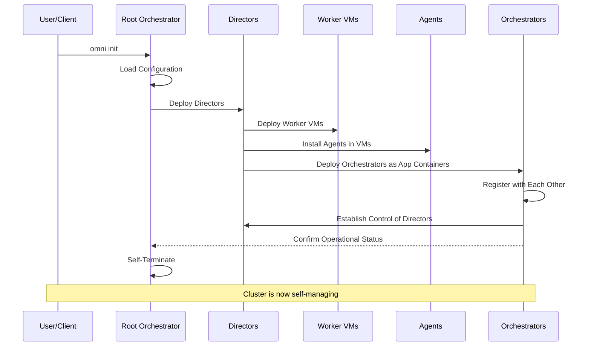
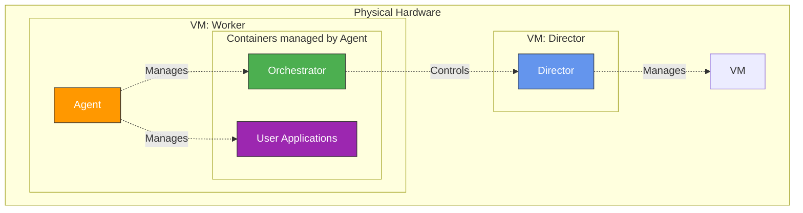

# Omni Init: Cluster Initialization Process

## Table of Contents
- [Overview](#overview)
- [Initialization Process](#the-initialization-process)
  - [Root Orchestrator Creation](#1-root-orchestrator-creation)
  - [Cluster Configuration Loading](#2-cluster-configuration-loading)
  - [Director VM Deployment](#3-director-vm-deployment)
  - [Control VM Creation](#4-control-vm-creation)
  - [Orchestrator Deployment](#5-orchestrator-deployment)
  - [Cluster Registration](#6-cluster-registration)
  - [Root Node Destruction](#7-root-node-destruction)
- [Process Flow](#complete-process-flow)
- [Sequence Diagram](#sequence-diagram)
- [Key Components](#key-components)
- [Architecture Diagram](#architecture-diagram)
- [Benefits](#benefits-of-this-approach)
- [Troubleshooting](#common-issues-and-troubleshooting)
- [Next Steps](#next-steps)

## Overview

The `omni init` command bootstraps an Omni cluster through a self-initializing process. It creates a temporary "root" orchestrator that configures worker nodes, deploys directors, and installs the permanent orchestrators that will run the cluster. This document explains the initialization process and the resulting architecture.

What makes Omni unique is its bootstrapped design: the system builds itself. Orchestrators control Directors, while themselves running as applications managed by Agents, which run on VMs controlled by Directors. This circular dependency enables a self-managing system after initialization completes.

## The Initialization Process

### 1. Root Orchestrator Creation

Running `omni init` creates a temporary root orchestrator that acts as the bootstrap mechanism. This orchestrator only exists during initialization.

```
$ omni init
```



The root orchestrator's job is to set up the permanent components and then remove itself from the system.

### 2. Cluster Configuration Loading

The root orchestrator loads the cluster configuration that defines nodes, resources, and network settings.

```yaml
# Example cluster configuration snippet
nodes:
  - name: worker-01
    role: worker
    resources:
      cpu: 8
      memory: 32Gi
  - name: worker-02
    role: worker
    resources:
      cpu: 8
      memory: 32Gi
```



### 3. Director VM Deployment

The root orchestrator deploys Director VMs to each node in the cluster. Directors are responsible for managing VMs on their respective nodes.



Directors handle VM lifecycle on each node. Unlike other components, Directors run directly on VMs, not in containers.

### 4. VM and Agent Deployment

The Directors deploy worker VMs and install Agents on them. Agents handle container management within each VM.



This step establishes the container runtime environment where applications (including orchestrators) will run.

### 5. Orchestrator Deployment

The Directors then deploy Orchestrators as applications into containers managed by Agents.



This is a critical point in the bootstrapping process: Orchestrators run as standard applications in containers, but they will eventually control the Directors.

### 6. Cluster Registration

The Orchestrators register with each other and establish control of the Directors, creating the circular management relationship that defines Omni.



At this point, the bootstrapped architecture is established: Orchestrators control Directors, while themselves running as containers managed by Agents, which run on VMs managed by Directors.

### 7. Root Node Destruction

Once the permanent orchestration layer is operational, the root orchestrator self-terminates.



The cluster is now self-managing, with no initialization components remaining.

## Complete Process Flow

The following diagram shows the entire initialization process:



## Sequence Diagram

This sequence diagram shows the interaction between components during initialization:



## Key Components

### Root Orchestrator
The temporary bootstrap mechanism that initializes the cluster and self-terminates once the permanent components are operational.

### Directors
Run directly on VMs and manage all VM lifecycles. Directors deploy worker VMs, install Agents, and deploy the initial Orchestrators as applications.

### Agents
Run within worker VMs and manage all containers within those VMs, including Orchestrator containers and user application containers.

### Orchestrators
Run as applications in containers but control Directors. Orchestrators provide the top-level API for the CLI and dashboard, forming the management plane of the cluster.

## Architecture Diagram



This diagram shows the final state of an Omni cluster. The bootstrapped nature creates a circular management relationship:

- **Directors** run directly on VMs and manage all VMs
- **Agents** run inside worker VMs and manage all containers
- **Orchestrators** run as applications in containers but control Directors
- **User Applications** run in containers alongside Orchestrators

This circular dependency - Orchestrators control Directors despite running in containers managed by Agents on VMs controlled by Directors - enables the self-managing nature of Omni.

## Benefits of this Approach

1. **Self-bootstrapping** - The system builds itself with minimal external intervention
2. **Clean separation** - Initialization components don't remain in the operational system
3. **Horizontal scalability** - The same process works for clusters of any size
4. **Resilience** - No single point of failure in the management plane
5. **Circular management** - Enables self-healing and autonomous operation

## Common Issues and Troubleshooting

### Initialization Failures
Check network connectivity between nodes, verify resource availability on target nodes, and confirm the root orchestrator has necessary permissions.

### Director Deployment Issues
Verify VM image availability, check resource allocation settings, and confirm network paths are open between nodes.

### Orchestrator Registration Problems
Examine cluster networking configuration, check service discovery functionality, and review logs from both Directors and Orchestrators.