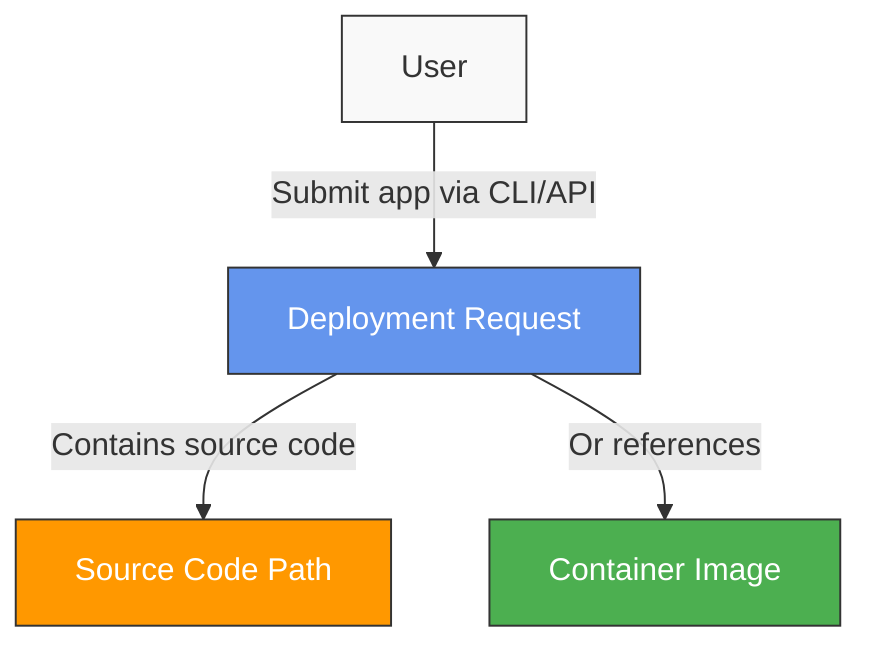
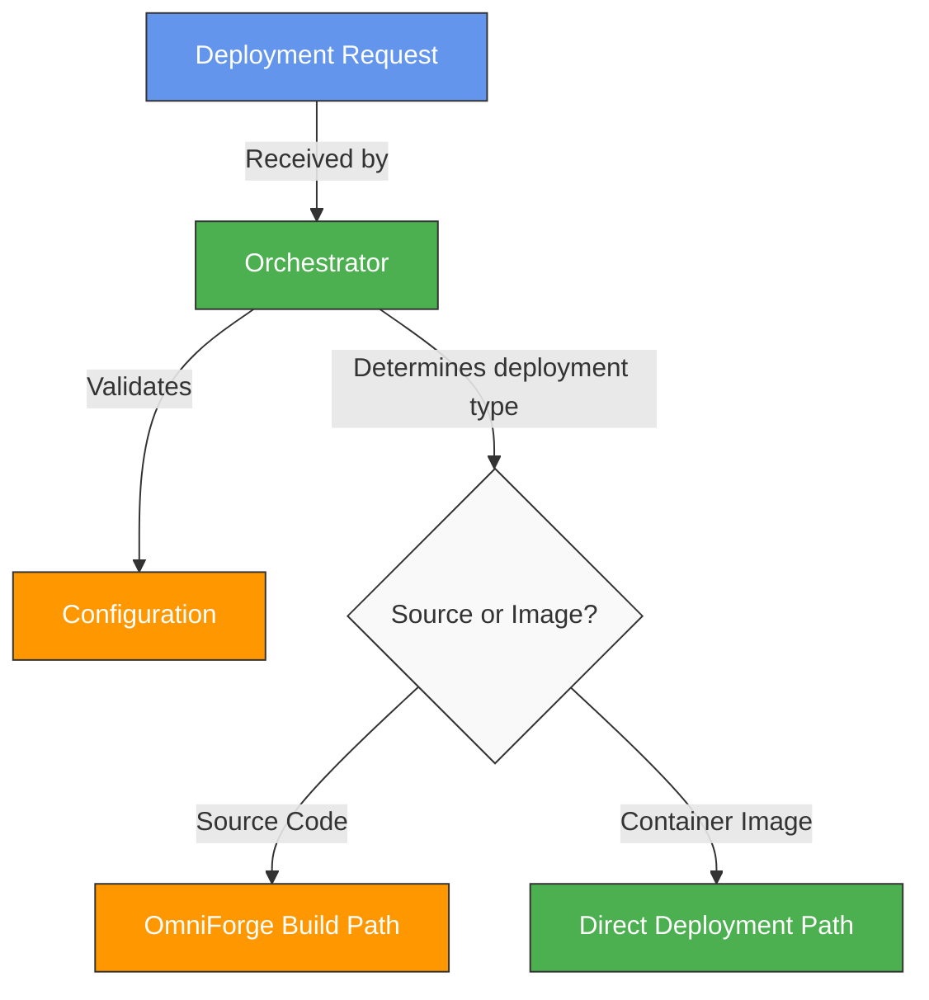
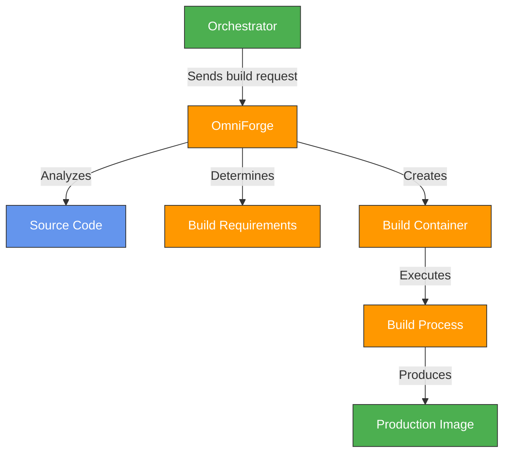
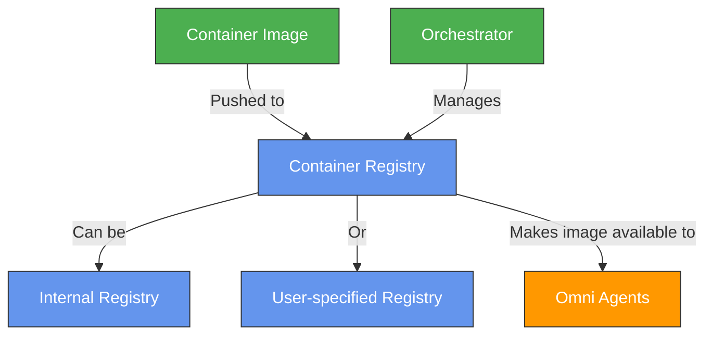
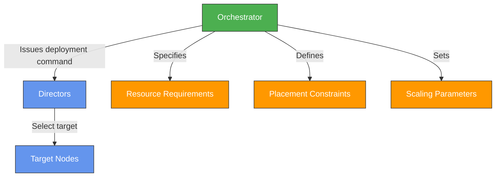
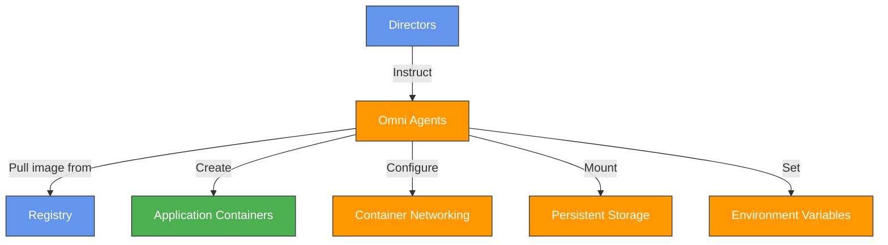
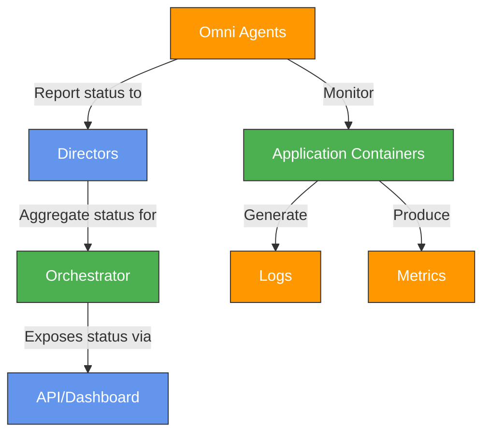
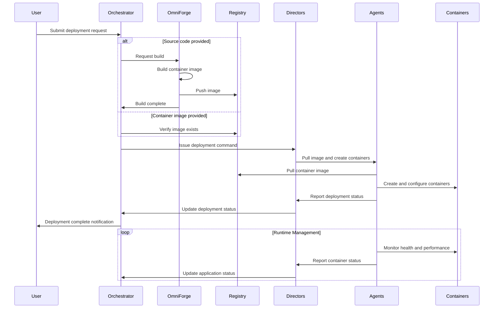
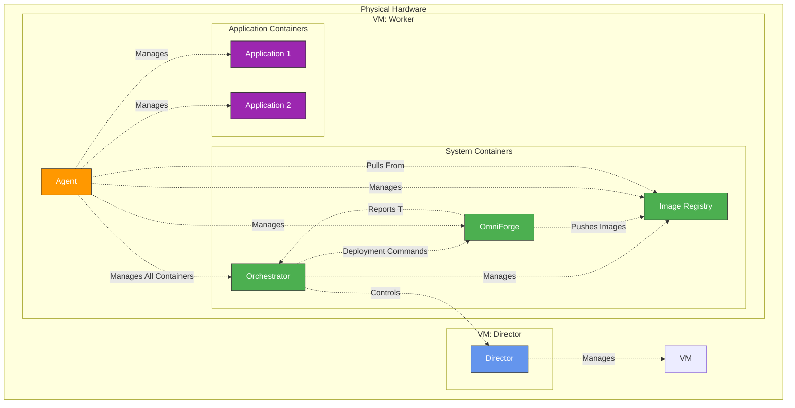
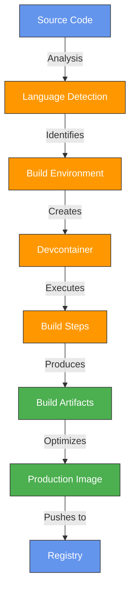

# Omni Application Deployment Process

## Table of Contents
- [Overview](#overview)
- [Deployment Workflow](#deployment-workflow)
  - [Deployment Request](#1-deployment-request)
  - [Request Processing](#2-request-processing)
  - [Build Process](#3-build-process)
  - [Image Registration](#4-image-registration)
  - [Deployment Orchestration](#5-deployment-orchestration)
  - [Container Instantiation](#6-container-instantiation)
  - [Runtime Management](#7-runtime-management)
- [Component Interactions](#component-interactions)
- [Architecture Diagram](#architecture-diagram)
- [OmniForge Deep Dive](#omniforge-deep-dive)
  - [Build Pipeline](#build-pipeline)
  - [Devcontainer Integration](#devcontainer-integration)
  - [Build Optimization](#build-optimization)
- [Registry Integration](#registry-integration)
- [Common Issues and Troubleshooting](#common-issues-and-troubleshooting)

## Overview

Omni's application deployment process transforms source code or container images into running applications within the cluster. The process leverages OmniForge, a universal build tool that converts raw application source into optimized container images. This document details the deployment workflow, component interactions, and the inner workings of OmniForge.

> [!NOTE]
> While OmniForge can replace traditional CI pipelines for many use cases, it can also complement existing CI/CD systems. You can use OmniForge for development builds while maintaining your production pipelines, or fully migrate to OmniForge for end-to-end application delivery.

## Deployment Workflow

### 1. Deployment Request

The deployment process begins when a user submits an application deployment request via the CLI, API, or dashboard. The request may include application source code or reference a pre-built container image.

The request includes specifications such as resource requirements, scaling parameters, networking configurations, and environment variables.

### 2. Request Processing

The Orchestrator (running as an application but controlling the cluster) receives and processes the deployment request.

The Orchestrator determines whether the application requires building (source code provided) or can be deployed directly (container image provided).

### 3. Build Process

If source code is provided, OmniForge handles the build process. OmniForge runs as an application under the Omni Agent but reports to the Orchestrator.

OmniForge identifies the application type, required dependencies, and optimal build process. It leverages devcontainer features to create a consistent build environment, then executes build steps to produce a production-ready container image.

> [!TIP]
> You can customize OmniForge's build process by including a `.omni/build.yaml` file in your repository. This allows you to specify custom build steps, environment variables, and resource requirements while still leveraging OmniForge's optimization capabilities.

### 4. Image Registration

Once built (or if provided directly), the container image is registered with the specified container registry.

The image registry serves as the central repository from which Agents pull images during deployment. Omni's internal registry is managed by the Orchestrator and runs as an application alongside OmniForge and other system services. The system supports both this internal registry and external user-specified registries.

> [!NOTE]
> When using the internal registry, images are automatically managed throughout their lifecycle. The Orchestrator handles cleanup of unused images and can enforce image retention policies based on tags, age, or usage patterns.

### 5. Deployment Orchestration

The Orchestrator instructs Directors to deploy the application based on the deployment configuration.

Directors determine the optimal nodes for deployment based on resource availability, constraints, and distribution policies.

> [!NOTE]
> Omni supports advanced placement strategies including affinity/anti-affinity rules, topology awareness, and hardware-specific targeting. For performance-sensitive applications, you can specify that containers should be placed on nodes with particular hardware characteristics such as GPUs, high-memory configurations, or specific CPU architectures.

### 6. Container Instantiation

Directors instruct Agents to pull the container image and instantiate application containers.

Agents handle the container runtime operations, including image pulling, container creation, networking configuration, and storage mounting.

> [!CAUTION]
> For stateful applications that use persistent storage, ensure proper backup mechanisms are in place before updating or redeploying. While Omni carefully manages persistent volumes during container lifecycles, it cannot recover data that wasn't properly backed up if a deployment error occurs during storage reconfiguration.

### 7. Runtime Management

Once deployed, Agents continuously monitor and manage the running containers, reporting status back to Directors and Orchestrators.

This continuous monitoring enables automatic scaling, healing, and optimization of running applications.

## Component Interactions

The following sequence diagram illustrates the interactions between components during the deployment process:

## Architecture Diagram

The architecture diagram shows the entire Omni application ecosystem: 

- **Directors** run on VMs and manage all VM operations
- **Agents** run inside worker VMs and manage all containers
- **Orchestrator** runs as a container but controls Directors and manages both OmniForge and the Image Registry
- **OmniForge** runs as a container for building application images
- **Image Registry** runs as a container managed by the Orchestrator that stores and serves container images
- **Application containers** run the actual user workloads

## OmniForge Deep Dive

### Build Pipeline

OmniForge implements an intelligent build pipeline that analyzes source code to identify the application type (Node.js, Python, Java, etc.) and determines optimal build steps based on detected frameworks and dependencies. It creates a build environment using devcontainer features, executes the necessary build steps including compilation, testing, and bundling, then optimizes the final image for production by removing build tools and minimizing layers. Finally, it tags the resulting image and pushes it to the configured registry for deployment.

> [!TIP]
> To improve language detection accuracy, include appropriate configuration files at the root of your repository: package.json for Node.js, requirements.txt for Python, pom.xml for Java Maven projects, etc. These files help OmniForge correctly identify your application type and automate more of the build process.

### Devcontainer Integration

OmniForge leverages devcontainer specifications to create consistent build environments. It uses devcontainer.json if present in the source code repository, while providing default devcontainer configurations for common application types when none is specified. These base configurations are extended with Omni-specific optimizations to enhance build performance. This approach ensures the build environment closely matches the development environment, reducing "works on my machine" problems and creating consistency between development and production.

> [!IMPORTANT]
> For applications with complex or unusual dependencies, providing your own devcontainer.json file is strongly recommended. This is especially critical for applications requiring specific system libraries, compiler toolchains, or proprietary dependencies that OmniForge might not detect automatically.

### Build Optimization

OmniForge implements several optimization techniques to improve build efficiency and container quality. It utilizes layer caching to dramatically speed up repeated builds, particularly for dependencies that change infrequently. Dependency pruning is applied to reduce the final image size by removing development-only packages and unnecessary files. Multi-stage builds separate build-time dependencies from runtime requirements, resulting in leaner production images. The system executes compatible build steps in parallel when possible, and intelligently allocates resources based on the specific requirements of each build task, balancing performance with resource utilization across the cluster.

## Registry Integration

Omni provides flexible container registry integration to suit various operational requirements. The platform includes an internal registry that runs as a container application within the Omni cluster, deployed and managed by the Orchestrator just like OmniForge and other system applications. This internal registry offers a pre-configured solution that requires no additional setup, while still benefiting from Omni's container management capabilities.

For environments with existing registry infrastructure, Omni supports external registries including Docker Hub, AWS ECR, Azure ACR, and other compatible services. Registry authentication is handled securely through the platform's credential management system. The platform maintains comprehensive image metadata for auditing, versioning, and compliance purposes, making it easier to track image lineage and deployment history.

> [!IMPORTANT]
> In air-gapped environments, you will need to leverage Omni's internal registry or a self-deployed container image registry that all Omni services can access. External registries requiring internet connectivity will not be available in such environments.

## Common Issues and Troubleshooting

### Build Failures

When encountering build failures, examine the application source compatibility with the Omni environment. Verify that adequate resources are available for the build process, as memory or CPU constraints can cause intermittent failures for resource-intensive builds. Detailed error information can be found in the OmniForge logs, which provide specific error messages and stack traces to help diagnose the root cause. For complex applications, consider adding a custom devcontainer.json to precisely specify the build environment requirements.

> [!WARNING]
> Resource constraints are a common cause of mysterious build failures. Java and C++ builds, in particular, may fail with cryptic errors if insufficient memory is allocated. If builds succeed locally but fail in OmniForge, check the memory and CPU limits in your deployment configuration and consider increasing them temporarily during the build phase.

### Image Pull Failures

Image pull issues typically stem from connectivity or authentication problems. Verify that registry connectivity is established and that the authentication credentials are correctly configured in the Omni platform. Check image naming and tagging to ensure they follow the expected format and conventions. Confirm that Agents have the necessary network access and permissions to pull from the configured registry, particularly in environments with strict network policies or when using private registries.

### Container Startup Issues

When containers fail to start or crash shortly after startup, review the application logs for error messages that indicate configuration problems. Verify that all required environment variables are correctly set and that service dependencies are available and accessible. Check resource allocation for the container, as insufficient memory or CPU can prevent proper application initialization. For stateful applications, ensure that any required persistent storage volumes are correctly mounted and have appropriate permissions.
