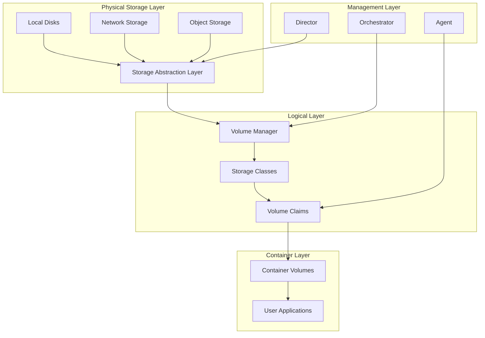
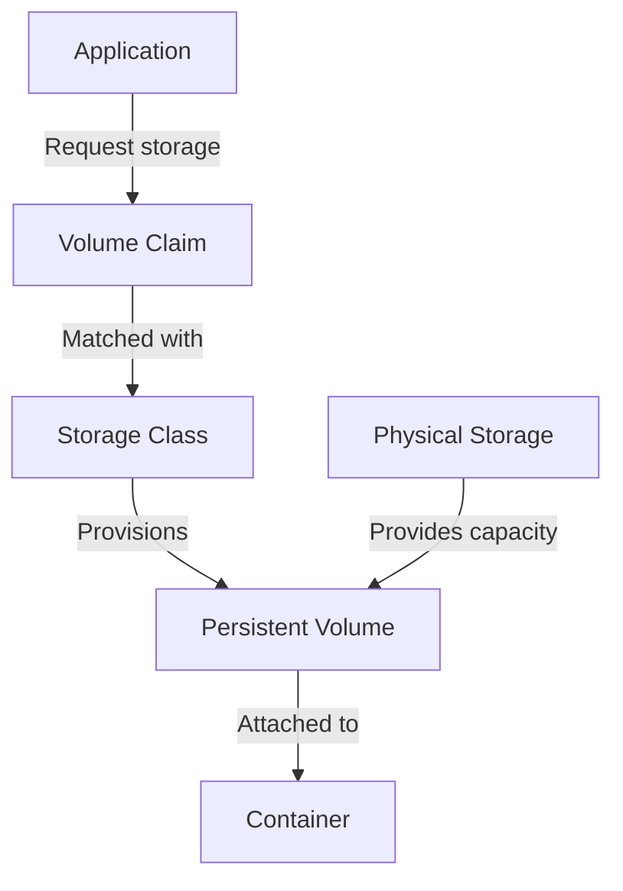
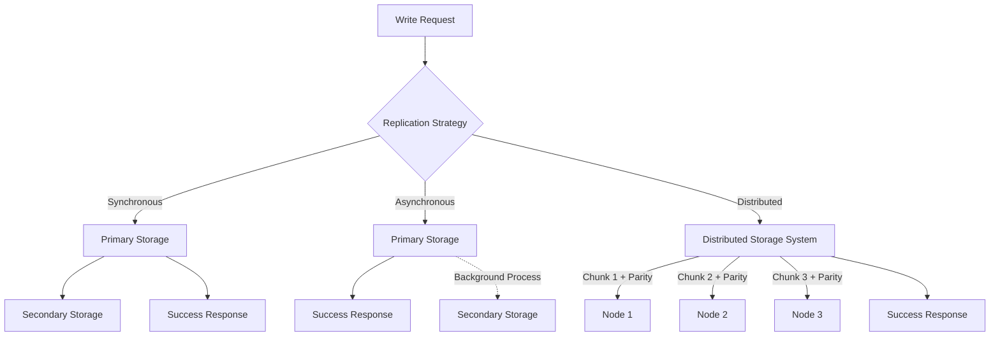
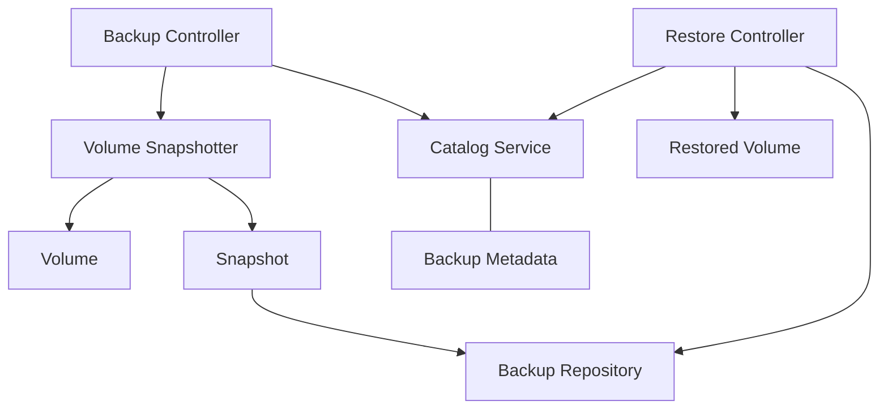
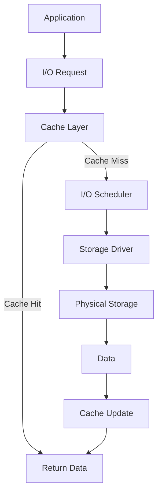
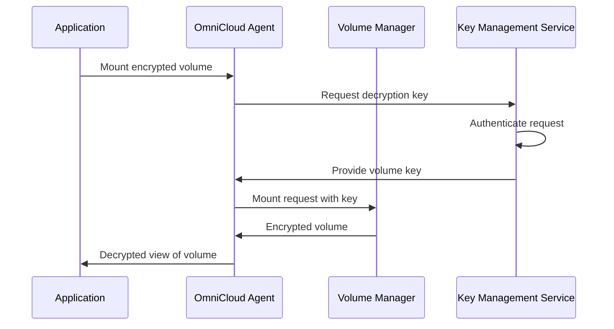
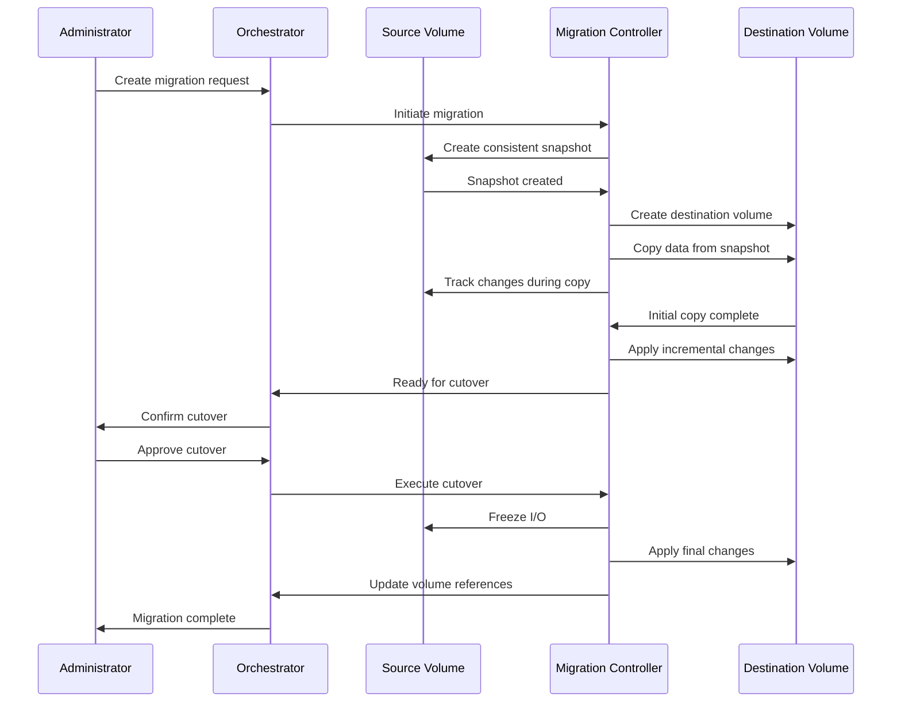

# OmniCloud Storage Solutions

> [!CAUTION]
> Storage has not yet been implemented, everything in this document is here for design purposes only

# Contents

- [OmniCloud Storage Solutions](#omnicloud-storage-solutions)
   * [Introduction](#introduction)
   * [Storage Architecture](#storage-architecture)
   * [Storage Types](#storage-types)
      + [Ephemeral Storage](#ephemeral-storage)
      + [Persistent Volumes](#persistent-volumes)
      + [Shared Volumes](#shared-volumes)
      + [Object Storage Integration](#object-storage-integration)
   * [Volume Management](#volume-management)
      + [Volume Provisioning](#volume-provisioning)
      + [Volume Claim Specifications](#volume-claim-specifications)
      + [Volume Lifecycle Management](#volume-lifecycle-management)
      + [Volume Snapshots](#volume-snapshots)
   * [Data Persistence](#data-persistence)
      + [Persistence Guarantees](#persistence-guarantees)
      + [Write Concerns](#write-concerns)
      + [Replication Strategies](#replication-strategies)
      + [Journaling and Transaction Logs](#journaling-and-transaction-logs)
   * [Backup and Recovery](#backup-and-recovery)
      + [Backup Architecture](#backup-architecture)
      + [Backup Strategies](#backup-strategies)
      + [Recovery Procedures](#recovery-procedures)
      + [Disaster Recovery](#disaster-recovery)
   * [Storage Performance](#storage-performance)
      + [Performance Characteristics](#performance-characteristics)
      + [Performance Optimization](#performance-optimization)
      + [Monitoring Performance](#monitoring-performance)
      + [Performance Tuning](#performance-tuning)
   * [Security and Encryption](#security-and-encryption)
      + [Encryption at Rest](#encryption-at-rest)
      + [Key Management](#key-management)
      + [Access Controls](#access-controls)
      + [Audit Logging](#audit-logging)
   * [Advanced Configuration](#advanced-configuration)
      + [Storage Pools](#storage-pools)
      + [Custom Storage Drivers](#custom-storage-drivers)
      + [Advanced Volume Features](#advanced-volume-features)
      + [Quality of Service](#quality-of-service)
   * [Storage Migration](#storage-migration)
      + [Migration Types](#migration-types)
      + [Migration Process](#migration-process)
      + [Online vs. Offline Migration](#online-vs-offline-migration)
      + [Migration Monitoring](#migration-monitoring)
   * [Troubleshooting](#troubleshooting)
      + [Common Issues](#common-issues)
         - [Volume Creation Failures](#volume-creation-failures)
         - [Performance Problems](#performance-problems)
         - [Data Corruption](#data-corruption)
      + [Diagnostic Tools](#diagnostic-tools)
      + [Support Information Collection](#support-information-collection)

## Introduction

OmniCloud provides a comprehensive and flexible storage system designed to support the diverse requirements of modern containerized applications. As a fully open source solution, OmniCloud storage can be deployed on virtually any infrastructure—from on-premises hardware to public cloud virtual machines—offering consistency and portability across environments. This means that organizations can avoid vendor lock-in while maintaining unified storage management practices regardless of where their workloads run.

The storage subsystem in OmniCloud has been architected with several key principles in mind: performance, reliability, flexibility, and simplicity. These principles guide the implementation of all storage features, ensuring that users can rely on their storage infrastructure even as their requirements evolve over time. Unlike proprietary alternatives that may limit your control or impose artificial restrictions, OmniCloud's open source nature means that every aspect of the system can be inspected, modified, and extended to suit specific organizational needs.

> [!NOTE]
> OmniCloud is a community-driven, open source platform. All storage features described in this documentation are available in the core project without requiring commercial licensing or proprietary extensions.

Whether you're running stateless web services, data-intensive analytics workloads, or mission-critical databases, OmniCloud's storage system provides the capabilities needed to support your applications effectively. This documentation offers a comprehensive overview of these capabilities, along with configuration guidance and best practices for system administrators and application developers.

## Storage Architecture

OmniCloud's storage subsystem is built on a distributed architecture that provides multiple abstraction layers between physical storage devices and containerized applications. This layered approach allows the platform to present a consistent interface to applications while accommodating a wide variety of underlying storage technologies, from local disks to sophisticated network-attached storage systems and distributed file systems.

At its core, the storage architecture reflects OmniCloud's bootstrapped design philosophy, where platform components manage each other in a circular relationship. The storage services themselves run as containerized applications, which means they require storage volumes to function. During initial platform deployment, bootstrap volumes are provisioned directly by Directors (the VM management layer). Once the storage services are operational, they take over volume management for all other components, including themselves when upgrades occur.



The Storage Abstraction Layer serves as the foundation of the system, presenting a unified interface to diverse underlying storage technologies. This layer handles the complexities of different storage protocols and capabilities, allowing the rest of the platform to interact with storage resources through a consistent API regardless of whether the underlying storage is a local SSD, a network file system, or a cloud-based object store.

Above the abstraction layer sits the Volume Manager, which handles the lifecycle of storage volumes from provisioning to decommissioning. The Volume Manager maintains a registry of all volumes in the system, tracking their status, associations, and metadata. It coordinates with the Directors and Agents to ensure that volumes are created, attached, detached, and deleted as needed, maintaining the desired state at all times.

Storage Classes define the characteristics and capabilities of different storage types available within the platform. Administrators can define multiple storage classes to reflect the performance profiles, redundancy levels, and other attributes of their storage infrastructure. For example, a cluster might offer a "fast-local" storage class for high-performance needs, a "replicated" class for improved durability, and an "archival" class for less frequently accessed data.

Volume Claims represent requests for storage from applications, which are fulfilled by provisioning volumes from appropriate storage classes. When an application requests storage with certain characteristics, the system matches these requirements against available storage classes and provisions a suitable volume. This approach decouples applications from the details of the underlying storage implementation, providing flexibility and portability.

Container Volumes are the storage volumes actually attached to containers, providing data persistence and sharing capabilities. These volumes appear as regular filesystems to the applications running in containers, but are managed by the OmniCloud platform behind the scenes. This abstraction allows for sophisticated management capabilities without requiring changes to application code.

Understanding this bootstrapped nature is crucial for administrators, as it impacts startup sequence, upgrades, and recovery procedures. For instance, during platform upgrades, special care must be taken to ensure that the storage services themselves remain available throughout the process, since they are essential for the operation of other components. Similarly, recovery procedures must account for the interdependencies between storage services and other platform components.

## Storage Types

OmniCloud supports multiple storage types to accommodate the varied requirements of modern applications. Each type offers different tradeoffs in terms of performance, durability, and sharing capabilities, allowing administrators to provide the most appropriate storage for each workload.

### Ephemeral Storage

Ephemeral storage is temporary and tied to the lifecycle of a container. When a container terminates, whether due to normal shutdown or failure, its ephemeral storage is released and all data is lost. This type of storage is ideal for applications that don't need to persist data beyond their own lifecycle, such as stateless web servers, batch processing jobs, or applications that store their persistent data elsewhere.

Ephemeral storage is typically implemented using the worker VM's local disk space, with isolation provided by the container runtime. This approach offers excellent performance characteristics, as the storage is local to the node where the container runs, minimizing latency and maximizing throughput. However, the tradeoff is the lack of persistence guarantees—if a container crashes or is rescheduled to another node, any data stored in ephemeral storage is lost.

Despite this limitation, ephemeral storage plays a vital role in many applications. It's ideal for scratch space, where temporary data is written during processing but doesn't need to be preserved after the task completes. It's also well-suited for caching frequently accessed data to improve performance, as the cache can be rebuilt if lost. Resource limits for ephemeral storage can be configured at the container, application, or tenant level, allowing administrators to control how much local disk space each workload can consume.

### Persistent Volumes

Persistent volumes address the fundamental limitation of ephemeral storage by maintaining data independently of container lifecycles. They can be detached from one container and reattached to another, enabling stateful applications that require data to persist beyond the lifetime of any individual container. This capability is essential for databases, file servers, content management systems, and any other application that creates and modifies data that must be preserved.

OmniCloud implements persistent volumes through several approaches, each offering different characteristics:

Local Persistent Volumes are stored on worker node local disks but managed in a way that preserves the data even if the container using them is removed. These volumes offer excellent performance due to their local nature but are tied to a specific node. If that node fails, the volume becomes unavailable until the node recovers. This approach is suitable for workloads that prioritize performance over availability, or in clusters where node failures are rare.

Network-Attached Volumes are implemented via network storage protocols such as NFS, iSCSI, or specialized storage vendor APIs. These volumes can be accessed from any node in the cluster, allowing containers to be rescheduled freely without losing access to their data. The tradeoff is increased latency due to network communication, though modern networks and storage protocols can minimize this impact. Network-attached volumes are ideal for workloads that require flexibility in placement and moderate performance.

Distributed Volumes are spread across multiple physical nodes for redundancy and improved availability. Technologies like Ceph, GlusterFS, or Longhorn underpin these volumes, storing multiple copies of the data or using erasure coding to protect against node failures. Distributed volumes offer the best combination of availability and performance, though they typically require more resources due to the replication overhead. They're well-suited for mission-critical applications where both performance and reliability are important.



The provisioning flow for persistent volumes starts when an application submits a volume claim specifying its requirements. The system matches this claim with an appropriate storage class, which then provisions a persistent volume with the requested characteristics. Once provisioned, the volume is attached to the container, appearing as a standard filesystem that the application can use like any other storage.

### Shared Volumes

Shared volumes extend the concept of persistent volumes by allowing multiple containers to access the same storage simultaneously. This capability enables data sharing between application components, whether they're running on the same node or distributed across the cluster. Shared volumes are essential for applications that consist of multiple services that need to work with the same data, such as content management systems with separate frontend and backend components.

OmniCloud supports several access modes for shared volumes, each suited to different use cases:

ReadWriteOnce (RWO) volumes can be mounted as read-write by a single container at a time. While not truly "shared" in the sense of simultaneous access, these volumes can be detached from one container and attached to another, allowing for sequential sharing. This mode is appropriate when only one component needs write access at any given time, such as a database with a single active instance.

ReadOnlyMany (ROX) volumes can be mounted as read-only by many containers simultaneously. This mode is ideal for distributing reference data or configuration information that needs to be consistent across multiple application components. For example, a set of web servers might mount a content volume in read-only mode to serve the same static assets.

ReadWriteMany (RWX) volumes can be mounted as read-write by many containers simultaneously. This is the most flexible mode but requires careful application design to prevent data corruption from concurrent writes. Applications must implement appropriate locking or coordination mechanisms when multiple components might modify the same files. Content repositories, shared document storage, and collaborative applications often require this access mode.

> [!WARNING]
> Shared volumes with ReadWriteMany access require careful application design to handle concurrent access properly. File locking mechanisms may be necessary to prevent data corruption when multiple containers write to the same files.

The implementation of shared volumes varies depending on the underlying storage technology. Network file systems like NFS natively support shared access, while block storage typically requires a clustered filesystem layer such as GFS2 or OCFS2 to enable sharing. OmniCloud abstracts these details, presenting a consistent interface regardless of the implementation, but administrators should be aware of the performance and reliability implications of their chosen technologies.

### Object Storage Integration

Beyond traditional file and block storage, OmniCloud integrates seamlessly with object storage systems, allowing applications to store and retrieve unstructured data through standard APIs. Object storage is particularly well-suited for large volumes of unstructured data that need to be accessed via HTTP-based protocols, such as application artifacts, log archives, user-generated content, or data lakes.

OmniCloud can deploy its own object storage system (based on MinIO) as part of the platform, providing a bootstrapped solution that's managed alongside other components. Alternatively, it can integrate with external object storage systems, including S3-compatible services, OpenStack Swift, and Azure Blob Storage (via a compatibility layer). This flexibility allows organizations to use existing investments in object storage while still benefiting from OmniCloud's unified management approach.

Applications can access object storage through standard client libraries, using familiar APIs to upload, download, and manage objects. This approach makes it easy to migrate existing applications that already use object storage to OmniCloud without code changes. For applications that primarily use file-based storage, OmniCloud provides bridge services that present object storage as mountable volumes, enabling a gradual transition to object-based architectures.

Object storage in OmniCloud isn't just for application data—the platform itself uses it for various purposes, including storing backup artifacts, container images, and platform logs. This integration showcases the versatility of object storage and demonstrates OmniCloud's approach of using its own features to support its operation, creating a cohesive and self-sufficient platform.

## Volume Management

OmniCloud provides a comprehensive set of tools and capabilities for managing storage volumes throughout their lifecycle, from initial provisioning to eventual decommissioning. These management features enable administrators to efficiently allocate, monitor, and optimize their storage resources while ensuring that application needs are met consistently.

### Volume Provisioning

Volumes in OmniCloud can be provisioned through several methods, each suited to different operational scenarios and requirements. Dynamic provisioning automatically creates volumes when applications request them through volume claims, minimizing administrative overhead and allowing for self-service access to storage resources. The system evaluates the requirements specified in the claim, selects an appropriate storage class, and provisions a volume with the requested characteristics. This approach is ideal for environments where applications frequently come and go, as it eliminates the need for administrators to manually create volumes in advance.

For environments with more predictable storage needs or where pre-allocation is preferred, static provisioning allows administrators to create volumes ahead of time. These pre-created volumes can then be assigned to applications as needed, providing greater control over when and how storage resources are allocated. Static provisioning is particularly valuable when working with storage systems that have lengthy provisioning times or when organizations want to separately manage storage allocation and application deployment processes.

OmniCloud also supports importing existing volumes from external sources, allowing organizations to incorporate storage that was provisioned outside the platform. This capability is crucial for migration scenarios, where applications and their data are being moved to OmniCloud from other environments. By importing existing volumes, organizations can preserve their data and access patterns while beginning to benefit from OmniCloud's management capabilities.

The storage class definition is a key element in volume provisioning, as it determines the characteristics of the volumes created. Administrators can define multiple storage classes to reflect the capabilities of their infrastructure and the needs of their applications. Each storage class specifies a provisioner (which driver to use), parameters (specific to the driver), a reclaim policy (what happens to volumes when claims are deleted), and a binding mode (when volumes are bound to claims). These settings collectively determine the behavior and capabilities of the volumes created from the storage class.

An example dynamic provisioning configuration might specify a storage class for SSDs with specific filesystem settings:

```yaml
apiVersion: omnicloud.io/v1
kind: StorageClass
metadata:
  name: fast-local-ssd
provisioner: omnicloud.io/local-ssd
parameters:
  diskType: ssd
  fsType: ext4
reclaimPolicy: Delete
volumeBindingMode: Immediate
```

This configuration creates a storage class named "fast-local-ssd" that provisions volumes on local SSDs with an ext4 filesystem. The "Delete" reclaim policy means that volumes will be deleted when the claims referencing them are deleted, and the "Immediate" binding mode means that volumes will be bound to claims as soon as they are created. These settings are appropriate for temporary or cache data that doesn't need to be preserved beyond the application's lifecycle.

### Volume Claim Specifications

Applications request storage by creating volume claims that specify their requirements in terms of size, access mode, and other characteristics. These claims are evaluated by the system, which then either provisions a new volume or assigns an existing one that matches the requirements. This abstraction allows applications to request what they need without having to know the details of the underlying storage infrastructure.

A typical volume claim specification includes the access mode (how the volume can be shared), the storage class (what type of storage to use), the requested size, and optionally a selector to match specific volumes. For example:

```yaml
apiVersion: omnicloud.io/v1
kind: PersistentVolumeClaim
metadata:
  name: database-storage
spec:
  accessModes:
    - ReadWriteOnce
  storageClassName: fast-local-ssd
  resources:
    requests:
      storage: 100Gi
  selector:
    matchLabels:
      environment: production
```

This claim requests a 100GB volume from the "fast-local-ssd" storage class, with ReadWriteOnce access mode (suitable for a database), and specifically looks for volumes labeled as being in the production environment. The platform will attempt to find or create a volume that meets these requirements, then bind it to the claim for use by the application.

The claim-based model provides several advantages. It decouples applications from the details of storage provisioning, allowing for greater flexibility in how storage is allocated and managed. It also enables a self-service approach, where application teams can request the storage they need without requiring direct intervention from storage administrators. And by specifying requirements in a declarative manner, it allows for automated validation and enforcement of policies, ensuring that applications receive appropriate storage resources.

### Volume Lifecycle Management

The OmniCloud volume lifecycle includes several states that track the volume's progression from creation to deletion. Understanding these states is essential for effective management and troubleshooting:

The Provisioned state indicates that a volume has been created but is not yet assigned to a claim. Volumes in this state are available for binding but are not currently in use. This state typically occurs when using static provisioning or when volumes are created ahead of time for future use.

Once a volume is assigned to a claim, it enters the Bound state. The volume is now associated with a specific application but may not yet be in active use. This binding creates a one-to-one relationship between the volume and the claim, ensuring that the application has exclusive access to the volume as long as the claim exists.

When a container attaches the volume for use, the volume enters the Mounted state. At this point, the volume is actively being used by an application, and I/O operations can occur. The mounting process makes the volume's filesystem available to the container at a specified path, allowing the application to read and write data.

If a container releases a volume, but the claim still exists, the volume enters the Released state. In this state, the volume is not actively being used but is still bound to a claim and preserved for future use. This situation commonly occurs when applications scale down temporarily or when containers are rescheduled to different nodes.

Finally, when a claim is deleted and the volume is no longer needed, it enters the Deleted state before being permanently removed from the system. The timing and nature of this deletion depend on the storage class's reclaim policy—volumes with a "Delete" policy are removed immediately, while those with a "Retain" policy persist until manually deleted.

Administrators can manage these transitions through the OmniCloud CLI, which provides commands for listing, describing, expanding, and deleting volumes. For example:

```bash
# List all volumes
omnicloud volume list

# Get detailed information about a specific volume
omnicloud volume describe vol-0a1b2c3d4e5f

# Expand a volume's capacity
omnicloud volume expand vol-0a1b2c3d4e5f --size 200Gi

# Delete a volume
omnicloud volume delete vol-0a1b2c3d4e5f
```

These commands provide administrators with direct control over the volume lifecycle, allowing for both routine management tasks and exceptional interventions when needed. The CLI also offers options for filtering and formatting output, enabling efficient management of large numbers of volumes across complex environments.

### Volume Snapshots

OmniCloud supports point-in-time snapshots of volumes, providing a powerful tool for backup, cloning, and recovery purposes. Snapshots capture the state of a volume at a specific moment, allowing for later restoration if needed. This capability is crucial for data protection and for creating consistent copies of volumes for testing or development purposes.

Snapshots can be created manually through the CLI or API, scheduled on a recurring basis, triggered automatically before high-risk operations, or exported to external storage systems for long-term retention. The creation process is typically quick, as most modern storage systems implement snapshots efficiently by tracking changes rather than copying all data.

Once created, snapshots can be used in several ways. They serve as recovery points, allowing for restoration of a volume to a previous state if data is corrupted or accidentally deleted. They can be used to create new volumes that are exact copies of the original at the time of the snapshot, facilitating data cloning for testing or analysis. And they can be exported or backed up to ensure that point-in-time copies of the data are preserved independently of the original volume.

The CLI provides commands for managing snapshots:

```bash
# Create a snapshot of a volume
omnicloud snapshot create --volume vol-0a1b2c3d4e5f --name daily-backup

# Create a new volume from a snapshot
omnicloud volume create --from-snapshot snap-0a1b2c3d4e5f --name restored-volume
```

These simple commands mask the complexity of the underlying operations, which may involve coordination with storage drivers, filesystem freezing to ensure consistency, and metadata management to track the relationship between volumes and their snapshots.

For applications with specific consistency requirements, OmniCloud also supports application-consistent snapshots. These involve coordinating with the application (typically through pre and post-snapshot hooks) to ensure that the data is in a consistent state before the snapshot is taken. This approach is particularly important for databases and other applications that maintain complex internal state, as it ensures that the snapshot contains a valid and recoverable state of the application's data.

## Data Persistence

Ensuring data persistence is one of the primary functions of OmniCloud's storage system. Applications rely on the platform to protect their data from various failure scenarios, from individual node failures to catastrophic events affecting entire regions. OmniCloud provides a range of persistence mechanisms and guarantees to address these needs, allowing applications to achieve the appropriate balance of durability, performance, and cost.

### Persistence Guarantees

OmniCloud provides different levels of persistence guarantees depending on the storage class used. These guarantees define what types of failures the storage system can withstand while preserving data access or integrity. Understanding these guarantees is essential for making informed decisions about which storage classes to use for different applications.

Basic persistence, provided by local-disk storage classes, protects data against container failures but not against node failures. If a container crashes or is rescheduled, the data remains intact on the node's local disk and can be accessed when the container restarts. However, if the node itself fails, the data becomes inaccessible until the node recovers, and there's a risk of data loss if the node's storage is damaged. This level is suitable for non-critical data or applications that maintain their own replication.

Enhanced persistence, offered by local-resilient storage classes, adds protection against disk failures through local redundancy mechanisms like RAID. These configurations can withstand the failure of individual disks within a node, continuing to operate and preserve data integrity. However, they still cannot protect against entire node failures. Enhanced persistence strikes a balance between performance and durability for important but not mission-critical data.

High persistence, provided by distributed storage classes, protects against node failures by storing data across multiple nodes within a zone or datacenter. If one node fails, the data remains accessible from other nodes, allowing applications to continue operating without interruption. This level is appropriate for most production workloads, offering a good combination of durability and performance without the complexity and cost of geographic replication.

Maximum persistence, available through geo-replicated storage classes, protects against failures at the zone or region level by maintaining copies of data in multiple geographic locations. This approach can withstand the failure of an entire datacenter, allowing applications to recover with minimal data loss. While offering the highest level of protection, geo-replication typically involves higher costs and potentially increased latency due to the distance between replicas.

| Storage Class | Persistence Level | Node Failure | Zone Failure | Region Failure |
|---------------|------------------|--------------|--------------|----------------|
| local-disk    | Basic            | ❌           | ❌           | ❌             |
| local-resilient | Enhanced        | ✅           | ❌           | ❌             |
| distributed   | High             | ✅           | ✅           | ❌             |
| geo-replicated | Maximum         | ✅           | ✅           | ✅             |

The choice of persistence level should be driven by the application's requirements, particularly its recovery time objective (RTO) and recovery point objective (RPO). Applications with strict RTO/RPO requirements may need high or maximum persistence, while those with more flexible recovery goals can use basic or enhanced persistence to optimize for performance or cost.

### Write Concerns

In addition to the overall persistence level, OmniCloud allows applications to specify write concerns that determine when write operations are considered complete. These concerns balance performance against durability, allowing applications to make fine-grained decisions about how their data is handled.

WriteAcknowledged is the basic write concern, where operations return after being committed to primary storage but before being persisted to durable media or replicated. This approach offers the highest performance but provides minimal guarantees about durability. It's suitable for non-critical data or applications that can regenerate data if lost.

WriteDurable increases the protection level by requiring operations to return only after being committed and flushed to disk. This ensures that data survives power failures or system crashes but does not provide protection against disk or node failures. WriteDurable offers a reasonable balance of performance and durability for many applications.

WriteReplicated further enhances durability by requiring operations to return only after being replicated to at least one additional node. This approach protects against single-node failures, ensuring that data remains accessible even if the primary node goes down. While introducing some performance overhead, WriteReplicated is appropriate for important data that needs high availability.

WriteDistributed provides the strongest guarantees by requiring operations to return only after being replicated across failure domains, such as different racks, zones, or regions. This approach protects against larger-scale failures but typically involves higher latency due to the distance between replicas. WriteDistributed is reserved for critical data where durability takes precedence over performance.

Applications can specify their preferred write concern when mounting volumes or through storage class parameters, allowing for different concerns to be used for different types of data within the same application. This flexibility enables a nuanced approach to balancing performance and durability based on the specific requirements of each data component.

> [!TIP]
> Use the highest write concern your application can tolerate performance-wise for critical data.

### Replication Strategies

OmniCloud implements several replication strategies to ensure data persistence, each with different characteristics in terms of performance, durability, and resource usage. The choice of strategy depends on the storage class and the specific requirements of the application.

Synchronous Mirroring provides real-time duplication of writes to multiple storage devices, typically within the same node or across nodes in close proximity. When an application writes data, the operation is not considered complete until all mirrors have acknowledged the write. This approach ensures that data is immediately consistent across all copies but can impact write performance due to the need for multiple acknowledgments. Synchronous mirroring is well-suited for critical data where consistency is paramount.

Asynchronous Replication takes a different approach by immediately acknowledging writes to the primary storage while copying data to backup storage in the background. This approach minimizes the performance impact on applications but introduces a replication lag during which data exists only on the primary storage and could be lost in case of failure. The size of this lag depends on factors like network bandwidth, system load, and the volume of data being written. Asynchronous replication offers a good balance of performance and durability for most applications.

Distributed Storage spreads data across multiple nodes with built-in redundancy mechanisms. Rather than creating complete copies of the data, these systems typically use techniques like erasure coding or distributed RAID to achieve redundancy with lower storage overhead. When data is written, it's divided into chunks, and parity information is calculated to allow reconstruction in case of failure. These chunks are then distributed across multiple nodes, ensuring that the failure of any single node (or sometimes multiple nodes, depending on the configuration) does not result in data loss. Distributed storage provides excellent scalability and efficiency for large deployments.

Geographic Replication extends these concepts by copying data across multiple physical locations, typically different datacenters or regions. This approach protects against large-scale disasters that might affect an entire facility but introduces additional complexity and latency due to the distances involved. Implementations may use a combination of synchronous and asynchronous methods, often synchronously replicating within a datacenter and asynchronously replicating between datacenters. Geographic replication is essential for applications with the most stringent availability and durability requirements.



The choice of replication strategy is typically determined by the storage class, with each class implementing the appropriate strategy for its intended use case. Administrators can configure aspects of these strategies, such as the number of replicas or the erasure coding parameters, to fine-tune the balance of performance, durability, and resource usage based on their specific requirements and constraints.

### Journaling and Transaction Logs

Beyond the basic replication mechanisms, OmniCloud storage includes several advanced features to enhance data integrity and recoverability. These features ensure that storage operations are atomic and recoverable, even in the event of unexpected failures or crashes.

Write-ahead logging is employed for critical operations, recording intended changes before they are applied to the main data structures. This approach ensures that operations can be completed or rolled back even if interrupted by a system failure. In the event of a crash, the system examines the write-ahead log during recovery to determine which operations were in progress and either completes or aborts them to maintain consistency.

Journal-based recovery extends this concept by maintaining a detailed journal of all modifications to the filesystem or volume. Unlike write-ahead logs, which focus on specific operations, journals record changes at a lower level, often tracking modifications to individual blocks or extents. This detailed recording allows for precise recovery after system failures, ensuring that no data is lost and that the filesystem remains in a consistent state.

Transaction logs provide a higher-level mechanism for grouping related operations into atomic units that either complete entirely or not at all. This approach is particularly important for complex operations that modify multiple parts of the storage system, as it prevents partial updates that could leave data in an inconsistent state. Applications can explicitly start and commit transactions, or the storage system can implicitly create transactions for certain types of operations.

Consistency point mechanisms periodically create stable snapshots of the storage system's state, providing known-good points for recovery in case of failures. These mechanisms coordinate across the various components of the storage system to ensure that all in-flight operations are either completed or aborted before the consistency point is established. This coordination creates a clear boundary between different states of the system, simplifying recovery and enabling features like snapshots and clones.

These features work together to provide a robust foundation for data integrity, ensuring that applications can rely on the storage system to maintain their data correctly even in the face of unexpected events. While mostly transparent to applications, these mechanisms are essential for the reliable operation of the storage system and the protection of valuable data.

## Backup and Recovery

OmniCloud provides comprehensive backup and recovery capabilities to protect against data loss. These capabilities go beyond the basic persistence mechanisms, offering additional layers of protection and more flexible recovery options. By implementing a robust backup strategy, organizations can ensure that their data remains safe even in the face of accidental deletions, application errors, or catastrophic failures.

### Backup Architecture

The backup system in OmniCloud consists of several interconnected components that work together to create, store, and manage backups of volumes and application data:

The Backup Controller orchestrates the backup process, coordinating the actions of other components and ensuring that backups are created according to defined policies and schedules. It maintains the state of ongoing backup operations, handles error conditions, and provides monitoring and reporting functions.

The Volume Snapshotter creates point-in-time copies of volumes, which serve as the foundation for consistent backups. By using snapshots, the system can capture the state of volumes without requiring them to be offline, minimizing disruption to running applications. The snapshotter coordinates with storage drivers to create efficient snapshots that capture only the data needed for the backup.

The Backup Repository stores backup artifacts, including volume snapshots, metadata, and application-specific information. This repository can be implemented using various storage technologies, from local disk to object storage or specialized backup systems. The repository ensures that backups are stored securely and can be accessed when needed for restoration.

The Catalog Service indexes and tracks available backups, maintaining metadata about their contents, creation time, source volumes, and relationships to applications. This service enables administrators and recovery processes to quickly locate the appropriate backups for restoration, understanding what data is available and from what point in time.

The Restore Controller manages the restoration process, coordinating the retrieval of data from the backup repository and the creation or updating of volumes to contain the restored data. It handles the complexities of restoring different types of backups while ensuring that the restored data is consistent and usable.



This architecture provides a flexible and extensible foundation for backup and recovery operations, allowing organizations to implement policies that match their specific requirements and constraints. The modular design also enables integration with external backup systems when needed, providing a bridge between OmniCloud's native capabilities and existing enterprise backup infrastructure.

### Backup Strategies

OmniCloud supports multiple backup approaches, each with different characteristics in terms of storage efficiency, backup time, and restoration speed. These approaches can be combined to create comprehensive backup strategies that balance performance, resource usage, and protection levels.

Full Backups create complete copies of volumes, capturing all data regardless of when it was last modified. These backups are self-contained and don't depend on other backups for restoration, making them the simplest to restore from. However, they also require the most storage space and take the longest to create, especially for large volumes. Full backups are typically used as the foundation of a backup strategy, with other approaches building upon them.

Incremental Backups capture only the changes since the last backup, whether that was a full or another incremental backup. This approach dramatically reduces the storage requirements and backup time compared to full backups, especially when changes are relatively small. The tradeoff is increased complexity during restoration, as multiple incremental backups may need to be applied in sequence after the base full backup. Despite this complexity, incremental backups are widely used due to their efficiency, particularly for data that changes gradually over time.

Differential Backups capture all changes since the last full backup, regardless of whether interim backups have been created. This approach strikes a middle ground between full and incremental backups in terms of storage requirements and backup time. The key advantage is simpler restoration, as only the full backup and the most recent differential backup are needed. This approach is well-suited for environments where restoration time is a priority but storage space is still a constraint.

Application-Consistent Backups coordinate the backup process with applications to ensure that the captured data is in a consistent state. This coordination typically involves signaling the application to complete in-flight transactions, flush caches, and temporarily pause write operations before the backup begins. By ensuring consistency at the application level, these backups can be restored without requiring additional recovery steps, making them particularly valuable for complex applications like databases. While more involved to implement, application-consistent backups provide the highest level of data integrity and the simplest path to recovery.

Administrators can define backup policies that combine these approaches to balance efficiency, recovery time, and resource usage. For example, a policy might specify weekly full backups with daily incremental backups, providing a balance of storage efficiency and recovery flexibility. Policies can also define retention periods for different backup types, automatically removing older backups as they become less relevant. This automated lifecycle management ensures that backup storage doesn't grow unbounded while maintaining an appropriate history for recovery purposes.

A comprehensive backup policy might be defined as follows:

```yaml
apiVersion: omnicloud.io/v1
kind: BackupPolicy
metadata:
  name: database-backup-policy
spec:
  schedule: "0 2 * * *"  # Daily at 2 AM
  retention:
    daily: 7
    weekly: 4
    monthly: 3
  target:
    volumes:
      - selector:
          matchLabels:
            app: database
  strategy:
    type: Incremental
    fullBackupSchedule: "0 2 * * 0"  # Full backup on Sundays
  consistency: Application
  preBackupHook:
    exec:
      command: ["/bin/sh", "-c", "pg_dump -U postgres -d mydb > /backup/dump.sql"]
```

This policy schedules daily incremental backups at 2 AM, with full backups on Sundays. It retains the last 7 daily backups, 4 weekly backups, and 3 monthly backups, providing multiple recovery points while managing storage usage. The policy targets volumes labeled as belonging to a database application and ensures application consistency by executing a pre-backup hook that dumps the database contents. This comprehensive approach provides robust protection for critical database data while optimizing resource usage.

### Recovery Procedures

OmniCloud provides multiple recovery options to address different scenarios, from accidental file deletion to complete system failures. These options offer flexibility in how data is restored, allowing organizations to choose the approach that best matches their specific situation and requirements.

Full Volume Restore is the most straightforward recovery option, recreating an entire volume from a backup. This approach is suitable when the entire volume has been lost or corrupted, or when a complete reversion to a previous state is desired. The restoration process creates a new volume with the same characteristics as the original and populates it with data from the backup. Applications can then be reconfigured to use the restored volume, resuming operation from the point in time captured by the backup.

Point-in-Time Recovery extends the full volume restore by applying transaction logs or incremental backups to reach a specific moment in time. This capability is particularly valuable when recovering from logical errors or corruption that occurred after the most recent backup. By replaying changes up to but not including the problematic operation, point-in-time recovery can restore data to its last known good state, minimizing data loss while avoiding the introduction of errors.

Selective File Restore provides more granular recovery by allowing specific files or directories to be restored without affecting the rest of the volume. This approach is ideal for recovering from accidental deletions or modifications of individual files, avoiding the need to restore an entire volume. Selective restoration can be performed from full, incremental, or differential backups, though the process may be more complex with incremental backups due to the need to reconstruct the files from multiple backup sets.

Application Recovery coordinates volume restores with application components, ensuring that related data sets are restored to consistent points in time and that applications are properly reconfigured to use the restored data. This approach is essential for complex applications that span multiple volumes or that require specific procedures to properly recover. Application recovery may involve executing scripts or other steps before and after volume restoration to prepare the application environment and verify the integrity of the restored data.

To perform a recovery, administrators can use the OmniCloud CLI, which provides commands for listing available backups, restoring volumes, and performing point-in-time recovery. For example:

```bash
# List available backups
omnicloud backup list --volume database-volume

# Restore a volume from backup
omnicloud restore create --from-backup backup-0a1b2c3d4e5f --target new-volume

# Perform point-in-time recovery
omnicloud restore create --from-backup backup-0a1b2c3d4e5f --point-in-time "2023-06-15T14:30:00Z"
```

These commands provide a straightforward interface for common recovery operations, hiding the complexity of the underlying processes. Behind the scenes, the restore controller coordinates with the catalog service to locate the appropriate backup data, retrieves that data from the backup repository, and creates or updates volumes to contain the restored data. For point-in-time recovery, this process also involves applying transaction logs or incremental backups as needed to reach the specified time.

> [!WARNING]
> Recovery operations may temporarily impact performance for applications using the affected volumes. Consider scheduling during maintenance windows when possible.

### Disaster Recovery

OmniCloud's disaster recovery capabilities extend beyond routine backups to address large-scale failures that might affect entire infrastructure components or regions. These capabilities ensure that applications can be recovered even in catastrophic scenarios, providing business continuity and minimizing data loss.

Cross-Zone Recovery allows for restoration from backups stored in another availability zone within the same region. This approach protects against failures that affect a single zone, such as power outages or networking problems, without requiring the complexity and cost of full cross-region recovery. By maintaining backup copies in multiple zones, organizations can quickly recover from zone-level failures, typically with minimal data loss and reasonable recovery times.

Cross-Region Recovery provides protection against region-wide disasters by maintaining backups in geographically distant locations. This approach can withstand catastrophic events like natural disasters that might affect an entire region, ensuring that data remains recoverable even if primary infrastructure is completely unavailable. Cross-region recovery typically involves longer recovery times due to the need to transfer data between regions, but it offers the highest level of protection against large-scale disasters.

Cold Site Recovery involves rebuilding on completely new infrastructure, using backups to restore applications and data from scratch. This approach is the most flexible in terms of infrastructure requirements, as it doesn't require maintaining standby environments. However, it also typically involves the longest recovery times, as infrastructure must be provisioned and configured before data can be restored. Cold site recovery is suitable for non-critical applications or organizations with less stringent recovery time objectives.

Warm Site Recovery takes a middle ground by maintaining standby environments that are partially configured but not actively running applications. These environments can be quickly activated and populated with data from backups, reducing the time required for recovery compared to cold site approaches. Warm site recovery balances cost against recovery time, providing reasonable recovery speeds without the expense of maintaining fully redundant active environments.

Each approach offers different recovery time objectives (RTO) and recovery point objectives (RPO), allowing organizations to balance cost against recovery speed. RTO represents how quickly applications can be restored to operation, while RPO indicates how much data might be lost due to the time between backups. More aggressive RTO and RPO requirements typically involve higher costs due to the need for more frequent backups, more sophisticated replication mechanisms, and potentially standby infrastructure.

OmniCloud supports all these approaches through its flexible backup and recovery architecture, allowing organizations to implement disaster recovery strategies that match their specific requirements and constraints. By combining different backup types, storage locations, and recovery procedures, organizations can create comprehensive disaster recovery plans that address a wide range of potential failure scenarios.

## Storage Performance

Performance optimization is a critical aspect of OmniCloud storage management. Applications have diverse performance requirements, from high-throughput batch processing to low-latency transactional systems, and OmniCloud provides tools and techniques to meet these varied needs efficiently.

### Performance Characteristics

Different storage classes offer varying performance profiles, allowing administrators to match storage capabilities to application requirements. Understanding these profiles is essential for making informed decisions about which storage classes to use for different types of workloads.

Memory-based storage offers exceptional performance, with very high IOPS (input/output operations per second), very high throughput, and very low latency. These characteristics make it ideal for applications with the most demanding performance requirements, such as in-memory databases, real-time analytics, or high-frequency trading systems. However, memory storage is also typically the most expensive and offers limited capacity compared to disk-based options. It provides strong consistency guarantees, ensuring that data is immediately visible after writes.

Local SSD storage provides high performance, with strong IOPS and throughput capabilities and low latency. While not quite as fast as memory-based storage, local SSDs offer an excellent balance of performance and capacity, making them suitable for many performance-sensitive applications. Like memory storage, local SSDs provide strong consistency guarantees. This storage class is ideal for databases, application servers, and other workloads that require rapid, predictable access to data.

Local HDD storage offers moderate performance at a lower cost than SSDs, with reasonable IOPS and throughput but higher latency. This profile makes it suitable for large-capacity workloads that don't require the speed of SSDs, such as content repositories, backup storage, or archival systems. Local HDDs still provide strong consistency guarantees but may exhibit more variability in performance due to the mechanical nature of the drives.

Network SSD storage combines the speed of SSDs with the flexibility of network-attached storage, offering medium IOPS, high throughput, and medium latency. The network overhead introduces some additional latency compared to local storage, but modern high-performance networks can minimize this impact. Network SSDs provide strong consistency guarantees and enable features like live migration and cross-node access, making them versatile for a wide range of applications.

Distributed storage spreads data across multiple nodes, offering medium IOPS, high throughput, and medium to high latency. The distributed nature introduces additional complexity and potential latency, but also provides enhanced durability and scalability. Unlike the other storage types, distributed storage typically offers eventual consistency rather than strong consistency, meaning that updates may not be immediately visible to all readers. This characteristic requires careful application design for workloads that are sensitive to consistency issues.

| Storage Class | IOPS | Throughput | Latency | Consistency |
|---------------|------|------------|---------|-------------|
| memory        | Very High | Very High | Very Low | Strong |
| local-ssd     | High | High | Low | Strong |
| local-hdd     | Medium | Medium | Medium | Strong |
| network-ssd   | Medium | High | Medium | Strong |
| distributed   | Medium | High | Medium-High | Eventually |

These performance profiles provide a starting point for storage class selection, but actual performance can vary based on specific hardware, configuration, and workload characteristics. OmniCloud's monitoring capabilities allow administrators to measure real-world performance and adjust their storage strategy accordingly.

### Performance Optimization

Several techniques can optimize storage performance, allowing administrators to get the most out of their storage infrastructure and ensure that applications receive the performance they need.

I/O Scheduling prioritizes critical operations during periods of contention, ensuring that important workloads receive adequate resources even when the system is under load. OmniCloud implements multiple scheduling algorithms, from simple first-come-first-served approaches to sophisticated quality-of-service-based scheduling that allocates resources based on workload priority. By configuring appropriate scheduling policies, administrators can ensure that critical applications maintain performance even in busy environments.

Caching Layers accelerate frequent access patterns by storing recently or frequently accessed data in faster storage media. OmniCloud implements multi-level caching, from memory caches for the most performance-critical data to SSD caches for frequently accessed data that doesn't fit in memory. These caching mechanisms work transparently, automatically identifying access patterns and optimizing data placement. Applications benefit from improved performance without requiring code changes or explicit cache management.

Prefetching anticipates data needs based on observed access patterns, retrieving data before it's explicitly requested. This technique can significantly improve performance for sequential access patterns, such as those found in log processing, media streaming, or batch analytics. OmniCloud's prefetching algorithms analyze access patterns in real-time, adjusting their behavior based on the observed workload characteristics. This adaptability ensures that prefetching benefits a wide range of applications without requiring manual configuration.

I/O Size Optimization aligns application I/O patterns with the characteristics of the underlying storage to maximize efficiency. Different storage systems have different optimal I/O sizes, from small blocks for transactional workloads to large blocks for sequential processing. OmniCloud provides guidance on optimal I/O sizes for different storage classes and workloads, helping applications achieve the best possible performance. For applications that can't be modified, the platform can sometimes intermediate by aggregating small I/Os or breaking down large ones to better match storage characteristics.



These optimization techniques work together to provide the best possible performance for each application, taking into account its specific requirements and access patterns. By implementing a holistic approach to performance optimization, OmniCloud ensures that storage resources are used efficiently and that applications receive consistent performance even as workloads evolve.

### Monitoring Performance

OmniCloud provides comprehensive performance monitoring capabilities, allowing administrators to track key metrics, identify bottlenecks, and verify that applications are receiving the performance they need. These capabilities are essential for effective storage management, providing the visibility needed to make informed decisions about configuration, optimization, and capacity planning.

The platform offers both command-line tools and graphical interfaces for performance monitoring, accommodating different workflows and preferences. For example, administrators can use the CLI to retrieve performance metrics for specific volumes:

```bash
# Get performance metrics for a volume
omnicloud volume metrics vol-0a1b2c3d4e5f --period 1h

# Monitor real-time performance
omnicloud volume watch vol-0a1b2c3d4e5f --metrics iops,throughput,latency
```

These commands provide immediate access to key performance data, allowing administrators to quickly assess the health and performance of individual volumes. For broader monitoring needs, OmniCloud integrates with popular monitoring systems like Prometheus and Grafana, enabling sophisticated dashboards and alerting based on storage performance metrics.

Key metrics to monitor include IOPS (input/output operations per second), which measures the rate at which the storage system can process operations. This metric is particularly important for transactional workloads that involve many small operations. Throughput measures the data transfer rate, indicating how quickly the storage system can move data. This metric is critical for workloads that involve large sequential transfers, such as data processing or media serving.

Latency measures the time required to complete operations, from the moment a request is issued until the response is received. Low latency is essential for interactive applications and real-time systems, where delays can directly impact user experience. Queue Depth indicates the number of pending operations waiting to be processed. High queue depths can indicate potential bottlenecks or overload conditions that may require attention.

Cache Hit Rate measures the percentage of requests that are served from cache rather than requiring access to slower storage media. A high cache hit rate indicates effective caching, while a low rate might suggest opportunities for cache optimization or increased cache size. This metric can help administrators understand how well caching mechanisms are working for specific workloads.

By monitoring these metrics over time, administrators can establish performance baselines, identify trends, detect anomalies, and make data-driven decisions about storage configuration and optimization. This proactive approach to performance management ensures that applications consistently receive the performance they need while making efficient use of storage resources.

### Performance Tuning

Administrators can tune performance through several mechanisms, allowing for fine-grained control over how storage resources are allocated and utilized. These tuning capabilities enable optimal performance for critical workloads while ensuring fair resource allocation across the environment.

Volume Properties can be adjusted to modify caching behavior, I/O scheduling, readahead settings, and other parameters that affect performance. These properties can be set when volumes are created or modified later to adapt to changing requirements. For example, an administrator might enable aggressive caching for a volume containing a database's transaction logs to minimize write latency, while disabling readahead for a volume with random access patterns where prefetching would be ineffective.

QoS Policies allow administrators to limit or guarantee resources for specific volumes, ensuring that critical workloads receive the performance they need while preventing any single application from monopolizing resources. These policies can set limits on IOPS, throughput, or both, and can be applied based on volume labels, application identifiers, or other criteria. By implementing appropriate QoS policies, administrators can maintain consistent performance across diverse workloads and tenants.

Placement Policies influence where volumes are provisioned, taking advantage of the performance characteristics of different nodes or storage subsystems. For example, policies might direct high-performance workloads to nodes with NVMe storage, while placing capacity-oriented workloads on nodes with larger but slower disks. These policies can also take into account factors like network topology, reducing latency by placing volumes close to the applications that use them.

Storage Class Selection is perhaps the most fundamental performance tuning mechanism, as it determines the basic characteristics of the volumes used by applications. By offering multiple storage classes with different performance profiles, administrators give application teams the ability to choose the appropriate balance of performance, durability, and cost for their specific needs. Clear documentation of storage class characteristics helps teams make informed decisions, ensuring that applications get the storage they need without over-provisioning expensive high-performance resources.

Example QoS policy:

```yaml
apiVersion: omnicloud.io/v1
kind: StorageQoSPolicy
metadata:
  name: database-storage-qos
spec:
  selector:
    matchLabels:
      app: database
  limits:
    iops: 1000
    throughput: 100Mi
  guarantees:
    iops: 500
    throughput: 50Mi
```

This policy applies to volumes labeled as belonging to database applications, limiting them to 1000 IOPS and 100 MiB/s throughput while guaranteeing at least 500 IOPS and 50 MiB/s. These limits prevent the database from consuming excessive resources during peak activity, while the guarantees ensure adequate performance even in busy environments. This balanced approach maintains predictable performance for a critical application while enabling efficient resource sharing.

> [!TIP]
> Start with monitoring before applying QoS limits. Over-constraining I/O can severely impact application performance.

Performance tuning is an iterative process, requiring ongoing monitoring, analysis, and adjustment as workloads evolve and requirements change. OmniCloud provides the tools needed for this continuous optimization, allowing administrators to maintain optimal performance over time.

## Security and Encryption

OmniCloud provides robust security features for protecting stored data, addressing concerns about confidentiality, integrity, and access control. These features ensure that data remains secure throughout its lifecycle, from initial storage through to eventual deletion, even in multi-tenant or regulated environments.

### Encryption at Rest

All persistent volumes in OmniCloud can be encrypted to protect data at rest, preventing unauthorized access in case of physical theft, improper disposal, or other scenarios where unauthorized parties might gain access to storage media. Encryption transforms the data into an unreadable form that can only be deciphered with the appropriate encryption keys, ensuring that the data remains secure even if the underlying storage is compromised.

OmniCloud supports multiple encryption approaches to address different security requirements and operational models. Volume-Level Encryption encrypts entire volumes as a unit, providing comprehensive protection with minimal configuration overhead. This approach is transparent to applications, which see the volume as a standard filesystem without needing to implement encryption logic.

File-Level Encryption provides more granular protection by encrypting individual files, potentially with different keys or algorithms based on sensitivity. This approach offers greater flexibility but requires more complex key management and may impact performance due to the need to encrypt and decrypt individual files rather than entire volumes.

Application-Level Encryption moves the encryption responsibility to the application itself, giving developers complete control over what is encrypted and how. This approach is suitable for applications with specialized security requirements or that need to implement encryption that follows data as it moves between systems. While powerful, application-level encryption requires careful implementation to avoid security gaps or performance issues.

Administrators can configure encryption settings through storage class definitions, enabling encryption for all volumes created from those classes. For example:

```yaml
apiVersion: omnicloud.io/v1
kind: StorageClass
metadata:
  name: encrypted-storage
provisioner: omnicloud.io/distributed
parameters:
  encryption: "true"
  encryptionAlgorithm: "AES-256-GCM"
  keyManagement: "internal-kms"
```

This configuration creates a storage class that encrypts all volumes using AES-256 in Galois/Counter Mode, a strong and efficient encryption algorithm. The encryption keys are managed by OmniCloud's internal key management service, simplifying administration while maintaining security. Applications can request volumes from this storage class without needing to implement encryption themselves, receiving transparent protection for their data.

### Key Management

OmniCloud supports multiple key management approaches, allowing organizations to implement the approach that best fits their security policies and operational requirements. Effective key management is critical for encrypted storage, as it ensures that encryption keys are properly generated, stored, rotated, and protected throughout their lifecycle.

Internal Key Management is the simplest approach, where OmniCloud manages encryption keys through its built-in key management service. This service generates keys, stores them securely, and provides them to authorized components when needed for encryption or decryption operations. Internal key management offers a good balance of security and operational simplicity, making it suitable for many environments.

External Key Management integrates with third-party key management services (KMS), allowing organizations to centralize key management across multiple systems and platforms. This approach can simplify compliance with security standards that require specialized key management practices and enables consistent key policies across hybrid environments. OmniCloud can integrate with popular KMS solutions, retrieving keys as needed for storage operations.

Customer-Managed Keys give organizations direct control over their encryption keys, addressing sovereignty concerns or regulatory requirements that mandate customer control of cryptographic materials. With this approach, organizations generate and manage keys themselves, providing them to OmniCloud for use in encryption operations. This model offers the highest level of control but requires organizations to implement their own key management infrastructure.

Hardware Security Modules (HSMs) provide physical devices dedicated to secure key management and cryptographic operations. HSMs offer strong protection for keys, with tamper-resistant hardware and specialized security features that exceed what's possible with software-based solutions. OmniCloud can integrate with HSMs through industry-standard interfaces, leveraging their security capabilities while maintaining operational simplicity.

The key management process for encrypted volumes involves several steps, as illustrated in this sequence:



When an application requests access to an encrypted volume, the OmniCloud Agent contacts the Key Management Service to request the appropriate decryption key. The KMS authenticates the request to ensure that the Agent is authorized to access the key, then provides the volume key. The Agent uses this key to mount the encrypted volume, presenting a decrypted view to the application. This process happens transparently, with the application seeing only the decrypted data without needing to handle encryption keys or implement decryption logic.

### Access Controls

OmniCloud implements multi-layered access controls to ensure that only authorized users and applications can access sensitive data. These controls work together to provide defense in depth, protecting data even if individual security mechanisms are compromised or misconfigured.

Role-Based Access Control (RBAC) defines permissions based on user roles, allowing administrators to grant appropriate access without managing permissions for each user individually. For example, database administrators might have full access to database volumes, while application developers have read-only access. RBAC simplifies permission management in large organizations while ensuring that users have the access they need to perform their roles.

Volume Access Policies control which applications can mount volumes, providing an additional layer of protection beyond user permissions. These policies can restrict volume access based on application identity, namespace, node location, or other criteria. By limiting which applications can access sensitive volumes, these policies reduce the risk of unauthorized data access even if an application is compromised.

Tenant Isolation prevents cross-tenant access to volumes in multi-tenant environments, ensuring that each tenant's data remains private. This isolation is implemented through a combination of namespace restrictions, network policies, and encryption, creating strong boundaries between tenants. Even administrators typically require special privileges to cross these boundaries, providing protection against accidental or malicious cross-tenant access.

Network Policies restrict storage traffic flows, controlling which nodes, containers, or external systems can communicate with storage services. These policies can limit traffic based on IP addresses, port numbers, protocols, or other network characteristics. By implementing appropriate network policies, administrators can create security zones for storage traffic, reducing the attack surface and limiting the potential impact of network-based attacks.

Example volume access policy:

```yaml
apiVersion: omnicloud.io/v1
kind: VolumeAccessPolicy
metadata:
  name: restricted-database-access
spec:
  volumeSelector:
    matchLabels:
      data: sensitive
  allowedApplications:
    - selector:
        matchLabels:
          app: database
  allowedUsers:
    - group: "database-admins"
  operations:
    - read
    - write
    - snapshot
```

This policy restricts access to volumes labeled as containing sensitive data, allowing only applications labeled as "database" and users in the "database-admins" group to access them. Furthermore, it specifies that these authorized entities can perform read, write, and snapshot operations but not other operations like deletion. This fine-grained control ensures that sensitive data is accessible only to authorized entities and that those entities can perform only approved operations.

### Audit Logging

All storage operations in OmniCloud are logged for audit purposes, creating a comprehensive record of who accessed what data, when, and how. This logging is essential for security monitoring, incident response, and compliance with regulations that require detailed access records.

The audit logs capture a wide range of events, including volume creation, modification, and deletion; mount and unmount operations; access attempts (both successful and failed); and administrative actions like policy changes. Each log entry includes details about the operation, the user or service account that initiated it, the time it occurred, and other contextual information that can help reconstruct the sequence of events.

OmniCloud stores these logs in tamper-evident storage, using cryptographic techniques to detect any attempts to modify or delete log entries after they're created. This tamper-evidence is crucial for maintaining the integrity of the audit trail, ensuring that logs remain reliable evidence even in case of security incidents. The platform can also implement log forwarding to external security information and event management (SIEM) systems, allowing organizations to integrate storage audit logs with their broader security monitoring infrastructure.

Retention policies determine how long audit logs are kept, balancing storage requirements against the need for historical records. These policies can be configured to comply with specific regulatory requirements, such as retaining logs for a minimum number of years or until certain conditions are met. The platform can implement automatic rotation or archiving of older logs, maintaining performance while preserving the required history.

Beyond simple storage, OmniCloud provides tools for analyzing audit logs to identify security anomalies or potential issues. These tools can detect patterns like unusual access times, excessive failed authentication attempts, or unexpected administrative actions that might indicate security problems. By proactively analyzing logs, administrators can identify and address security issues before they lead to data breaches or other incidents.

## Advanced Configuration

OmniCloud's storage system offers advanced configuration options for specialized requirements, allowing administrators to finely tune the platform to meet the most demanding storage needs. These options extend the basic functionality of the system, providing additional capabilities for performance, management, integration, and customization.

### Storage Pools

Administrators can create storage pools to group physical resources, providing a logical abstraction that simplifies management and enables more sophisticated storage strategies. These pools can span multiple nodes, aggregate different types of storage devices, and implement various redundancy models to match specific requirements.

Storage pools serve several purposes within the OmniCloud ecosystem. They enable workload isolation, allowing administrators to dedicate specific physical resources to particular applications or tenants. This isolation ensures that demanding workloads don't impact others, maintaining predictable performance even in busy environments. Pools can also implement tiered storage architectures, combining different types of storage media (like SSDs and HDDs) within a single logical unit. This tiering allows data to be automatically placed on the most appropriate media based on access patterns, optimizing both performance and cost.

Pools can provide specialized capabilities that might not be available or efficient across all storage resources. For example, a pool might enable encryption, compression, or deduplication for specific workloads while omitting these features for workloads where they're not beneficial. This selective approach ensures that advanced features are available where needed without imposing their overhead universally. Finally, pools help manage resource allocation across tenants in multi-tenant environments, ensuring fair access to storage resources and preventing any single tenant from monopolizing capacity or performance.

Administrators define storage pools through configuration files that specify which nodes and devices to include, what redundancy model to use, and what filesystem or storage technology to implement. For example:

```yaml
apiVersion: omnicloud.io/v1
kind: StoragePool
metadata:
  name: high-performance-pool
spec:
  nodeSelector:
    matchLabels:
      storage: nvme
  devices:
    - /dev/nvme0n1
    - /dev/nvme1n1
  parameters:
    redundancy: mirror
    fsType: xfs
    mountOptions: "noatime,nodiratime"
```

This configuration creates a storage pool named "high-performance-pool" that includes NVMe devices from nodes labeled as having NVMe storage. The pool implements mirroring for redundancy, uses the XFS filesystem, and specifies mount options to optimize performance by disabling access time updates. These settings create a pool optimized for high-performance workloads that require both speed and redundancy.

Once created, storage pools become available for use by storage classes, which can specify which pool to use when provisioning volumes. This connection between pools and classes creates a flexible hierarchy that allows administrators to manage physical resources in pools while exposing logical storage types through classes.

### Custom Storage Drivers

OmniCloud supports the development of custom storage drivers for integration with proprietary or specialized storage systems. This extensibility ensures that the platform can work with virtually any storage technology, from mainstream cloud providers to niche high-performance systems or legacy enterprise storage.

Storage drivers in OmniCloud implement a well-defined interface that abstracts the details of the underlying storage system, presenting a consistent API to the rest of the platform. This interface includes methods for creating, deleting, attaching, and detaching volumes; creating and restoring snapshots; and performing other storage operations. By implementing this interface, developers can create drivers that make any storage system compatible with OmniCloud, extending the platform's reach and capabilities.

A simplified version of the driver interface might look like this:

```go
// Example driver interface (simplified)
type VolumeDriver interface {
    Initialize(config map[string]string) error
    CreateVolume(name string, size int64, params map[string]string) (Volume, error)
    DeleteVolume(volume Volume) error
    AttachVolume(volume Volume, node string) error
    DetachVolume(volume Volume) error
    SnapshotVolume(volume Volume, name string) (Snapshot, error)
    RestoreSnapshot(snapshot Snapshot) (Volume, error)
}
```

Developers implement this interface to create drivers for specific storage systems, translating OmniCloud's abstract operations into the specific API calls or commands needed for that system. The implementation details can vary widely depending on the target storage system—some drivers might use REST APIs, others might use command-line tools, and still others might use proprietary SDKs or libraries.

Once developed, drivers are packaged as containers and registered with the OmniCloud platform through a registration process that makes them available for use. This containerized approach simplifies deployment and ensures that drivers can include all their dependencies without conflicting with other components. Administrators can register drivers with configuration:

```yaml
apiVersion: omnicloud.io/v1
kind: StorageDriver
metadata:
  name: custom-storage-driver
spec:
  image: registry.example.com/storage-drivers/custom:v1.0.0
  parameters:
    endpoint: "https://storage.example.com"
    authMethod: "token"
  capabilities:
    - create
    - delete
    - snapshot
    - expand
```

This configuration registers a driver named "custom-storage-driver," specifying the container image to use, parameters like the storage endpoint and authentication method, and the capabilities the driver supports. Not all drivers support all operations—some might omit features like snapshots or expansion if the underlying storage system doesn't support them. The capabilities list lets OmniCloud know which operations are valid for this driver, preventing attempts to use unsupported features.

The OmniCloud community maintains a growing library of drivers for popular storage systems, and organizations can develop their own drivers for proprietary or specialized systems. This extensibility ensures that OmniCloud can adapt to diverse storage environments, providing a consistent management experience across heterogeneous infrastructure.

### Advanced Volume Features

OmniCloud supports advanced volume capabilities that go beyond basic storage provisioning, enabling sophisticated data management and lifecycle operations. These capabilities allow administrators and applications to modify volumes, create duplicates, transform between types, and implement other advanced workflows.

Volume Expansion allows for increasing volume size without downtime, enabling applications to grow their storage capacity as needs evolve. This capability is particularly valuable for databases, content repositories, and other applications that accumulate data over time. The expansion process typically involves resizing both the underlying storage volume and the filesystem it contains, ensuring that the additional space is actually usable by the application. OmniCloud coordinates these steps to provide a seamless expansion experience.

Volume Shrinking reduces volume size when supported by the underlying storage and filesystem. This capability is less commonly used than expansion but can be valuable for reclaiming unused space or optimizing resource usage. Not all storage systems and filesystems support shrinking—notably, XFS filesystems can be expanded but not shrunk. OmniCloud validates shrink requests against these constraints to prevent data loss or corruption.

Volume Cloning creates exact duplicates of existing volumes, enabling scenarios like testing with production data, creating development environments that mirror production, or implementing backup strategies that involve full copies. Clones can be created from active volumes or from snapshots, with the latter approach minimizing impact on the source volume during the cloning process. OmniCloud optimizes cloning when possible, using storage-level features like copy-on-write to create efficient clones that initially share data with the source.

Volume Transformation converts volumes between storage classes or formats, allowing for migrations from one type of storage to another. This capability enables workflows like moving data from development-class storage to production-class storage, archiving infrequently accessed data to lower-cost storage, or upgrading to higher-performance storage for critical applications. Transformations typically involve creating a new volume of the target type and copying data from the source, though some storage systems support in-place transformations for certain changes.

These advanced features are accessible through the OmniCloud CLI, providing straightforward commands for common operations. For example:

```bash
# Expand a volume to 200GB
omnicloud volume expand vol-0a1b2c3d4e5f --size 200Gi
```

This command instructs the platform to expand the specified volume to 200 gigabytes, handling all the necessary storage and filesystem operations transparently. Behind the scenes, OmniCloud coordinates with the appropriate storage driver to increase the volume's size, then resizes the filesystem to use the new space. The operation can typically be performed while the volume is in use, with no disruption to the application.

> [!IMPORTANT]
> Some operations may require filesystem support. For example, expanding XFS filesystems is possible, but shrinking is not supported.

The availability of these advanced features depends on the capabilities of the underlying storage system and the driver being used. OmniCloud provides a consistent interface for these operations when supported, abstracting the implementation details while preserving the unique capabilities of different storage technologies.

### Quality of Service

OmniCloud provides sophisticated Quality of Service (QoS) controls for storage, allowing administrators to manage how storage resources are allocated and utilized. These controls ensure that critical applications receive the performance they need while preventing any single workload from monopolizing resources to the detriment of others.

QoS controls in OmniCloud operate at multiple levels, from individual volumes to applications and tenants, providing fine-grained management of storage resources. At the most basic level, administrators can set limits on IOPS and throughput for specific volumes, capping the resources they can consume. These limits prevent excessive usage while still allowing volumes to utilize available resources up to their caps. For more sophisticated control, administrators can set different limits for read and write operations, recognizing that these operations often have different performance characteristics and impact.

Beyond simple limits, OmniCloud supports burstable QoS, allowing volumes to temporarily exceed their normal limits to handle spikes in activity. Administrators can configure the duration and magnitude of these bursts, balancing the need for flexibility against the importance of predictable resource allocation. For example, a volume might be allowed to burst to twice its normal IOPS limit for up to five minutes, providing headroom for periodic intensive operations while still preventing sustained overuse.

For environments with dynamic workloads, OmniCloud offers adaptive QoS that can adjust limits based on application metrics or system conditions. This capability enables scenarios like increasing storage performance when CPU utilization is high, recognizing that the application is in a processing-intensive phase, or reducing limits for backup operations during business hours to prioritize interactive workloads. These adaptive policies create a more responsive and efficient storage environment, automatically adjusting to changing conditions without requiring manual intervention.

QoS profiles can also include latency targets, specifying the desired response time for storage operations. The platform attempts to maintain operations within these targets, potentially adjusting other parameters like queue depths or prefetching behavior to meet the specified latency goals. This approach is particularly valuable for applications with strict performance requirements, where consistent response times are more important than raw throughput.

A comprehensive QoS profile might look like this:

```yaml
apiVersion: omnicloud.io/v1
kind: StorageQoSProfile
metadata:
  name: database-profile
spec:
  limits:
    iops:
      read: 1000
      write: 500
    throughput:
      read: 100Mi
      write: 50Mi
    latency:
      target: 10ms
  burstable:
    enabled: true
    duration: 5m
    iopsMultiplier: 2.0
  adaptation:
    enabled: true
    metricThreshold: "cpu.utilization > 90%"
    action: "increase.iops.limit(200)"
```

This profile sets different limits for read and write operations, with higher allowances for reads reflecting their typically lower impact on storage systems. It specifies a target latency of 10 milliseconds, guiding the platform in optimizing for consistent response times. The profile enables bursting to twice the normal IOPS for up to five minutes, providing flexibility for periodic intensive operations. Finally, it includes an adaptation rule that increases the IOPS limit by 200 when CPU utilization exceeds 90%, recognizing that high CPU usage often indicates a processing-intensive phase that requires additional storage performance.

Implementing effective QoS controls requires a good understanding of application requirements and storage system capabilities. OmniCloud provides monitoring tools to help administrators analyze workload patterns and determine appropriate QoS settings, as well as observability features to track the effectiveness of these settings in production.

## Storage Migration

OmniCloud provides tools for migrating data between storage classes, systems, and environments, enabling flexibility and portability in how and where data is stored. These migration capabilities address a range of scenarios, from performance optimization to datacenter consolidation to cloud adoption strategies.

### Migration Types

Several migration scenarios are supported within the OmniCloud ecosystem, each addressing different operational needs and challenges.

Storage Class Migration moves volumes between performance tiers within the same OmniCloud cluster, allowing for optimization of storage resources based on changing application requirements. This type of migration might be used to promote a volume from standard to high-performance storage when an application becomes more critical, or to demote infrequently accessed data to lower-cost storage for cost optimization. The migration happens within the same environment, minimizing complexity and risk.

Node Migration relocates volumes between worker nodes in the same cluster, typically for load balancing, hardware maintenance, or decommissioning purposes. This approach allows administrators to evacuate nodes before taking them offline for updates or repairs, or to balance storage load across the cluster for optimal performance. Node migration is relatively straightforward, as it occurs within a single cluster with consistent management and networking.

Zone Migration moves volumes between availability zones within a region, enhancing resilience or responding to capacity constraints or performance issues in specific zones. This type of migration crosses datacenter boundaries but remains within the same logical region, maintaining relatively low latency and high bandwidth between source and destination. Zone migration might be used to implement disaster recovery strategies or to relocate workloads closer to their users for performance reasons.

Environment Migration transfers volumes between different OmniCloud clusters, whether those clusters are in different datacenters, different cloud providers, or different regions. This approach enables more significant transformations, such as datacenter migrations, cloud provider transitions, or geographic expansion. Environment migration is the most complex type, often involving different networks, potentially different storage technologies, and coordination between separate OmniCloud deployments.

Each migration type requires different techniques and considerations, but all share a common goal: moving data while minimizing disruption to applications and users. OmniCloud provides consistent tooling and processes across these scenarios, simplifying what can otherwise be complex and risk-prone operations.

### Migration Process

The migration process in OmniCloud follows a well-defined sequence designed to ensure data integrity and minimize downtime. This process adapts to different migration types and requirements, providing flexibility while maintaining a consistent overall approach.



The process begins when an administrator creates a migration request, specifying the source volume and the desired destination characteristics. The Orchestrator validates the request and initiates the migration through the Migration Controller, which coordinates the entire operation. The first step is creating a consistent snapshot of the source volume, capturing its state at a point in time without requiring the volume to be offline.

Using this snapshot, the Migration Controller creates a destination volume with the specified characteristics and begins copying data from the snapshot. This initial copy happens in the background, allowing the source volume to remain in active use. While the copy proceeds, the controller tracks changes being made to the source volume, creating a list of blocks or files that have been modified since the snapshot was taken.

Once the initial copy completes, the controller applies these tracked changes to the destination volume, bringing it closer to the current state of the source. This process may iterate several times for active volumes with many changes, with each iteration applying the changes that occurred during the previous copy phase. Eventually, the controller determines that the destination volume is sufficiently synchronized to proceed with cutover, and notifies the Orchestrator.

The Orchestrator informs the administrator that the migration is ready for cutover and awaits approval. This step allows the administrator to schedule the cutover at an appropriate time, such as during a maintenance window for critical applications. When approved, the cutover process begins with freezing I/O to the source volume, preventing further changes. The Migration Controller applies any final changes to the destination volume, ensuring complete synchronization.

Finally, the Orchestrator updates volume references in the system, pointing applications to the new volume instead of the old one. Applications can then resume operations using the migrated volume, and the migration is complete. Depending on the configuration, the source volume might be preserved for a period as a fallback option or deleted to reclaim resources.

### Online vs. Offline Migration

OmniCloud supports both online and offline migration approaches, each with different characteristics and tradeoffs. The choice between these approaches depends on application requirements, particularly tolerance for downtime and sensitivity to performance impacts.

Online Migration, also known as live migration, minimizes downtime by keeping applications running during most of the migration process. The source volume remains available for read and write operations while data is copied to the destination, with only a brief pause during the final cutover phase. This approach is ideal for applications that require high availability and cannot tolerate extended downtime.

The online approach does introduce some complexities and overheads. The need to track and apply changes during migration requires additional system resources and can impact performance on both source and destination volumes. Multiple synchronization passes may be needed for active volumes, potentially extending the total migration time. And there's a higher risk of consistency issues if applications are sensitive to the brief disruption during cutover.

Offline Migration takes a simpler approach by requiring applications to be stopped during the migration process. With no ongoing changes to track, the migration involves a straightforward copy from source to destination, followed by reconfiguring applications to use the new volume. This approach is more deterministic and typically faster for large volumes, as it avoids the overhead of tracking changes and performing multiple synchronization passes.

The primary drawback of offline migration is the extended downtime required, which may be unacceptable for critical applications. This approach is best suited for maintenance windows, non-critical applications, or environments where simplicity and reliability take precedence over continuous availability. It's also often preferred for large migrations where the online approach might take an extended period to synchronize changes.

Administrators can choose the appropriate approach based on service level requirements, resource constraints, and risk tolerance. OmniCloud supports both methods with the same basic tooling, providing flexibility to address different scenarios and requirements.

### Migration Monitoring

OmniCloud provides detailed visibility into migration progress, allowing administrators to track operations, estimate completion times, and identify potential issues. This monitoring capability is essential for managing migrations effectively, particularly for large or critical volumes where success is paramount.

The platform offers command-line tools for monitoring migrations:

```bash
# List ongoing migrations
omnicloud migration list

# Get detailed status of a migration
omnicloud migration status mig-0a1b2c3d4e5f

# View migration metrics
omnicloud migration metrics mig-0a1b2c3d4e5f
```

These commands provide access to key information about migrations, from high-level status to detailed metrics. The list command shows all active migrations in the system, including their source and destination volumes, current state, and progress percentage. The status command provides more detailed information about a specific migration, including error conditions, recent events, and estimated completion time.

The metrics command offers the deepest insights, showing detailed performance statistics for the migration. Key metrics include data transfer progress (how much data has been copied so far), transfer rate (how quickly data is being copied), estimated completion time (when the migration is expected to finish), error counts (how many issues have been encountered), and synchronization delay (for online migrations, how far behind the destination is compared to the source).

In addition to these command-line tools, OmniCloud integrates with monitoring systems to provide graphical dashboards and alerts for migrations. These integrations allow administrators to visualize migration progress over time, receive notifications about completed or failed migrations, and track resource usage during migration operations. This comprehensive monitoring ensures that administrators have the visibility they need to manage migrations effectively, from planning through execution to completion.

> [!TIP]
> For large migrations, consider using offline migration during maintenance windows to minimize the risk of consistency issues and reduce the overall migration time.

## Troubleshooting

This section provides guidance for diagnosing and resolving common storage issues in OmniCloud. Storage problems can manifest in various ways, from outright failures to subtle performance degradations, and effective troubleshooting requires a systematic approach and appropriate tools.

### Common Issues

#### Volume Creation Failures

One of the most common issues administrators encounter is failures during volume creation. These failures can prevent applications from starting or scaling properly, as they cannot access the storage they need. Understanding the potential causes and resolution steps is essential for maintaining system availability.

Symptoms of volume creation failures include volumes remaining in "Pending" state for extended periods, error messages in orchestrator logs, and applications unable to start due to missing volumes. These symptoms indicate that the requested volume cannot be provisioned as expected, requiring investigation to determine the cause.

Several factors can cause volume creation failures. Insufficient capacity in the storage pool is a common issue, particularly in busy environments where multiple applications are competing for storage resources. This situation can occur even when the overall system has adequate capacity if the specific storage class or pool requested is running low. Driver communication issues can also cause failures, particularly when integrating with external storage systems that may be unavailable or experiencing problems.

Permission problems are another potential cause, especially in multi-tenant environments with complex access controls. If the user or service account requesting the volume doesn't have appropriate permissions for the storage class or pool, the request will fail even if resources are available. Configuration errors in storage classes, pools, or drivers can also lead to failures, particularly after system upgrades or changes that might have introduced inconsistencies.

To resolve volume creation failures, administrators can take several steps:

```bash
# Check storage pool capacity
omnicloud storage-pool status pool-name

# Verify driver health
omnicloud storage-driver health driver-name

# Review recent errors
omnicloud logs --component storage-controller
```

These commands provide insights into the potential causes of failures. The storage-pool status command shows capacity metrics for the specified pool, revealing whether there's sufficient space available for new volumes. The storage-driver health command checks the status of the storage driver, including its connectivity to underlying storage systems and any errors it's experiencing. The logs command retrieves recent error messages from the storage controller, which often contain specific information about why volume creation requests are failing.

Based on these diagnostics, administrators can take appropriate actions to resolve the issue. This might involve adding capacity to storage pools, fixing connectivity issues with external storage systems, adjusting permissions for users or service accounts, or correcting configuration errors in storage classes or drivers. In some cases, it might be necessary to direct applications to use different storage classes temporarily while addressing the underlying issues.

#### Performance Problems

Storage performance problems can significantly impact application behavior, from slow response times to timeout errors. These issues can be particularly challenging to diagnose because they often involve complex interactions between applications, storage systems, and other infrastructure components.

Symptoms of storage performance problems include high application latency (slow response times), timeout errors when performing I/O operations, and reduced throughput for data-intensive operations. These symptoms indicate that the storage system is not keeping up with application demands, whether due to resource constraints, configuration issues, or other factors.

Diagnosing performance problems requires a methodical approach, starting with gathering detailed metrics about the affected volumes:

```bash
# Check volume performance metrics
omnicloud volume metrics vol-0a1b2c3d4e5f --detailed

# Monitor I/O patterns
omnicloud volume io-trace vol-0a1b2c3d4e5f --duration 5m

# Check for noisy neighbors
omnicloud node storage-analysis node-0a1b2c3d
```

The volume metrics command provides detailed performance statistics for the specified volume, including IOPS, throughput, latency, and queue depth. These metrics can reveal whether the volume is hitting its limits or experiencing unusual patterns like high queue depths or latency spikes. The io-trace command captures detailed information about I/O patterns, showing the size, frequency, and type (read or write) of operations. This information can help identify suboptimal access patterns that might be contributing to performance issues.

The node storage-analysis command examines all volumes on a specific node, helping to identify "noisy neighbor" situations where one volume's heavy usage is impacting others on the same node. This analysis is particularly valuable in multi-tenant environments where workloads from different applications or teams share the same underlying infrastructure.

Based on these diagnostics, administrators can implement various solutions to address performance issues. These might include adjusting QoS settings to provide more resources to critical volumes, modifying application code to optimize I/O patterns, migrating volumes to different storage classes or nodes, or scaling out storage infrastructure to handle increased demand. In some cases, it might also be necessary to investigate network or compute issues that could be contributing to storage performance problems, as these components are deeply interconnected in modern systems.

#### Data Corruption

Data corruption is among the most serious storage issues, potentially leading to application errors, data loss, or system instability. While rare in properly configured systems, corruption can occur due to hardware failures, software bugs, or improper shutdown procedures, and requires immediate attention when detected.

Symptoms of data corruption include application errors related to data integrity (such as checksum failures or invalid structures), filesystem errors reported by the operating system, and unexpected file contents that don't match what was written. These symptoms indicate that the data on storage has been altered in unexpected ways, compromising its integrity and potentially its usability.

When data corruption is suspected, administrators should take a systematic approach to diagnosis and recovery:

```bash
# Check volume integrity
omnicloud volume check vol-0a1b2c3d4e5f

# Restore from snapshot if available
omnicloud restore create --from-snapshot snap-recent --target vol-0a1b2c3d4e5f

# Perform filesystem-specific repairs
omnicloud volume repair vol-0a1b2c3d4e5f
```

The volume check command performs integrity checks on the specified volume, examining filesystem structures and potentially file-level checksums to identify corruption. This check can confirm whether corruption exists and provide information about its extent and location. If corruption is confirmed, the most reliable recovery approach is typically restoring from a recent snapshot or backup, replacing the corrupted data with a known-good copy from before the corruption occurred.

In cases where a suitable snapshot isn't available or where the corruption is limited to specific structures, filesystem-specific repairs might be possible. The volume repair command attempts to fix common filesystem issues using tools appropriate for the filesystem type (like fsck for ext4 or xfs_repair for XFS). These repairs can sometimes recover from corruption without data loss, though their success depends on the nature and extent of the damage.

Beyond immediate recovery, it's important to investigate the root cause of corruption to prevent recurrence. This investigation might involve checking hardware health (particularly storage devices and memory), reviewing system logs for errors or warnings that preceded the corruption, and examining application behavior that might have contributed to the issue. Addressing these root causes is essential for maintaining data integrity over the long term.

### Diagnostic Tools

OmniCloud includes several specialized diagnostic tools for troubleshooting storage issues, beyond the basic commands covered in the common issues section. These tools provide deeper insights into storage systems, helping administrators identify and resolve complex problems that might not be apparent through standard monitoring.

The Volume Inspector examines volume metadata and structure, providing detailed information about how a volume is configured, provisioned, and used. This tool can reveal inconsistencies in volume metadata, issues with the underlying storage allocation, or problems with the mapping between logical volumes and physical storage. The inspector is particularly valuable for diagnosing issues where volumes exist but aren't behaving as expected, such as incorrect sizes, permissions, or attachment status.

The I/O Analyzer traces I/O patterns and identifies bottlenecks by capturing detailed information about storage operations and their performance characteristics. This analyzer can reveal patterns like excessive small writes, sequential access being treated as random (or vice versa), or I/O operations that are taking longer than expected. By understanding these patterns, administrators can optimize storage configurations, adjust application behavior, or implement caching strategies to improve performance.

The Consistency Checker verifies data integrity across storage layers, from the physical media through the filesystem to the application data. This checker can identify mismatches between expected and actual data, helping to detect corruption before it causes application failures. The checker uses techniques like checksums, redundancy verification, and structure validation to ensure that data is stored correctly and consistently.

The Error Analyzer correlates errors across components, helping to identify patterns and relationships that might not be apparent when looking at individual logs or events. This analyzer can connect seemingly unrelated issues that share a common root cause, such as network problems affecting multiple storage operations or hardware issues manifesting in different ways across the system. By revealing these connections, the analyzer helps administrators address root causes rather than just symptoms.

```bash
# Run the volume inspector
omnicloud debug inspect-volume vol-0a1b2c3d4e5f

# Analyze I/O patterns
omnicloud debug io-analyze vol-0a1b2c3d4e5f --duration 10m
```

These diagnostic tools are typically used when standard monitoring and troubleshooting approaches haven't resolved an issue, providing deeper insights that can reveal subtle problems or complex interactions. While they require more expertise to interpret than basic commands, they offer valuable information for resolving challenging storage issues.

### Support Information Collection

When seeking community support or filing issues, collecting relevant information is essential for efficient problem resolution. OmniCloud provides tools for gathering this information systematically, ensuring that support requests include the details needed for effective assistance.

The support bundle is the primary tool for collecting information, gathering relevant logs, configuration files, and system state information into a single package that can be shared with support resources. This bundle includes details about the storage subsystem, recent errors, performance metrics, and other information that might help diagnose the issue.

```bash
# Generate a support bundle
omnicloud support-bundle create --focus storage

# Include specific volumes in the bundle
omnicloud support-bundle create --volumes vol-0a1b2c3d4e5f,vol-1a2b3c4d5e6f
```

The support bundle automatically redacts sensitive information such as credentials and encryption keys, but administrators should still review the bundle before sharing it on public forums. This review ensures that no organization-specific information is inadvertently disclosed while still providing the technical details needed for effective support.

When creating a support bundle, administrators can use the --focus parameter to specify which component to gather detailed information about, ensuring that the bundle contains relevant data without becoming excessively large. For storage-specific issues, focusing on the storage subsystem includes logs from storage controllers, drivers, and agents, as well as configuration details and recent events related to storage operations.

The --volumes parameter allows for including specific volumes in the bundle, gathering detailed information about their configuration, status, and recent operations. This parameter is particularly useful when troubleshooting issues that affect only certain volumes, focusing the bundle on the relevant information without including unnecessary details about unaffected volumes.

Beyond the support bundle, administrators should also document the steps they've already taken to diagnose and resolve the issue, any error messages they've encountered, and when the problem started or how it can be reproduced. This additional context helps support resources understand the issue more quickly and provide more relevant assistance.