## Overview

The OmniCloud Upgrade Process provides a controlled, monitored path for updating the platform to newer versions while minimizing service disruption. Users with the operator role can initiate this process, selecting from available version upgrades and configuring how the upgrade will maintain application availability during the transition. This document details the entire upgrade workflow, strategy options, and safety mechanisms built into the process.

OmniCloud's upgrade system is designed to maintain service continuity through a carefully orchestrated update sequence that addresses each platform component. The Orchestrators, Directors, Agents, and application containers are all updated in a coordinated fashion that preserves system stability and user experience. Throughout the entire process, both platform administrators and application end-users experience minimal disruption as the system maintains API compatibility, preserves session states, and ensures consistent data access.

> [!NOTE]
> Upgrades are only available to users with the operator role in OmniCloud's permission settings. This restriction helps ensure that upgrades are performed by authorized personnel with appropriate system knowledge.

## Upgrade Workflow

### 1. Initiation and Version Selection

The upgrade process begins when an operator executes the `omni update` command. This command initiates the upgrade workflow and presents a version selection screen displaying all available versions newer than the currently installed OmniCloud version.

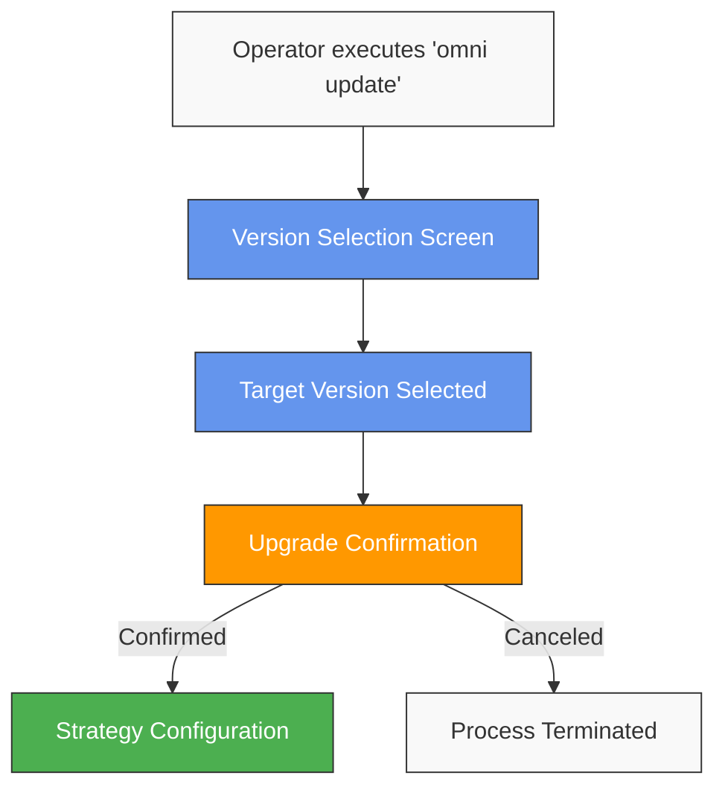

After selecting a version, the system requests confirmation to proceed with the upgrade. This confirmation step helps prevent accidental upgrades and gives operators a chance to verify their selection before proceeding.

### 2. Configuration and Strategy Selection

Once the upgrade is confirmed, the operator configures the upgrade strategy. This includes defining how application availability will be maintained during the upgrade process.

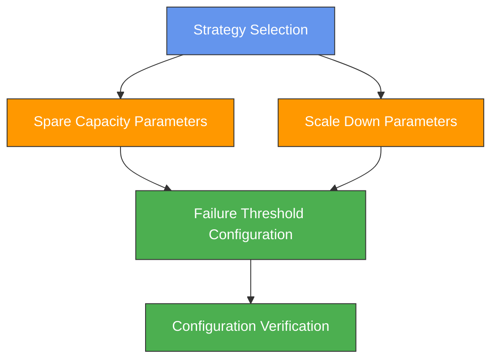

The operator can choose between spinning up spare capacity or reducing application scale during the upgrade. Platform-level default settings can pre-configure these options, but operators can adjust them per upgrade. Additionally, failure thresholds are configured to determine when automatic rollback should occur.

> [!TIP]
> For critical production environments, prefer the spare capacity strategy to maintain full application availability during upgrades, even though it requires additional resources temporarily.

### 3. Pre-upgrade Verification

Before executing the upgrade, the system performs verification checks to ensure the environment is in a suitable state for upgrading.

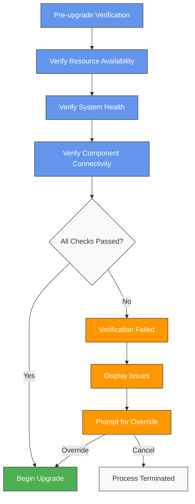

The verification process checks resource availability, system health, and connectivity between components. If issues are detected, the operator is informed and can choose to override the warnings or cancel the upgrade process.

> [!CAUTION]
> Overriding verification failures should only be done after careful analysis of the reported issues. Proceeding with an upgrade when verification fails increases the risk of upgrade problems and service disruption.

### 4. Capacity Adjustment

Based on the selected strategy, the system adjusts capacity before beginning the actual upgrade process.

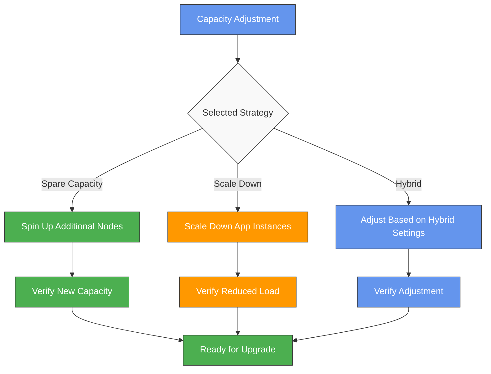

If using the spare capacity strategy, the system spins up additional nodes to accommodate workloads during the upgrade. With the scale-down strategy, application instances are reduced according to the configured parameters. A hybrid approach uses a combination of both methods based on the specific settings.

### 5. Rolling Upgrade Execution

The upgrade is performed in a rolling fashion across the cluster, with careful orchestration to minimize disruption.

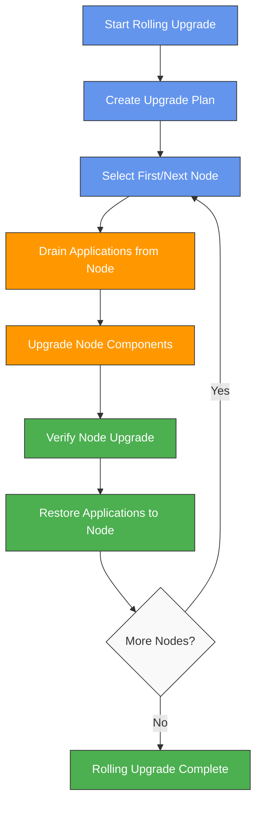

The system creates an upgrade plan that sequences nodes for upgrade. For each node, applications are drained, node components are upgraded, the upgrade is verified, and then applications are restored to the node. This process continues until all nodes are upgraded.

When upgrading each node, the process uses several techniques to maintain application availability:

1. **Connection Draining**: Before taking a node offline, incoming connections are gradually redirected to other nodes. Existing connections are allowed to complete naturally rather than being abruptly terminated.

2. **State Preservation**: For stateful applications, the system ensures that state data is properly persisted or replicated to other nodes before the upgrade begins.

3. **Session Management**: User sessions are maintained through distributed session stores or sticky sessions that redirect to new instances after migration.

4. **Rolling Deployment**: Application instances are gradually replaced with new versions using strategies like blue-green deployments within each node.

5. **Health Probing**: New instances are verified as healthy before being added to load balancers, ensuring users are only routed to fully operational services.

> [!NOTE]
> Platform administrators experience minimal UI disruption during upgrades, as the admin interface itself uses a versioned API that maintains backward compatibility. Status updates about the upgrade process are streamed in real-time to the dashboard.

### 6. Monitoring and Verification

Throughout the upgrade process, the system continuously monitors for errors and anomalies.

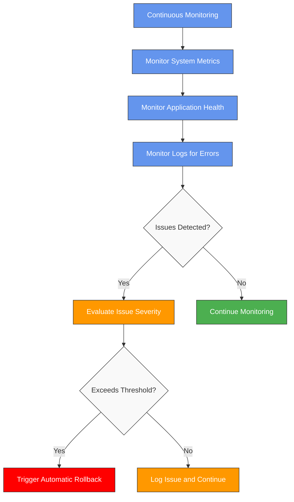

The monitoring system watches system metrics, application health, and logs for errors. Issues are evaluated against configured thresholds. If thresholds are exceeded, an automatic rollback is triggered unless overridden by the operator.

### Component-Specific Monitoring

Each platform component has specialized monitoring during upgrades:

**Orchestrator Monitoring**: Despite running as a standard application container, Orchestrators are critical control plane components. Monitoring focuses on API response times, command queue depth, and leadership stability. Special attention is paid to cross-version communication between upgraded and non-upgraded Orchestrator instances, ensuring the control plane remains responsive throughout the upgrade.

**Director Monitoring**: As Directors run directly on VMs, their monitoring tracks VM management operations, resource allocation efficiency, and communication with both Orchestrators and Agents. VM lifecycle operations are closely observed for any timing anomalies that might indicate synchronization issues. Director cluster stability is continuously verified to ensure consistent control of the infrastructure layer.

**Agent Monitoring**: Agents run within worker VMs and manage all containers, so their monitoring focuses on container creation/destruction rates, volume attachment operations, and network configuration activities. Resource isolation between containers is verified to ensure the upgrade hasn't affected security boundaries. Container startup times and success rates are particularly important metrics during Agent updates.

**Registry and Forge Monitoring**: These system applications require specialized monitoring of their functions. For the Registry, image pull and push operations are tracked for success rates and performance. For OmniForge, build success rates, resource utilization during builds, and compatibility with existing application source code are all monitored throughout the upgrade.

**Application Monitoring**: Beyond basic health checks, application monitoring includes business metric validation to ensure that application behavior remains correct. This includes tracking error rates, transaction completion rates, and end-user experience metrics like page load times.

> [!IMPORTANT]
> The monitoring system compares real-time metrics against historical baselines specific to each component, allowing it to detect subtle performance regressions that might otherwise go unnoticed. This helps identify potential issues before they impact users.

### 7. Finalization or Rollback

After the upgrade completes or if a rollback is needed, the system executes the appropriate finalization steps.

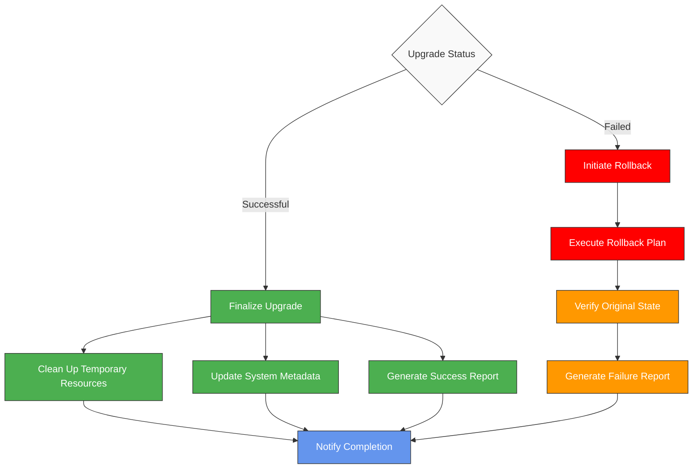

Upon successful completion, the system finalizes the upgrade by cleaning up temporary resources, updating system metadata, and generating a success report. If a rollback is needed, the system executes the rollback plan, verifies the original state is restored, and generates a failure report.

## Upgrade Strategies

OmniCloud offers multiple strategies for handling workloads during the upgrade process, each with different trade-offs between resource utilization and service continuity.

### Capacity-First Strategy

The capacity-first strategy prioritizes maintaining full application capacity throughout the upgrade process by provisioning additional resources before beginning the upgrade.

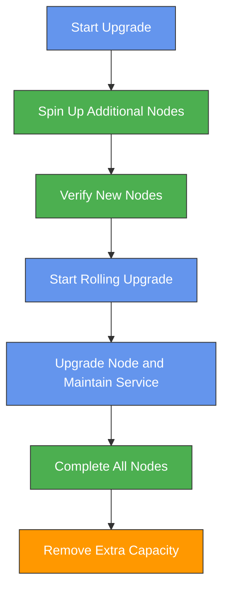

With this approach, extra nodes are provisioned to ensure that application capacity is maintained even when nodes are taken offline for upgrading. This strategy provides the highest level of service continuity but requires additional resources during the upgrade process.

When using the capacity-first strategy, OmniCloud provisions additional resources in a way that matches your existing topology. If you have specified node roles or zone distribution, the temporary capacity follows the same patterns to ensure consistent performance characteristics. The system intelligently distributes workloads to these new resources, taking into account application affinity rules and data locality requirements.

During the upgrade, these temporary nodes serve as migration targets, hosting applications while their original nodes are updated. This approach maintains full redundancy and scaling capabilities throughout the process, ensuring that even unexpected traffic spikes can be handled normally.

> [!NOTE]
> The capacity-first strategy is ideal for production environments where maintaining service levels is critical. The cost of temporary additional resources is offset by the elimination of service degradation during upgrades.

### Scale-Down Strategy

The scale-down strategy temporarily reduces application scale to free up resources for the upgrade process.

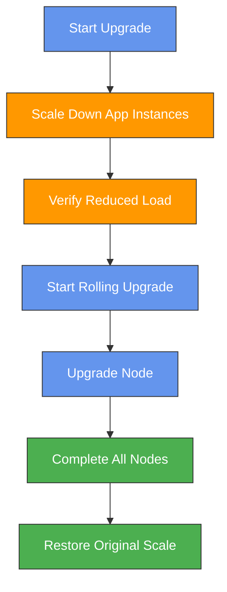

This approach reduces the number of application instances running in the cluster, freeing up resources to maintain service during the node upgrade process. While more resource-efficient, it does result in reduced capacity during the upgrade.

> [!WARNING]
> When using the scale-down strategy, carefully consider the peak load expectations during the upgrade window. Ensure that reduced capacity can still handle anticipated traffic to prevent service disruptions.

### Hybrid Approach

The hybrid approach combines elements of both strategies, intelligently allocating resources based on application criticality and available capacity.

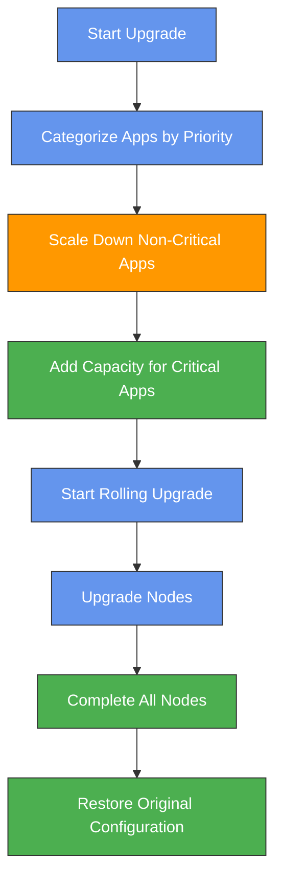

With the hybrid approach, applications are categorized by priority. Critical applications maintain or increase capacity, while non-critical applications are scaled down. This balances resource utilization with service continuity for important workloads.

## Component Interactions

The following sequence diagram illustrates the interactions between OmniCloud components during the upgrade process:

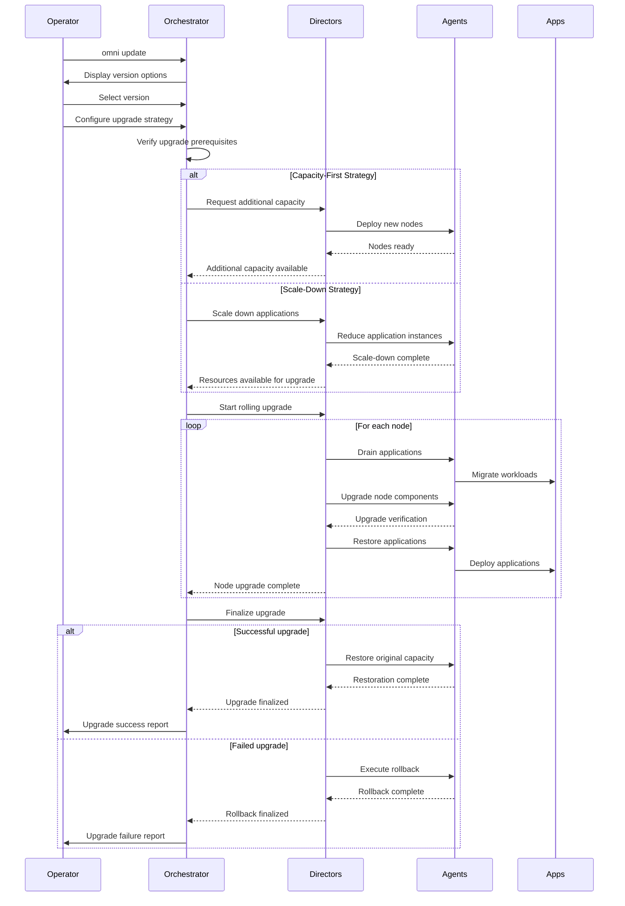

## Monitoring During Upgrades

During the upgrade process, the system continuously monitors several aspects of the environment to detect potential issues:

The monitoring system tracks system-level metrics including CPU usage, memory utilization, disk I/O, and network performance across all components. These metrics help identify resource constraints or unexpected performance degradation during the upgrade process. Significant deviations from baseline performance can trigger alerts or, if severe enough, automatic rollback procedures.

Application health checks are performed continuously, verifying that applications are responding correctly and meeting expected performance parameters. These checks include verifying API response times, successful database transactions, and proper inter-service communication. Failed health checks are aggregated and evaluated against the configured failure thresholds for each application.

The log monitoring system analyzes logs from all components in real-time, looking for error patterns, exceptions, or warning messages that might indicate upgrade issues. Advanced log analysis uses pattern recognition to identify potential issues even before they affect application performance or availability.

> [!IMPORTANT]
> Each application can have its own failure threshold defined in its settings. These thresholds determine how many instance failures can occur before triggering an automatic rollback. Setting appropriate thresholds is crucial to balance between overreacting to minor issues and allowing serious problems to persist.

## Rollback Mechanisms

OmniCloud includes sophisticated rollback mechanisms to restore the system to its previous state if critical issues are detected during the upgrade:

Automatic rollback is triggered when detected errors exceed the configured thresholds. The system maintains a complete snapshot of the pre-upgrade state, allowing for a methodical restoration of all components to their previous versions. The rollback process follows the same careful orchestration as the upgrade, ensuring that application dependencies are respected and services are restored in the proper sequence.

For situations where issues are detected but don't meet the automatic rollback threshold, operators can initiate a manual rollback. Additionally, operators can add the `--disregard-errors` flag to continue the upgrade despite threshold violations, although this is generally not recommended except in specific scenarios where failures are expected and acceptable.

The rollback process includes verification of the restored state, comparing system and application metrics against baseline measurements taken before the upgrade began. This verification ensures that the rollback was successful and the system is functioning correctly at its previous version.

> [!CAUTION]
> Using the `--disregard-errors` flag bypasses important safety mechanisms. While the system will still report all errors, it won't automatically stop and roll back when thresholds are exceeded. This should only be used after thorough analysis of the reported issues and with confidence that the errors won't impact critical services.

## Common Issues and Troubleshooting

### Resource Constraints

During upgrades, resource constraints can occur if the upgrade strategy doesn't allocate sufficient capacity. Watch for CPU, memory, or storage warnings in the monitoring dashboard. To resolve, consider scaling down less critical applications further or provisioning additional temporary resources before retrying the upgrade.

### Failed Application Migrations

When applications fail to migrate properly between nodes during the rolling upgrade, check application logs for dependency or configuration issues. Ensure that all application dependencies are properly defined and that configuration management is consistent across the cluster. For stateful applications, verify that persistent storage is correctly handled during the migration.

### Incomplete Rollbacks

If a rollback doesn't completely restore the system to its previous state, check for resources that might have been orphaned during the process. Look for stuck pods, incomplete deployments, or resource locks that might be preventing proper restoration. Manual intervention may be required to clean up these resources before retrying the rollback or upgrade.

> [!TIP]
> Before initiating an upgrade, perform a trial rollback on a test environment with similar configuration to validate that both your upgrade and rollback procedures work as expected. This can highlight potential issues before they affect production systems.

## Best Practices

Several best practices can help ensure successful OmniCloud upgrades:

Schedule upgrades during periods of low activity to minimize the impact on users and reduce the likelihood of resource contention during the upgrade process. While OmniCloud is designed to perform upgrades with minimal disruption, any upgrade carries some risk and complexity that's easier to manage during quieter periods.

Before upgrading production environments, thoroughly test the upgrade in a staging environment that closely mirrors production. This allows you to identify potential issues and refine your upgrade strategy without affecting critical systems. Pay particular attention to application compatibility with the new version and any performance impacts observed during testing.

Document your specific upgrade configuration, including failure thresholds and strategy parameters. This documentation helps maintain consistency across upgrades and provides valuable reference information if troubleshooting becomes necessary. Include notes about any issues encountered and their resolutions to build an organizational knowledge base around the upgrade process.

### Application-Specific Considerations

While the platform handles most upgrade complexities automatically, application owners should follow these practices to ensure the smoothest experience for their users:

Review application logs before the upgrade to identify and resolve any existing issues. Ongoing application problems can complicate upgrade troubleshooting by making it difficult to distinguish between pre-existing issues and upgrade-related problems.

For critical applications, consider implementing custom health checks that verify business functionality, not just technical availability. These checks can provide early warning if the upgrade affects application behavior in subtle ways that standard health probes might miss.

Test applications that use advanced platform features like auto-scaling, specialized storage, or custom networking. These applications may be more sensitive to platform changes and benefit from additional verification during the upgrade process.

> [!TIP]
> Consider staggering application updates after platform upgrades rather than immediately adopting new platform features. This approach allows you to isolate potential issues and provides time to adapt application code to any platform changes.

### Communication Plan

Develop a communication plan for upgrades, even if they're expected to be transparent to users:

1. **Pre-upgrade notification**: Inform stakeholders about the upcoming upgrade timing.
2. **Status updates**: Provide regular status updates during lengthy upgrades.
3. **Completion notification**: Confirm successful completion and highlight any new features.
4. **Issue communication**: Have templates ready for communicating any unexpected issues.

This communication approach helps manage expectations and builds confidence in the upgrade process, even when everything works perfectly.