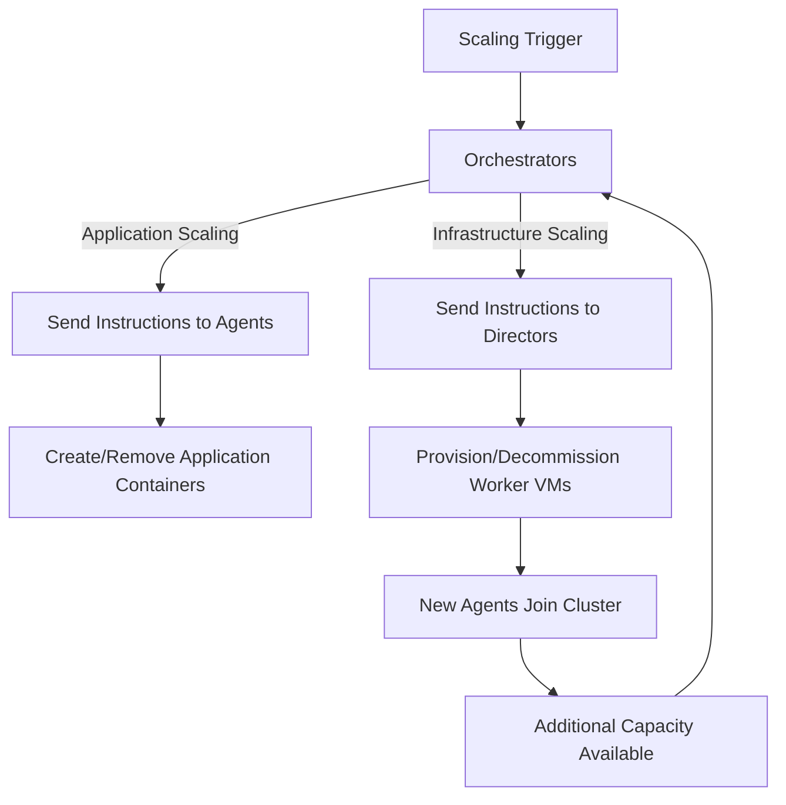

# OmniCloud Scaling & Performance Tutorial

> [!CAUTION]
> Storage has not yet been implemented, everything in this document is here for design purposes only

> [!NOTE]
> As OmniCloud advances into it's development most of the configs here will become entirely optional overrides as Omni will be able to configure itself in the vast majority of deployments

## Table of Contents

- [Introduction](#introduction)
- [OmniCloud's Bootstrapped Scaling Model](#omniclouds-bootstrapped-scaling-model)
- [Implementing Horizontal Scaling in OmniCloud](#implementing-horizontal-scaling-in-omnicloud)
- [OmniCloud's Approach to Vertical Scaling](#omniclouds-approach-to-vertical-scaling)
- [Configuring Autoscaling for OmniCloud Applications](#configuring-autoscaling-for-omnicloud-applications)
- [Performance Tuning Techniques](#performance-tuning-techniques)
   * [Topology-Aware Placement](#topology-aware-placement)
   * [Director-Agent Optimized Data Paths](#director-agent-optimized-data-paths)
   * [Bootstrapped Resource Priorities](#bootstrapped-resource-priorities)
   * [OmniForge Performance Optimizations](#omniforge-performance-optimizations)
   * [Implementing Performance Tuning](#implementing-performance-tuning)
- [OmniCloud-Specific Resource Management](#omnicloud-specific-resource-management)
   * [Bootstrap-Aware Resource Allocation](#bootstrap-aware-resource-allocation)
   * [Multi-Layered Resource Quotas](#multi-layered-resource-quotas)
   * [Director-Orchestrator Resource Coordination](#director-orchestrator-resource-coordination)
   * [Implementing Effective Resource Management](#implementing-effective-resource-management)
- [Leveraging OmniCloud's Monitoring System](#leveraging-omniclouds-monitoring-system)
   * [Bootstrap-Aware Metrics Collection](#bootstrap-aware-metrics-collection)
   * [Multi-Layer Dashboards](#multi-layer-dashboards)
   * [Orchestrator-Director-Agent Metric Correlation](#orchestrator-director-agent-metric-correlation)
   * [Implementing Effective Monitoring](#implementing-effective-monitoring)
- [Working Within OmniCloud's Scaling Boundaries](#working-within-omniclouds-scaling-boundaries)
   * [Bootstrap-Imposed Scaling Limits](#bootstrap-imposed-scaling-limits)
   * [VM-Container Boundary Management](#vm-container-boundary-management)
   * [Practical Scaling Boundaries](#practical-scaling-boundaries)
- [Advanced OmniCloud Scaling Patterns](#advanced-omnicloud-scaling-patterns)
- [Predictive Bootstrap Scaling](#predictive-bootstrap-scaling)
   * [Cross-Component Coordinated Scaling](#cross-component-coordinated-scaling)
   * [VM-Topology-Aware Application Scaling](#vm-topology-aware-application-scaling)
   * [Implementing Advanced Scaling Patterns](#implementing-advanced-scaling-patterns)
- [Command Reference](#command-reference)
   * [Scaling Commands](#scaling-commands)
   * [Bootstrap and Cross-Layer Commands](#bootstrap-and-cross-layer-commands)
   * [Performance Management Commands](#performance-management-commands)
   * [Troubleshooting Commands](#troubleshooting-commands)
   * [Configuration Management Commands](#configuration-management-commands)

## Introduction

OmniCloud takes a unique approach to application scaling and performance optimization through its bootstrapped architecture. Unlike traditional container orchestration platforms, OmniCloud's circular relationship between components creates distinctive scaling dynamics that this tutorial will help you navigate and leverage effectively.

This document focuses specifically on how to implement, configure, and troubleshoot scaling within OmniCloud environments, assuming you're already familiar with general container orchestration concepts. We'll explore the platform-specific tools, commands, and configurations that make OmniCloud's scaling capabilities particularly powerful for both stateless and stateful workloads.

> [!NOTE]
> This tutorial covers OmniCloud's implementation details rather than general scaling concepts. If you need background on container orchestration fundamentals, please refer to the OmniCloud Concepts documentation.

The scaling capabilities in OmniCloud are deeply integrated with its core architecture—where Orchestrators run as containerized applications yet control the Directors that ultimately manage the worker VMs hosting the Orchestrators themselves. This unique bootstrapped approach influences how scaling decisions propagate through the system and how resources are dynamically allocated. Understanding this foundation is essential for effectively scaling applications in OmniCloud environments.

## OmniCloud's Bootstrapped Scaling Model

OmniCloud's scaling architecture differs fundamentally from traditional platforms due to its bootstrapped design. In OmniCloud, scaling decisions originate from Orchestrators (which run as containerized applications) but are implemented through Directors (which manage VMs) and Agents (which manage containers). This circular relationship creates a self-reinforcing scaling system with unique characteristics.

When scaling occurs in OmniCloud, the process follows a distinctive flow:

1. Orchestrators detect the need for scaling based on metrics, policies, or manual commands
2. For application scaling, Orchestrators instruct Agents to create or remove containers
3. For infrastructure scaling, Orchestrators tell Directors to provision or decommission worker VMs
4. Directors deploy or remove VMs as instructed, updating the available infrastructure pool
5. Agents on new VMs register with Orchestrators, becoming available for container placement
6. Orchestrators track the overall system state and continue making scaling decisions

This bootstrapped model means that the components making scaling decisions are themselves subject to those same scaling mechanisms. Orchestrators, running as containerized applications, can themselves be scaled out to handle larger clusters, creating a self-managing hierarchy that can grow or shrink as needed without external coordination.



OmniCloud implements this model through dedicated control loops in each component. The primary scaling control loop runs in the Orchestrators, processing metrics and events from across the system. Secondary loops in Directors and Agents handle the actual implementation of scaling decisions, providing status updates back to Orchestrators to complete the feedback cycle.

To work effectively with OmniCloud's scaling capabilities, you need to understand which component handles each part of the scaling process:

- **Orchestrators**: Make scaling decisions, manage application and infrastructure scaling policies
- **Directors**: Handle VM lifecycle for infrastructure scaling, maintain VM pools
- **Agents**: Implement container-level scaling, manage container placement and resources
- **OmniForge**: Optimizes container images for scaling performance
- **Metrics Collectors**: Gather the telemetry that drives scaling decisions

This division of responsibilities enables OmniCloud to scale applications and infrastructure independently but in coordination, providing more flexible resource allocation than platforms with more monolithic scaling designs.

## Implementing Horizontal Scaling in OmniCloud

Horizontal scaling in OmniCloud builds on the platform's bootstrapped architecture to provide highly flexible scaling for both stateless and stateful applications. Unlike traditional platforms that treat all applications similarly, OmniCloud offers specialized scaling implementations for different application types.

To implement basic horizontal scaling for a stateless application in OmniCloud, you define a Deployment with a replica count:

```yaml
apiVersion: omnicloud.io/v1
kind: Deployment
metadata:
  name: web-frontend
spec:
  replicas: 10  # Static scaling - fixed number of replicas
  selector:
    matchLabels:
      app: web-frontend
  template:
    metadata:
      labels:
        app: web-frontend
    spec:
      containers:
      - name: nginx
        image: nginx:latest
        resources:
          requests:
            cpu: 100m
            memory: 128Mi
          limits:
            cpu: 500m
            memory: 256Mi
```

OmniCloud's implementation differs from other platforms in several ways:

1. The Orchestrator directly manages replica counts, not through intermediate controllers
2. Scaling operations are transaction-based, ensuring consistency during scaling events
3. The `omnicloud scale` command can modify replica counts with immediate effect
4. Replica distribution uses OmniCloud-specific placement algorithms that account for its bootstrapped architecture

You can manually scale a deployment using the OmniCloud CLI:

```bash
# Scale a deployment to 15 replicas
omnicloud scale deployment web-frontend --replicas=15

# Check the scaling status
omnicloud describe deployment web-frontend
```

For stateful applications, OmniCloud provides StatefulSets with enhanced capabilities specifically designed for the platform's architecture:

```yaml
apiVersion: omnicloud.io/v1
kind: StatefulSet
metadata:
  name: database-cluster
spec:
  serviceName: "database"
  replicas: 3
  podManagementPolicy: OrderedReady  # OmniCloud-specific: ensures proper initialization sequence
  selector:
    matchLabels:
      app: database
  template:
    metadata:
      labels:
        app: database
    spec:
      containers:
      - name: postgres
        image: postgres:13
        volumeMounts:
        - name: data
          mountPath: /var/lib/postgresql/data
  volumeClaimTemplates:
  - metadata:
      name: data
    spec:
      accessModes: [ "ReadWriteOnce" ]
      storageClassName: "fast-ssd"
      resources:
        requests:
          storage: 100Gi
```

OmniCloud's StatefulSets implement several platform-specific features:

1. **Bootstrapped Identity Management**: Orchestrators maintain identity information even if they're restarted
2. **VM-Aware Placement**: StatefulSet pods are distributed with awareness of the underlying VM structure
3. **Director-Coordinated Storage**: Volume management is coordinated between Orchestrators and Directors
4. **Agent-Local Fast Paths**: Optimized data paths when StatefulSet pods are co-located on the same VM

To efficiently scale stateful applications in OmniCloud, follow these platform-specific best practices:

1. Use the platform's `podManagementPolicy: OrderedReady` for dependencies between instances
2. Leverage OmniCloud's transaction log for safe scaling operations that survive component restarts
3. Configure `updateStrategy: RollingUpdate` with appropriate `partition` values for controlled scaling
4. Utilize the platform's specialized `omnicloud statefulset scale` command for advanced scaling operations

```bash
# Scale with controlled rollout
omnicloud statefulset scale database-cluster --replicas=5 --max-unavailable=1
```

OmniCloud's horizontal scaling implementation offers several advantages over traditional platforms: faster scaling decisions due to the direct Orchestrator control, more resilient scaling operations through the bootstrapped architecture, and specialized optimization for both stateless and stateful workloads.

## OmniCloud's Approach to Vertical Scaling

OmniCloud implements vertical scaling through a distinctive two-tier approach that reflects its bootstrapped architecture. Unlike platforms that only offer container-level vertical scaling, OmniCloud can scale both container resources and the underlying VMs that host those containers.

At the container level, OmniCloud provides the VerticalPodAutoscaler (VPA) with platform-specific enhancements:

```yaml
apiVersion: omnicloud.io/v1
kind: VerticalPodAutoscaler
metadata:
  name: database-vpa
spec:
  targetRef:
    apiVersion: "omnicloud.io/v1"
    kind: Deployment
    name: database
  updatePolicy:
    updateMode: "Auto"  # OmniCloud supports Auto, Initial, Off, and Recreate modes
  resourcePolicy:
    containerPolicies:
      - containerName: "*"
        minAllowed:
          cpu: 100m
          memory: 500Mi
        maxAllowed:
          cpu: 4
          memory: 8Gi
        controlledResources: ["cpu", "memory"]
        controlledPhases: ["startup", "runtime"]  # OmniCloud-specific phase control
```

OmniCloud's VPA implementation includes several unique features:

1. **Phase-Specific Resource Allocation**: Different resource allocations for startup vs. runtime
2. **Live Resizing**: Ability to adjust CPU/memory without restarting containers in many cases
3. **VM-Aware Recommendations**: Resource recommendations that account for VM boundaries
4. **Bootstrap-Compatible Updates**: Update mechanisms that work with OmniCloud's circular component relationships

The second tier of OmniCloud's vertical scaling happens at the VM level through Director components. When container resource requests exceed what's available on current worker VMs, OmniCloud can:

1. Migrate containers to larger existing VMs
2. Provision new, larger VM types to accommodate the workload
3. Vertically scale the VM itself (when supported by the underlying infrastructure)

This VM-level vertical scaling is managed through NodeClasses and VMSizingPolicies:

```yaml
apiVersion: omnicloud.io/v1
kind: NodeClass
metadata:
  name: compute-optimized
spec:
  sizingPolicy:
    name: vertical-compute-priority
  resources:
    cpu: 64
    memory: 256Gi
  labels:
    node-type: compute-optimized

---
apiVersion: omnicloud.io/v1
kind: VMSizingPolicy
metadata:
  name: vertical-compute-priority
spec:
  scaling:
    verticalPriority: high  # Prefer vertical VM scaling when possible
    horizontalThreshold: 85  # Switch to horizontal when VMs reach 85% utilization
  sizes:
    - name: small
      cpu: 8
      memory: 32Gi
    - name: medium
      cpu: 16
      memory: 64Gi
    - name: large
      cpu: 32
      memory: 128Gi
    - name: xlarge
      cpu: 64
      memory: 256Gi
```

To implement effective vertical scaling in OmniCloud:

1. Configure appropriate VPAs for your applications with phase-specific resource controls
2. Define NodeClasses with sizing policies that match your workload characteristics
3. Use the OmniCloud-specific `resourceFit` placement constraints to ensure containers land on appropriate VMs
4. Monitor scaling operations with `omnicloud vpa describe` and `omnicloud node describe` commands

```bash
# Check VPA recommendations and status
omnicloud vpa describe database-vpa

# See VM-level vertical scaling history
omnicloud node describe worker-03 --scaling-history
```

OmniCloud's two-tier vertical scaling approach provides more flexibility than traditional container platforms, allowing resources to be adjusted at both the container and VM level according to workload needs. This integration between container and VM scaling is made possible by the platform's bootstrapped design, where Orchestrators, Directors, and Agents collaborate to implement scaling decisions across the stack.

## Configuring Autoscaling for OmniCloud Applications

OmniCloud implements a multi-layered autoscaling system that integrates horizontal scaling, vertical scaling, and infrastructure scaling within its bootstrapped architecture. This unified approach enables sophisticated autoscaling behaviors that would require multiple disjointed systems in other platforms.

The foundation of OmniCloud's autoscaling is the HorizontalPodAutoscaler (HPA), enhanced with platform-specific capabilities:

```yaml
apiVersion: omnicloud.io/v1
kind: HorizontalPodAutoscaler
metadata:
  name: web-frontend-hpa
spec:
  scaleTargetRef:
    apiVersion: omnicloud.io/v1
    kind: Deployment
    name: web-frontend
  minReplicas: 3
  maxReplicas: 20
  metrics:
  - type: Resource
    resource:
      name: cpu
      target:
        type: Utilization
        averageUtilization: 70
  - type: Pods
    pods:
      metric:
        name: http_requests_per_second
      target:
        type: AverageValue
        averageValue: 100
  behavior:
    scaleUp:
      stabilizationWindowSeconds: 60
      policies:
      - type: Percent
        value: 100
        periodSeconds: 60
    scaleDown:
      stabilizationWindowSeconds: 300
      policies:
      - type: Percent
        value: 20
        periodSeconds: 60
  scaling:  # OmniCloud-specific section
    coordination:
      verticalPriority: false  # Prioritize horizontal over vertical scaling
      infrastructureAwareness: true  # Consider infrastructure capacity in decisions
```

To configure a complete autoscaling setup in OmniCloud, you need to address three layers:

1. **Application Autoscaling**: HPA and VPA configurations for containers
2. **Infrastructure Autoscaling**: ClusterAutoscaler and NodePool settings
3. **Coordination Settings**: OmniCloud-specific configurations that connect the layers

OmniCloud's unique infrastructure autoscaling is implemented through the ClusterAutoscaler component, which communicates directly with Directors:

```yaml
apiVersion: omnicloud.io/v1
kind: ClusterAutoscaler
metadata:
  name: main-autoscaler
spec:
  nodeGroups:
  - name: general-purpose
    minSize: 3
    maxSize: 20
    scalingPolicy:
      scaleUp:
        cpuThreshold: 70
        memoryThreshold: 70
        decisionTime: 60s
      scaleDown:
        utilizationThreshold: 30
        emptyTime: 600s
  bootstrapPriority: medium  # OmniCloud-specific: how to handle Orchestrator capacity
  directorAwareness: true  # OmniCloud-specific: ensure Directors scale with workload
```

The `bootstrapPriority` field is unique to OmniCloud—it controls how the platform handles scaling of its own components during autoscaling events. This reflects OmniCloud's bootstrapped architecture, where the components managing scaling are themselves subject to scaling.

To implement comprehensive autoscaling in OmniCloud, follow these platform-specific steps:

1. Configure HPAs with appropriate metrics and behaviors for your applications
2. Add VPAs for applications that benefit from dynamic resource adjustment
3. Set up ClusterAutoscaler with appropriate nodeGroups and scaling policies
4. Define coordination settings to link application and infrastructure scaling
5. Configure appropriate VM types and sizing policies through Directors

You can monitor and manage your autoscaling configuration using OmniCloud CLI commands:

```bash
# Check autoscaling status
omnicloud autoscaling status

# View recent scaling decisions
omnicloud scaling-history --period 24h

# Simulate a scaling event to test configuration
omnicloud autoscaling simulate --target deployment/web-frontend --metric cpu --value 85
```

OmniCloud's integrated autoscaling system offers several advantages over traditional platforms:

1. **Coordinated Decisions**: Application and infrastructure scaling decisions are made together
2. **Bootstrap-Aware**: The system understands and accounts for OmniCloud's circular component relationships
3. **Multi-Dimensional**: Can consider multiple metrics across different layers simultaneously
4. **Self-Optimizing**: The platform can scale its own components alongside application workloads

By leveraging these capabilities, you can create autoscaling configurations that respond intelligently to changing demands, ensuring optimal performance and resource utilization while minimizing manual intervention.

## Performance Tuning Techniques

OmniCloud offers several platform-specific techniques for optimizing application performance that take advantage of its bootstrapped architecture. These approaches go beyond standard container optimization, leveraging OmniCloud's unique structure to achieve better performance than would be possible on generic container platforms.

### Topology-Aware Placement

OmniCloud's placement engine incorporates knowledge of the underlying VM topology, allowing for container placement that minimizes latency and maximizes throughput:

```yaml
apiVersion: omnicloud.io/v1
kind: Deployment
metadata:
  name: database
spec:
  replicas: 3
  selector:
    matchLabels:
      app: database
  template:
    metadata:
      labels:
        app: database
    spec:
      topologyConstraints:  # OmniCloud-specific section
        placement:
          type: DistributedWithinVMGroup
          vmGroupKey: "compute-group"
        colocations:
          - selector:
              matchLabels:
                component: cache
            strategy: PreferSameVM
            reason: "Cache-database affinity improves performance"
        layerAwareness:
          enforceDirectorZones: true  # Respect Director-defined zones
```

The `topologyConstraints` section is unique to OmniCloud and allows for sophisticated placement strategies that account for the platform's VM and container layers. This example distributes database replicas across VMs within a VM group for resilience while trying to place each database instance on the same VM as its corresponding cache instance to minimize latency.

### Director-Agent Optimized Data Paths

OmniCloud can establish optimized data paths between containers based on communication patterns:

```yaml
apiVersion: omnicloud.io/v1
kind: DataPathOptimization
metadata:
  name: api-database-path
spec:
  source:
    selector:
      matchLabels:
        component: api
  destination:
    selector:
      matchLabels:
        component: database
  optimization:
    type: DirectVMPath  # Use VM-level networking when possible
    fallback: StandardContainerNetwork
    measurement: true  # Collect metrics on path performance
```

This OmniCloud-specific resource creates an optimized data path between API and database components. When these components are on the same VM, the platform establishes a direct VM-level communication channel that bypasses container networking overhead.

### Bootstrapped Resource Priorities

OmniCloud's resource management system implements priority-based resource allocation that accounts for the platform's bootstrapped nature:

```yaml
apiVersion: omnicloud.io/v1
kind: PriorityClass
metadata:
  name: high-performance-service
spec:
  value: 1000000
  bootstrapEffect: Limited  # OmniCloud-specific field
  description: "High priority workload with limited impact on bootstrap components"
```

The `bootstrapEffect` field is unique to OmniCloud—it controls how the prioritized workload interacts with the platform's core components (Orchestrators, OmniForge, etc.). Setting it to `Limited` ensures that even high-priority workloads won't starve the platform's own components, maintaining system stability while still providing preferential resource access.

### OmniForge Performance Optimizations

OmniCloud's integrated OmniForge build tool includes performance-focused optimizations for container images:

```yaml
apiVersion: omnicloud.io/v1
kind: BuildConfiguration
metadata:
  name: optimized-api-build
spec:
  source:
    git:
      url: "https://github.com/example/api-service"
  strategy:
    type: OmniForge
    omniForge:
      baseImage: minimal-runtime:latest
      performanceOptimizations:
        layerOptimization: Aggressive
        startupOptimization: true
        resourceAlignment: true  # Align with OmniCloud container boundaries
        vmAwareCompilation: true  # Optimize for target VM architecture
```

OmniForge's platform-specific optimizations produce containers that start faster, use less memory, and perform better specifically within OmniCloud environments.

### Implementing Performance Tuning

To implement effective performance tuning in OmniCloud:

1. Use topology constraints to optimize container placement based on communication patterns
2. Configure DataPathOptimizations for critical service-to-service communications
3. Define appropriate PriorityClasses with bootstrap effects for workload prioritization
4. Leverage OmniForge's performance optimizations for container images
5. Monitor performance with OmniCloud's integrated metrics system

You can check the effectiveness of your optimizations using the OmniCloud CLI:

```bash
# Analyze container placement and suggest improvements
omnicloud topology-analyzer deployment/api-service

# Check data path optimization status
omnicloud datapath-status api-database-path

# View performance metrics with bootstrap awareness
omnicloud metrics performance --bootstrap-aware
```

OmniCloud's performance tuning capabilities enable applications to achieve better performance than they would on generic container platforms by leveraging the unique characteristics of the bootstrapped architecture.

## OmniCloud-Specific Resource Management

OmniCloud implements a distinctive approach to resource management that reflects its bootstrapped architecture. The platform's resource management system spans both container and VM layers, with specialized mechanisms for handling the circular dependencies between components.

### Bootstrap-Aware Resource Allocation

The core of OmniCloud's resource management is its bootstrap-aware allocation system, which ensures that platform components (Orchestrators, OmniForge, etc.) and application workloads share resources appropriately:

```yaml
apiVersion: omnicloud.io/v1
kind: ResourceGroup
metadata:
  name: production-services
spec:
  allocation:
    guaranteedShare: 70  # 70% of resources guaranteed for this group
    burstShare: 90  # Can burst to 90% when resources available
  bootstrapBehavior:
    minimumOrchestrators: 3  # Ensure at least 3 Orchestrators remain viable
    platformProtection: true  # Protect core platform services during contention
  containment:
    namespaces:
      - production
      - monitoring
```

The `bootstrapBehavior` section is unique to OmniCloud—it controls how the platform balances resources between applications and the platform's own components. This ensures stability by preventing applications from starving the very components that manage them.

### Multi-Layered Resource Quotas

OmniCloud extends traditional namespace quotas with VM-layer awareness:

```yaml
apiVersion: omnicloud.io/v1
kind: ResourceQuota
metadata:
  name: team-quota
  namespace: team-a
spec:
  hard:
    requests.cpu: "20"
    requests.memory: 100Gi
    limits.cpu: "40"
    limits.memory: 200Gi
    persistentvolumeclaims: "20"
    services: "30"
  vmAwareness:  # OmniCloud-specific section
    maxVMTypes: 3  # Limit the VM types this namespace can consume
    directExposure: false  # Don't expose VM details to namespace users
    vmAffinities:
      - vmType: general-purpose
        allocation: Preferred
```

The `vmAwareness` section links container-level quotas to VM-level resource planning, allowing OmniCloud to make more intelligent allocation decisions that account for both layers.

### Director-Orchestrator Resource Coordination

OmniCloud implements a coordination mechanism between Directors (which manage VMs) and Orchestrators (which manage containers) for efficient resource usage:

```yaml
apiVersion: omnicloud.io/v1
kind: ResourceCoordinator
metadata:
  name: main-coordinator
spec:
  strategies:
    - name: bin-packing
      scope: cluster-wide
      priority: high
    - name: spread-workload
      scope: namespace-specific
      namespaces:
        - system
      priority: highest
  directorIntegration:
    vmSizing: Continuous  # Continuously adjust VM sizing based on container needs
    placementFeedback: true  # Directors provide feedback to Orchestrators about placement
  stabilization:
    period: 10m  # Minimum time between major resource redistributions
```

This OmniCloud-specific resource defines how Directors and Orchestrators coordinate resource decisions, implementing strategies like bin-packing containers onto VMs or spreading critical workloads for reliability.

### Implementing Effective Resource Management

To implement effective resource management in OmniCloud:

1. Configure ResourceGroups with appropriate bootstrap behaviors for your workloads
2. Set up ResourceQuotas with VM awareness for each namespace
3. Define a ResourceCoordinator with strategies that match your priorities
4. Use Quality of Service settings that account for bootstrap components
5. Implement appropriate Priority Classes for critical workloads

You can monitor and manage resource allocation using OmniCloud CLI commands:

```bash
# View resource allocation across bootstrap and application components
omnicloud resource-analyzer --bootstrap-aware

# Check for resource contention issues
omnicloud resource-contention describe

# Simulate resource allocation changes
omnicloud resource-simulator --add-workload deployment.yaml
```

OmniCloud's resource management capabilities enable more efficient resource utilization than traditional container platforms by accounting for both container and VM layers while ensuring the stability of the bootstrapped architecture.

## Leveraging OmniCloud's Monitoring System

OmniCloud provides a comprehensive monitoring system specifically designed for its bootstrapped architecture. This system collects and analyzes metrics across both container and VM layers, with special attention to the circular relationships between platform components.

### Bootstrap-Aware Metrics Collection

OmniCloud's metrics collection is configured through MetricsEndpoints with bootstrap awareness:

```yaml
apiVersion: omnicloud.io/v1
kind: MetricsEndpoint
metadata:
  name: api-metrics
spec:
  selector:
    matchLabels:
      app: api-service
  port: 8080
  path: /metrics
  scrapeInterval: 15s
  honorLabels: true
  bootstrapAwareness:  # OmniCloud-specific section
    includeOrchestrationMetrics: true  # Include metrics about how the service is orchestrated
    directorVisibility: true  # Include metrics from the Director managing this service's VM
    selfOrchestrationMetrics: false  # Don't include metrics about services orchestrating themselves
```

The `bootstrapAwareness` section is unique to OmniCloud—it controls which cross-layer metrics are collected, allowing you to see how the platform's components interact with each other and with your applications.

### Multi-Layer Dashboards

OmniCloud provides specialized dashboards that visualize the platform's bootstrapped architecture and its impact on application performance:

```yaml
apiVersion: omnicloud.io/v1
kind: Dashboard
metadata:
  name: service-health-dashboard
spec:
  title: "Service Health with Bootstrap Context"
  refreshInterval: 10s
  panels:
    - name: "Application Performance"
      type: Graph
      metrics:
        - query: 'rate(http_requests_total{app="api-service"}[5m])'
    - name: "Bootstrap Impact"
      type: HeatMap
      description: "Impact of bootstrap components on service performance"
      metrics:
        - query: 'orchestrator_impact_score{target_app="api-service"}'
    - name: "Cross-Layer Latency"
      type: Graph
      metrics:
        - query: 'container_to_worker_communication_latency{source="api-service",destination="database"}'
```

These dashboards incorporate OmniCloud-specific metrics that show how the bootstrapped architecture affects your applications, providing insights not available on traditional platforms.

### Orchestrator-Director-Agent Metric Correlation

OmniCloud's monitoring system can correlate metrics across its three main component types, revealing relationships that would be invisible in standard monitoring:

```yaml
apiVersion: omnicloud.io/v1
kind: MetricCorrelation
metadata:
  name: scaling-impact-correlation
spec:
  sourceMetrics:
    - name: orchestrator_scaling_decisions_count
      aggregation: sum
      filters:
        target_type: "deployment"
        target_name: "api-service"
  targetMetrics:
    - name: director_worker_provision_duration_seconds
      aggregation: avg
    - name: agent_container_start_duration_seconds
      aggregation: avg
      filters:
        container_name: "api"
  correlation:
    method: TimeShift
    timeWindow: 10m
    minimumCorrelationScore: 0.7
```

This OmniCloud-specific resource tracks how scaling decisions made by Orchestrators affect VM provisioning time (via Directors) and container startup time (via Agents), providing a complete view of scaling performance across the platform's layers.

### Implementing Effective Monitoring

To leverage OmniCloud's monitoring system effectively:

1. Configure MetricsEndpoints with appropriate bootstrap awareness for your services
2. Set up multi-layer dashboards that show both application and platform metrics
3. Create MetricCorrelations to understand relationships between layers
4. Use the OmniCloud-specific alerts that account for the platform's architecture
5. Configure appropriate retention and aggregation for historical analysis

You can interact with the monitoring system using OmniCloud CLI commands:

```bash
# View comprehensive metrics for a service including bootstrap context
omnicloud metrics describe deployment/api-service --bootstrap-context

# Analyze scaling performance across layers
omnicloud scaling-analyzer --period 24h

# Check the health of the monitoring system itself
omnicloud monitoring-health
```

OmniCloud's monitoring system provides unique insights into application performance within its bootstrapped architecture, revealing relationships and optimization opportunities that would be invisible in traditional container monitoring.

## Working Within OmniCloud's Scaling Boundaries

OmniCloud's bootstrapped architecture creates unique scaling dynamics with both capabilities and limitations that differ from traditional container platforms. Understanding these boundaries is essential for designing applications that scale effectively within OmniCloud environments.

### Bootstrap-Imposed Scaling Limits

OmniCloud's most distinctive scaling characteristic is the interdependency between the components that implement scaling and the resources being scaled. This creates platform-specific scaling limits:

```yaml
apiVersion: omnicloud.io/v1
kind: ClusterScalingPolicy
metadata:
  name: main-scaling-policy
spec:
  bootstrapLimits:  # OmniCloud-specific section
    orchestratorRatio: 1:100  # 1 Orchestrator per 100 application containers
    directorRatio: 1:10  # 1 Director per 10 worker VMs
    minimumReservedCapacity: 20  # Keep 20% capacity reserved for bootstrap components
  applicationLimits:
    maxPodsPerNode: 100
    maxContainersPerPod: 10
    maxReplicasPerDeployment: 500
  scalingRates:
    normalMaxPerMinute: 30  # Max 30 containers per minute under normal conditions
    emergencyMaxPerMinute: 100  # Up to 100 containers per minute in emergencies
```

The `bootstrapLimits` section defines constraints specific to OmniCloud's architecture, ensuring that scaling application workloads doesn't overshadow the platform's own needs for resources.

### VM-Container Boundary Management

OmniCloud provides mechanisms for managing the boundaries between VM and container scaling:

```yaml
apiVersion: omnicloud.io/v1
kind: ScalingBoundary
metadata:
  name: web-tier-boundary
spec:
  selector:
    matchLabels:
      tier: web
  containerScaling:
    maxPerVM: 20  # Maximum containers per VM
    minPerVM: 5  # Minimum containers per VM 
  vmScaling:
    preferredUtilization: 70  # Target VM utilization percentage
    scaleUpThreshold: 85  # Add VMs when utilization exceeds 85%
    scaleDownThreshold: 50  # Remove VMs when utilization falls below 50%
  crossBoundaryBehavior:
    strategy: ContainerFirst  # Prefer scaling containers before adding VMs
    vmStartupBuffer: 2  # Keep 2 VMs worth of headroom for fast scaling
```

This OmniCloud-specific resource defines how container scaling and VM scaling interact for a specific tier of your application, controlling when the platform scales horizontally within existing VMs versus adding new VMs.

### Practical Scaling Boundaries

In practice, OmniCloud implementations face several specific scaling boundaries:

1. **Orchestrator Processing Capacity**: Each Orchestrator can manage a finite number of containers (typically hundreds to low thousands)
2. **Director Management Capacity**: Each Director can manage a limited number of VMs (typically dozens)
3. **Cross-Component Communication**: The control plane has bandwidth and latency constraints that affect large-scale operations
4. **Bootstrap Component Resources**: Platform components themselves require resources that must be accounted for in scaling plans

To work effectively within these boundaries:

1. Design applications with scaling units that align with OmniCloud's architecture
2. Break extremely large applications into multiple smaller deployments
3. Use appropriate namespace and resource group boundaries
4. Configure scaling policies with bootstrap-aware limits
5. Monitor both application and platform component metrics during scaling events

You can check your current position relative to scaling boundaries using:

```bash
# View scaling capacity and limits
omnicloud scaling-capacity

# Check bootstrap component health and capacity
omnicloud bootstrap-status

# Analyze scaling headroom for a specific application
omnicloud scaling-headroom deployment/api-service
```

By understanding and respecting OmniCloud's scaling boundaries, you can design applications that scale predictably and reliably within the platform's bootstrapped architecture.

## Advanced OmniCloud Scaling Patterns

OmniCloud's bootstrapped architecture enables several advanced scaling patterns that leverage the platform's unique capabilities. These patterns go beyond standard container scaling approaches to provide more sophisticated, efficient, and resilient scaling behaviors.

## Predictive Bootstrap Scaling

OmniCloud can predict application scaling needs and proactively scale its bootstrap components (Orchestrators, Directors) ahead of demand:

```yaml
apiVersion: omnicloud.io/v1
kind: PredictiveBootstrapScaler
metadata:
  name: business-hours-scaler
spec:
  schedule:
    - dayOfWeek: "Monday-Friday"
      timeStart: "07:30"
      timeEnd: "09:30"
      description: "Morning business ramp-up"
      bootstrapAction:
        orchestrators:
          targetReplicas: 5
          preScaleMinutes: 15
        directors:
          targetReplicas: 8
          preScaleMinutes: 20
        vmPool:
          targetSize: 20
          preScaleMinutes: 25
  metricTriggers:
    - metric: "http_requests_per_second"
      threshold: 1000
      bootstrapAction:
        orchestratorRatio: 1:200
        directorRatio: 1:15
  bootstrapScaleDown:
    delay: 30m
    conditionWindow: 15m
```

This OmniCloud-specific resource enables the platform to scale its own components ahead of anticipated application load, ensuring that the control plane has sufficient capacity to handle the upcoming scaling events. This pattern leverages OmniCloud's understanding of its own architecture to optimize the entire scaling process.

### Cross-Component Coordinated Scaling

OmniCloud can coordinate scaling actions across multiple components that have dependencies:

```yaml
apiVersion: omnicloud.io/v1
kind: ScalingCoordinator
metadata:
  name: ecommerce-coordinator
spec:
  components:
    - name: web-frontend
      kind: Deployment
      scalingRatio: 1
    - name: api-service
      kind: Deployment
      scalingRatio: 0.5
    - name: order-processor
      kind: Deployment
      scalingRatio: 0.2
    - name: database
      kind: StatefulSet
      scalingRatio: 0.1
      minReplicas: 3
  coordinationPolicy:
    triggerComponent: web-frontend
    scalingOrder:
      - database
      - api-service
      - order-processor
      - web-frontend
    scaleDownReversed: true
  bootstrapConsiderations:
    ensureCapacityBefore: true  # Ensure bootstrap components have capacity before scaling
    crossLayerCoordination: true  # Coordinate VM and container scaling
```

This pattern maintains proper proportional scaling across multiple components while respecting their dependencies, scaling them in the correct order and with appropriate ratios. The `bootstrapConsiderations` section ensures that OmniCloud's own components are properly scaled to support this coordinated scaling process.

### VM-Topology-Aware Application Scaling

OmniCloud can scale applications with awareness of the underlying VM topology and characteristics:

```yaml
apiVersion: omnicloud.io/v1
kind: TopologyAwareScaler
metadata:
  name: database-cluster-scaler
spec:
  target:
    kind: StatefulSet
    name: database-cluster
  replicaRange:
    min: 3
    max: 15
  topologyRules:
    - type: SpreadAcrossVMs
      priority: Highest
    - type: SpreadAcrossDirectors
      priority: High
    - type: PreferVMType
      vmType: storage-optimized
      priority: Medium
  vmConsiderations:
    requireExclusiveVMs: true  # Each replica gets its own VM
    vmStartupAlignment: true  # Align replica scaling with VM availability
    directorAwareness: true  # Consider Director capacity and health
```

This OmniCloud-specific scaling pattern considers the underlying VM infrastructure when making application scaling decisions, ensuring optimal placement and resource utilization across both container and VM layers.

### Implementing Advanced Scaling Patterns

To implement these advanced patterns in OmniCloud:

1. Identify workloads that would benefit from platform-specific scaling capabilities
2. Configure appropriate predictive, coordinated, or topology-aware scalers
3. Test scaling patterns with simulated load to verify behavior
4. Monitor both application components and bootstrap components during scaling
5. Refine configurations based on observed performance

You can manage these advanced scaling patterns using specialized commands:

```bash
# Analyze scaling behavior and suggest optimizations
omnicloud scaling-pattern-analyzer deployment/web-frontend

# Test a scaling pattern with simulated load
omnicloud scaling-simulator --pattern=topology-aware --target=database-cluster

# Monitor coordinated scaling operations
omnicloud scaling-coordinator monitor ecommerce-coordinator
```

These advanced scaling patterns leverage OmniCloud's unique architecture to provide capabilities not available in traditional container platforms, enabling more efficient, predictable, and reliable scaling for complex applications.

## Command Reference

This section provides a reference for OmniCloud-specific CLI commands related to scaling and performance management. These commands are designed to work within OmniCloud's bootstrapped architecture, offering capabilities not found in standard container orchestration platforms.

### Scaling Commands

```bash
# View current scaling status across all components
omnicloud scaling status

# Scale a deployment with specified parameters
omnicloud scale deployment/web-frontend --replicas=10 --wait --timeout=5m

# Configure horizontal autoscaling
omnicloud autoscale configure deployment/web-frontend --min=3 --max=20 --cpu-percent=70

# Enable vertical pod autoscaling
omnicloud vpa create --deployment=api-service --mode=Auto --min-cpu=100m --min-memory=256Mi

# View detailed scaling history
omnicloud scaling history --period=24h --component=web-frontend

# Analyze scaling performance
omnicloud scaling analyzer --target=web-frontend --period=7d

# Configure predictive scaling
omnicloud predictive-scaling configure --deployment=web-frontend --history-days=14 --prediction-window=30m
```

### Bootstrap and Cross-Layer Commands

```bash
# View bootstrap component status
omnicloud bootstrap status

# Check VM scaling status
omnicloud vm-scaling status

# Configure bootstrap protection settings
omnicloud bootstrap protection configure --orchestrator-ratio=1:100 --director-ratio=1:20 --reserved-capacity=15%

# View cross-layer scaling metrics
omnicloud cross-layer-metrics --period=1h

# Analyze bootstrap component health
omnicloud bootstrap health

# Configure coordination between Director and Orchestrator scaling
omnicloud coordination configure --mode=tightly-coupled --vm-headroom=3
```

### Performance Management Commands

```bash
# View performance metrics for a deployment
omnicloud performance metrics deployment/api-service --period=3h

# Configure topology constraints for a deployment
omnicloud topology configure deployment/database --strategy=DistributedWithinVMGroup --vm-group=storage

# Analyze resource usage patterns
omnicloud resource analyzer --namespace=production --period=7d

# Configure data path optimization
omnicloud datapath optimize --source=api-service --destination=database --type=DirectVMPath

# View performance recommendations
omnicloud performance recommendations deployment/web-frontend

# Analyze container placement efficiency
omnicloud placement analyzer --namespace=production
```

### Troubleshooting Commands

```bash
# View comprehensive scaling diagnostics
omnicloud scaling diagnostics deployment/web-frontend

# Check for resource contention
omnicloud contention analyzer --focus=scaling

# Identify scaling bottlenecks
omnicloud bottleneck analyzer --component=web-frontend

# View bootstrap component logs relevant to scaling
omnicloud logs --bootstrap-components=orchestrator,director --filter=scaling

# Analyze dependency relationships
omnicloud dependency analyzer --focus=scaling

# Simulate scaling operations
omnicloud scaling simulator --target=web-frontend --replicas=20 --predict-only
```

### Configuration Management Commands

```bash
# View current scaling configuration
omnicloud configure view --focus=scaling

# Export scaling configuration to file
omnicloud configure export --components=autoscaling,vpa,bootstrap --output=scaling-config.yaml

# Import scaling configuration from file
omnicloud configure import --file=scaling-config.yaml --validate-only

# Compare current configuration with best practices
omnicloud configure analyze --focus=scaling --compare-with=best-practices

# Generate scaling configuration template
omnicloud configure template generate --type=predictive-scaling --output=predictive-template.yaml
```

These OmniCloud-specific commands provide the tools needed to effectively manage scaling and performance within the platform's unique bootstrapped architecture. They offer capabilities beyond standard container orchestration tools, reflecting OmniCloud's integrated approach to container and VM management.
