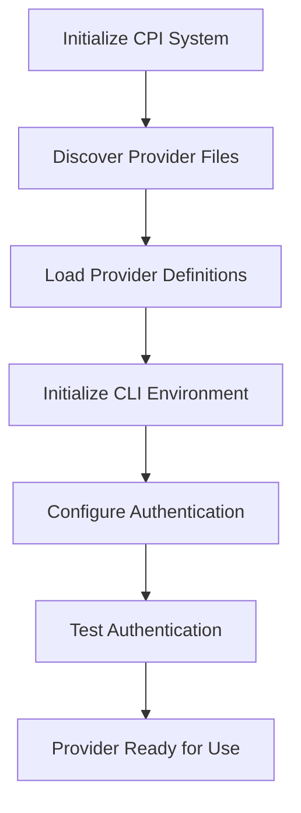
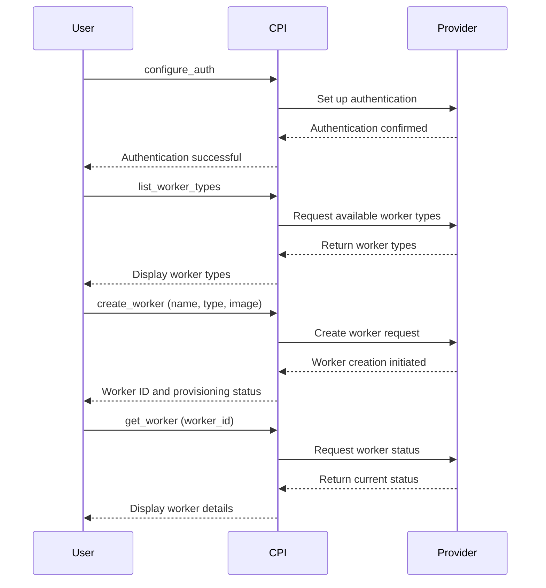
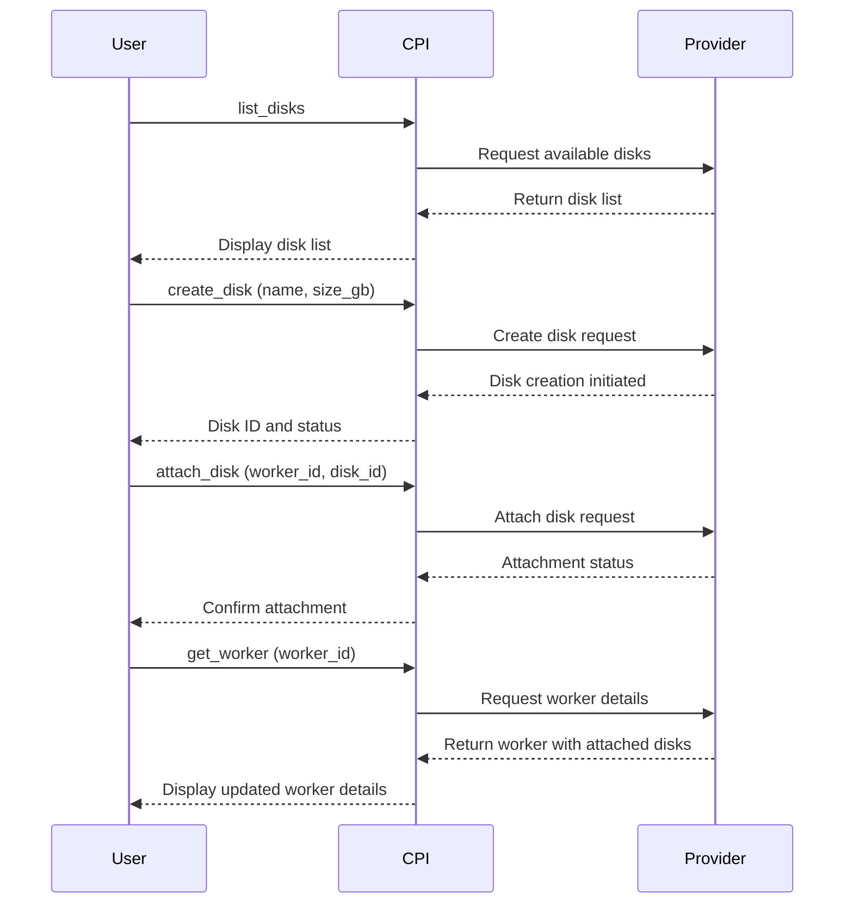

## 8. CPI Lifecycle and Initialization Process

The CPI system follows a defined lifecycle that starts with CLI initialization and ends with resource management. Understanding this flow helps implementers build robust providers.

### 8.1 Standard Initialization Sequence



### 8.2 Recommended Initialization Implementation

When implementing a new CPI provider, follow this sequence for initialization:

1. **CLI Setup**: Ensure the CLI tools are installed and properly configured
   - For command-based CPIs:
   ```json
   "initialize_cli": {
     "target": {
       "Command": "bash -c 'if ! command -v {cli_path} &> /dev/null; then curl -sSL https://downloads.cloudco.io/cli/install.sh | bash -s -- --version {cli_version} --install-dir $(dirname {cli_path}); fi'"
     },
     "params": ["cli_path", "cli_version"],
     "parse_rules": { 
       "type": "object",
       "patterns": {
         "success": {
           "regex": "Installation complete|already installed",
           "transform": "boolean"
         },
         "version": {
           "regex": "Installed version:\\s+([\\d\\.]+)",
           "group": 1,
           "optional": true
         }
       }
     }
   }
   ```
   
   - For endpoint-based CPIs:
   ```json
   "initialize_cli": {
     "target": {
       "Command": "pip install truenas-api-client"
     },
     "params": [],
     "parse_rules": {
       "type": "object",
       "patterns": {
         "success": {
           "regex": "Successfully installed",
           "transform": "boolean"
         }
       }
     }
   }
   ```

2. **Authentication Configuration**: Set up credentials for accessing the cloud provider
   
   - For command-based CPIs:
   ```json
   "configure_auth": {
     "target": {
       "Command": "cloudco-cli auth configure --api-key {api_key} --project {project_id}"
     },
     "params": [
       "api_key",
       "project_id"
     ],
     "parse_rules": {
       "type": "object",
       "patterns": {
         "success": {
           "regex": "Authentication configured successfully",
           "transform": "boolean"
         },
         "account_id": {
           "regex": "Account ID:\\s+([a-z0-9-]+)",
           "group": 1,
           "optional": true
         }
       }
     }
   }
   ```
   
   - For endpoint-based CPIs:
   ```json
   "configure_auth": {
     "target": {
       "Endpoint": {
         "url": "{api_url}/auth/token",
         "method": "Post",
         "headers": {
           "Content-Type": "application/json"
         },
         "body": "{\"username\":\"{username}\",\"password\":\"{password}\"}"
       }
     },
     "params": [
       "api_url",
       "username",
       "password"
     ],
     "parse_rules": {
       "type": "object",
       "patterns": {
         "api_key": {
           "regex": "\"token\":\\s*\"([^\"]+)\"",
           "group": 1
         }
       }
     }
   }
   ```

3. **Authentication Validation**: Verify that authentication is working properly
   
   - For command-based CPIs:
   ```json
   "test_auth": {
     "target": {
       "Command": "cloudco-cli auth validate"
     },
     "params": [],
     "parse_rules": {
       "type": "object",
       "patterns": {
         "status": {
           "regex": "Authentication Status:\\s+(\\w+)",
           "group": 1
         },
         "username": {
           "regex": "Username:\\s+([^\\n]+)",
           "group": 1,
           "optional": true
         }
       }
     }
   }
   ```
   
   - For endpoint-based CPIs:
   ```json
   "test_auth": {
     "target": {
       "Endpoint": {
         "url": "{api_url}/auth/check",
         "method": "Get",
         "headers": {
           "Authorization": "Bearer {api_key}",
           "Content-Type": "application/json"
         }
       }
     },
     "params": [
       "api_url",
       "api_key"
     ],
     "parse_rules": {
       "type": "object",
       "patterns": {
         "status": {
           "regex": "\"authenticated\":\\s*(true|false)",
           "group": 1
         }
       }
     }
   }
   ```

4. **Installation Testing**: Verify that the CLI or API is installed and accessible
   
   - For command-based CPIs:
   ```json
   "test_install": {
     "target": {
       "Command": "cloudco-cli --version"
     },
     "params": [],
     "parse_rules": {
       "type": "object",
       "patterns": {
         "version": {
           "regex": "cloudco-cli version ([\\d\\.]+)",
           "group": 1
         }
       }
     }
   }
   ```
   
   - For endpoint-based CPIs:
   ```json
   "test_install": {
     "target": {
       "Endpoint": {
         "url": "{api_url}/system/version",
         "method": "Get",
         "headers": {
           "Authorization": "Bearer {api_key}",
           "Content-Type": "application/json"
         }
       }
     },
     "params": [
       "api_url",
       "api_key"
     ],
     "parse_rules": {
       "type": "object",
       "patterns": {
         "version": {
           "regex": "\"version\":\\s*\"([^\"]+)\"",
           "group": 1
         }
       }
     }
   }
   ```

This sequence ensures that the CPI provider is properly set up before any resource management commands are executed.

## 9. Target Types and Specifications

The CPI system supports two primary target types for action execution: Command and Endpoint. Each type has specific requirements and capabilities.

### 9.1 Command Target Type

The Command target type executes shell commands on the host system. This is typically used for cloud providers that offer a command-line interface (CLI) tool.

```json
"target": {
  "Command": "cloudco-cli worker create --name {name} --type {worker_type}"
}
```

### 9.2 Endpoint Target Type

The Endpoint target type makes HTTP requests to REST APIs. This is used for cloud providers that offer a REST API interface or when direct API access is preferred over a CLI tool.

```json
"target": {
  "Endpoint": {
    "url": "{api_url}/instances",
    "method": "Post",
    "headers": {
      "Authorization": "Bearer {api_key}",
      "Content-Type": "application/json"
    },
    "body": "{\"name\":\"{name}\",\"type\":\"{worker_type}\"}"
  }
}
```

### 9.3 Supported HTTP Methods

For Endpoint targets, the following HTTP methods are supported:

- `Get` - For retrieving resources
- `Post` - For creating resources
- `Put` - For replacing resources
- `Patch` - For updating resources
- `Delete` - For removing resources
- `Option` - For checking allowed operations
- `Custom` - For provider-specific methods

### 9.4 Parameter Substitution

Both Command and Endpoint targets support parameter substitution using curly braces `{}`. Any parameter referenced in the command string or endpoint details must be listed in the `params` array.

```json
"create_worker": {
  "target": {
    "Command": "cloudco-cli worker create --name {name} --type {worker_type}"
  },
  "params": [
    "name",
    "worker_type"
  ]
}
```

## 10. Parser Rules and Output Processing

The CPI system uses a flexible parsing system to extract structured data from command outputs or API responses. The parser transforms raw text into structured objects that can be used by the caller.

### 10.1 Parser Types

Three primary parser types are supported:

#### 10.1.1 Object Parser

Used for extracting key-value pairs from outputs with a single instance of each field.

```json
"parse_rules": {
  "type": "object",
  "patterns": {
    "version": {
      "regex": "Version:\\s+([\\d\\.]+)",
      "group": 1
    },
    "status": {
      "regex": "Status:\\s+(\\w+)",
      "group": 1
    }
  }
}
```

#### 10.1.2 Array Parser

Used for extracting repeated patterns from outputs, such as lists of items.

```json
"parse_rules": {
  "type": "array",
  "separator": "\\n",
  "patterns": {
    "id": {
      "regex": "ID:\\s+([a-z0-9-]+)",
      "group": 1
    },
    "name": {
      "regex": "Name:\\s+([^\\n]+)",
      "group": 1
    }
  }
}
```

#### 10.1.3 Properties Parser

Used for extracting complex nested structures with multiple instances of related fields.

```json
"parse_rules": {
  "type": "properties",
  "patterns": {
    "id": {
      "regex": "\"id\":\\s*\"([^\"]+)\"",
      "group": 1
    }
  },
  "array_patterns": {
    "disks": {
      "prefix": "Disk",
      "index": "(\\d+)",
      "object": {
        "id": {
          "regex": "Disk-(\\d+)-ID:\\s+([a-z0-9-]+)",
          "group": 2
        },
        "size": {
          "regex": "Disk-(\\d+)-Size:\\s+(\\d+)GB"
        }
      }
    }
  }
}
```
# Cloud Provider Interface (CPI) Standardization

## 1. Introduction

This document establishes standards for Cloud Provider Interface (CPI) implementations to ensure consistency across different providers while maintaining flexibility for provider-specific features. By following these standards, developers can create CPI providers that work seamlessly within the ecosystem and offer a predictable experience for users.

The CPI system balances standardization with flexibility. Core operations like creating, listing, and managing workers follow consistent patterns across providers, while allowing for platform-specific extensions and capabilities. This document outlines the minimum requirements for compliance along with optional methods that enhance functionality.

## 2. Required Methods

Every CPI provider must implement the following core methods to be considered compliant with the standard. These methods represent the fundamental operations that all cloud providers support.

### 2.1 Basic Provider Methods

| Method | Description | Required Parameters |
|--------|-------------|---------------------|
| `test_install` | Verifies that the provider's CLI tools are installed and accessible | None |
| `list_workers` | Lists all workers (virtual machines) | Region/zone (if applicable) |
| `create_worker` | Creates a new worker | Name, size/type, image/OS |
| `delete_worker` | Permanently removes a worker | Worker ID |
| `get_worker` | Retrieves details about a specific worker | Worker ID |
| `start_worker` | Powers on a stopped worker | Worker ID |
| `stop_worker` | Powers off a running worker | Worker ID |

### 2.2 Implementation Details

The `test_install` method should verify that the necessary tools for the provider are installed and accessible. This method helps users identify installation or configuration issues quickly.

For command-based CPIs, this typically involves checking CLI tool availability:

```json
"test_install": {
  "target": {
    "Command": "cloudco-cli --version"
  },
  "params": [],
  "parse_rules": {
    "type": "object",
    "patterns": {
      "version": {
        "regex": "cloudco-cli version ([\\d\\.]+)",
        "group": 1
      }
    }
  }
}
```

For endpoint-based CPIs, this involves testing API connectivity:

```json
"test_install": {
  "target": {
    "Endpoint": {
      "url": "{api_url}/system/version",
      "method": "Get",
      "headers": {
        "Authorization": "Bearer {api_key}",
        "Content-Type": "application/json"
      }
    }
  },
  "params": [
    "api_url",
    "api_key"
  ],
  "parse_rules": {
    "type": "object",
    "patterns": {
      "version": {
        "regex": "\"version\":\\s*\"([^\"]+)\"",
        "group": 1
      }
    }
  }
}
```

The `list_workers` method should return all workers accessible to the authenticated user, with basic information about each worker. The output should include, at minimum, worker IDs, names, statuses, and types.

Command-based example:

```json
"list_workers": {
  "target": {
    "Command": "cloudco-cli workers list --region {region} --output json"
  },
  "params": ["region"],
  "parse_rules": {
    "type": "array",
    "separator": "\\n",
    "patterns": {
      "id": {
        "regex": "\"id\":\\s*\"([^\"]+)\"",
        "group": 1
      },
      "name": {
        "regex": "\"name\":\\s*\"([^\"]+)\"",
        "group": 1
      },
      "status": {
        "regex": "\"status\":\\s*\"([^\"]+)\"",
        "group": 1
      },
      "type": {
        "regex": "\"type\":\\s*\"([^\"]+)\"",
        "group": 1
      }
    }
  }
}
```

Endpoint-based example:

```json
"list_workers": {
  "target": {
    "Endpoint": {
      "url": "{api_url}/instances",
      "method": "Get",
      "headers": {
        "Authorization": "Bearer {api_key}",
        "Content-Type": "application/json"
      }
    }
  },
  "params": [
    "api_url",
    "api_key",
    "region"
  ],
  "parse_rules": {
    "type": "object",
    "patterns": {
      "workers": {
        "regex": "(.*)",
        "group": 1
      }
    }
  }
}
```

The `create_worker` method provisions a new worker with the specified parameters. At minimum, it should support specifying the worker name, size/type, and image/OS. The method should return the worker ID and initial status.

Command-based example:

```json
"create_worker": {
  "target": {
    "Command": "cloudco-cli worker create --name {name} --type {worker_type} --image {image} --region {region} --network {network}"
  },
  "params": [
    "name",
    "worker_type",
    "image",
    "region",
    "network"
  ],
  "parse_rules": {
    "type": "properties",
    "patterns": {
      "id": {
        "regex": "Worker ID:\\s+([a-z0-9-]+)",
        "group": 1
      },
      "name": {
        "regex": "Name:\\s+([^\\n]+)",
        "group": 1
      },
      "ip_address": {
        "regex": "IP Address:\\s+([0-9\\.]+)",
        "group": 1,
        "optional": true
      },
      "status": {
        "regex": "Status:\\s+(\\w+)",
        "group": 1
      }
    }
  }
}
```

Endpoint-based example:

```json
"create_worker": {
  "target": {
    "Endpoint": {
      "url": "{api_url}/instances",
      "method": "Post",
      "headers": {
        "Authorization": "Bearer {api_key}",
        "Content-Type": "application/json"
      },
      "body": "{\"name\":\"{name}\",\"type\":\"{worker_type}\",\"image\":\"{image}\",\"region\":\"{region}\",\"network\":\"{network}\"}"
    }
  },
  "params": [
    "api_url",
    "api_key",
    "name",
    "worker_type",
    "image",
    "region",
    "network"
  ],
  "parse_rules": {
    "type": "object",
    "patterns": {
      "id": {
        "regex": "\"id\":\\s*\"([^\"]+)\"",
        "group": 1
      },
      "status": {
        "regex": "\"status\":\\s*\"([^\"]+)\"",
        "group": 1
      }
    }
  }
}
```

The `delete_worker` method permanently removes a specified worker. This operation is typically irreversible, so implementations should include appropriate warnings in their documentation.

Command-based example:

```json
"delete_worker": {
  "target": {
    "Command": "cloudco-cli workers delete {worker_id}"
  },
  "params": ["worker_id"],
  "parse_rules": {
    "type": "object",
    "patterns": {
      "success": {
        "regex": ".*",
        "transform": "boolean"
      }
    }
  }
}
```

Endpoint-based example:

```json
"delete_worker": {
  "target": {
    "Endpoint": {
      "url": "{api_url}/instances/{worker_id}",
      "method": "Delete",
      "headers": {
        "Authorization": "Bearer {api_key}",
        "Content-Type": "application/json"
      }
    }
  },
  "params": [
    "api_url",
    "api_key",
    "worker_id"
  ],
  "parse_rules": {
    "type": "object",
    "patterns": {
      "result": {
        "regex": "(.*)",
        "group": 1
      }
    }
  }
}
```

The `get_worker` method retrieves detailed information about a specific worker, including its current status, specifications, and network configuration.

Command-based example:

```json
"get_worker": {
  "target": {
    "Command": "cloudco-cli workers describe {worker_id}"
  },
  "params": ["worker_id"],
  "parse_rules": {
    "type": "properties",
    "patterns": {
      "id": {
        "regex": "\"id\":\\s*\"([^\"]+)\"",
        "group": 1
      },
      "name": {
        "regex": "\"name\":\\s*\"([^\"]+)\"",
        "group": 1
      },
      "status": {
        "regex": "\"status\":\\s*\"([^\"]+)\"",
        "group": 1
      },
      "type": {
        "regex": "\"type\":\\s*\"([^\"]+)\"",
        "group": 1
      },
      "ip_address": {
        "regex": "\"ip\":\\s*\"([^\"]+)\"",
        "group": 1,
        "optional": true
      }
    }
  }
}
```

Endpoint-based example:

```json
"get_worker": {
  "target": {
    "Endpoint": {
      "url": "{api_url}/instances/{worker_id}",
      "method": "Get",
      "headers": {
        "Authorization": "Bearer {api_key}",
        "Content-Type": "application/json"
      }
    }
  },
  "params": [
    "api_url",
    "api_key",
    "worker_id"
  ],
  "parse_rules": {
    "type": "object",
    "patterns": {
      "worker": {
        "regex": "(.*)",
        "group": 1
      }
    }
  }
}
```

The `start_worker` and `stop_worker` methods control the power state of a worker. These operations should be idempotent—calling start on an already running worker should not cause an error.

Command-based example:

```json
"start_worker": {
  "target": {
    "Command": "cloudco-cli workers start {worker_id}"
  },
  "params": ["worker_id"],
  "parse_rules": {
    "type": "object",
    "patterns": {
      "success": {
        "regex": ".*",
        "transform": "boolean"
      }
    }
  }
}
```

Endpoint-based example:

```json
"start_worker": {
  "target": {
    "Endpoint": {
      "url": "{api_url}/instances/{worker_id}/start",
      "method": "Post",
      "headers": {
        "Authorization": "Bearer {api_key}",
        "Content-Type": "application/json"
      }
    }
  },
  "params": [
    "api_url",
    "api_key",
    "worker_id"
  ],
  "parse_rules": {
    "type": "object",
    "patterns": {
      "result": {
        "regex": "(.*)",
        "group": 1
      }
    }
  }
}
```

## 3. Optional Methods

While the required methods provide basic functionality, optional methods enhance the CPI provider with additional capabilities. Implementing these methods allows for more sophisticated management operations.

### 3.1 Enhanced Worker Management

| Method | Description | Parameters |
|--------|-------------|------------|
| `reboot_worker` | Restarts a running worker | Worker ID |
| `resize_worker` | Changes a worker's size/type | Worker ID, new size/type |
| `rename_worker` | Changes a worker's name | Worker ID, new name |
| `update_worker` | Updates worker metadata or tags | Worker ID, metadata/tags |
| `has_worker` | Checks if a worker exists | Worker ID |

### 3.2 Storage Management

| Method | Description | Parameters |
|--------|-------------|------------|
| `list_disks` | Lists storage volumes | Region/zone (if applicable) |
| `create_disk` | Creates a new storage volume | Name, size, type |
| `delete_disk` | Removes a storage volume | Disk ID |
| `attach_disk` | Attaches a volume to a worker | Worker ID, disk ID |
| `detach_disk` | Detaches a volume from a worker | Worker ID, disk ID |
| `resize_disk` | Changes a volume's size | Disk ID, new size |
| `has_disk` | Checks if a disk exists | Disk ID |

### 3.3 Image Management

| Method | Description | Parameters |
|--------|-------------|------------|
| `list_images` | Lists available OS images | Region/zone (if applicable) |
| `create_snapshot` | Creates a worker snapshot | Worker ID, snapshot name |
| `list_snapshots` | Lists available snapshots | Worker ID (optional) |
| `delete_snapshot` | Removes a snapshot | Snapshot ID |
| `has_snapshot` | Checks if a snapshot exists | Snapshot ID |

### 3.4 Network Management

| Method | Description | Parameters |
|--------|-------------|------------|
| `list_networks` | Lists available networks | Region/zone (if applicable) |
| `create_network` | Creates a new network | Name, CIDR range |
| `delete_network` | Removes a network | Network ID |
| `list_subnets` | Lists subnets within a network | Network ID |
| `create_subnet` | Creates a new subnet | Network ID, CIDR range |
| `delete_subnet` | Removes a subnet | Subnet ID |
| `list_firewall_rules` | Lists firewall rules | Network ID (optional) |
| `create_firewall_rule` | Creates a new firewall rule | Direction, protocol, ports, etc. |
| `delete_firewall_rule` | Removes a firewall rule | Rule ID |

### 3.5 Authentication and Account Management

| Method | Description | Parameters |
|--------|-------------|------------|
| `configure_auth` | Configures authentication credentials | API key, token, credentials file, etc. |
| `test_auth` | Tests if current authentication is valid | None |
| `get_account_info` | Retrieves information about the current account | None |
| `list_credentials` | Lists available credentials | Credential type (optional) |
| `create_credential` | Creates a new credential | Credential name, type, permissions |
| `delete_credential` | Removes a credential | Credential ID |
| `rotate_credential` | Rotates/regenerates a credential | Credential ID |
| `set_default_project` | Sets the default project or organization | Project ID |
| `list_projects` | Lists available projects or organizations | None |

### 3.6 CLI Setup and Initialization

| Method | Description | Parameters |
|--------|-------------|------------|
| `initialize_cli` | Sets up the CLI environment | Installation path, version |
| `setup_environment` | Configures environment variables | Variable names and values |
| `update_cli` | Updates the CLI to the latest version | Version (optional) |
| `validate_prerequisites` | Checks if all prerequisites are met | None |
| `install_plugin` | Installs a CLI plugin | Plugin name, version |

### 3.7 Metadata and Infrastructure

| Method | Description | Parameters |
|--------|-------------|------------|
| `list_regions` | Lists available regions/locations | None |
| `list_zones` | Lists zones within a region | Region |
| `list_worker_types` | Lists available worker types/sizes | Region/zone (if applicable) |
| `get_pricing` | Retrieves pricing information | Resource type, size |
| `get_quota` | Retrieves account resource quotas | Resource type |

## 4. Example CPI Implementations

Below are example implementations for both command-based and endpoint-based CPI providers that meet the minimum CPI requirements while also implementing some optional methods.

### 4.1 Command-Based CPI: "CloudCo"

```json
{
  "name": "cloudco",
  "type": "command",
  "default_settings": {
    "region": "us-central",
    "worker_type": "standard-2",
    "image": "ubuntu-20-04",
    "network": "default",
    "cli_path": "/usr/local/bin/cloudco-cli"
  },
  "actions": {
    "test_install": {
      "target": {
        "Command": "cloudco-cli --version"
      },
      "params": [],
      "parse_rules": {
        "type": "object",
        "patterns": {
          "version": {
            "regex": "cloudco-cli version ([\\d\\.]+)",
            "group": 1
          }
        }
      }
    },
    "create_worker": {
      "target": {
        "Command": "cloudco-cli worker create --name {name} --type {worker_type} --image {image} --region {region} --network {network}"
      },
      "params": [
        "name",
        "worker_type",
        "image",
        "region",
        "network"
      ],
      "parse_rules": {
        "type": "properties",
        "patterns": {
          "id": {
            "regex": "Worker ID:\\s+([a-z0-9-]+)",
            "group": 1
          },
          "name": {
            "regex": "Name:\\s+([^\\n]+)",
            "group": 1
          },
          "ip_address": {
            "regex": "IP Address:\\s+([0-9\\.]+)",
            "group": 1,
            "optional": true
          },
          "status": {
            "regex": "Status:\\s+(\\w+)",
            "group": 1
          }
        }
      }
    },
    "list_workers": {
      "target": {
        "Command": "cloudco-cli worker list --region {region} --output json"
      },
      "params": [
        "region"
      ],
      "parse_rules": {
        "type": "array",
        "separator": "\\n",
        "patterns": {
          "id": {
            "regex": "\"id\":\\s*\"([^\"]+)\"",
            "group": 1
          },
          "name": {
            "regex": "\"name\":\\s*\"([^\"]+)\"",
            "group": 1
          },
          "status": {
            "regex": "\"status\":\\s*\"([^\"]+)\"",
            "group": 1
          },
          "type": {
            "regex": "\"type\":\\s*\"([^\"]+)\"",
            "group": 1
          }
        }
      }
    },
    "get_worker": {
      "target": {
        "Command": "cloudco-cli worker describe {worker_id} --region {region} --output json"
      },
      "params": [
        "worker_id",
        "region"
      ],
      "parse_rules": {
        "type": "properties",
        "patterns": {
          "id": {
            "regex": "\"id\":\\s*\"([^\"]+)\"",
            "group": 1
          },
          "name": {
            "regex": "\"name\":\\s*\"([^\"]+)\"",
            "group": 1
          },
          "status": {
            "regex": "\"status\":\\s*\"([^\"]+)\"",
            "group": 1
          },
          "type": {
            "regex": "\"type\":\\s*\"([^\"]+)\"",
            "group": 1
          },
          "ip_address": {
            "regex": "\"ip\":\\s*\"([^\"]+)\"",
            "group": 1,
            "optional": true
          }
        }
      }
    },
    "delete_worker": {
      "target": {
        "Command": "cloudco-cli worker delete {worker_id} --region {region}"
      },
      "params": [
        "worker_id",
        "region"
      ],
      "parse_rules": {
        "type": "object",
        "patterns": {
          "success": {
            "regex": "Worker deleted successfully",
            "transform": "boolean"
          }
        }
      }
    },
    "start_worker": {
      "target": {
        "Command": "cloudco-cli worker start {worker_id} --region {region}"
      },
      "params": [
        "worker_id",
        "region"
      ],
      "parse_rules": {
        "type": "object",
        "patterns": {
          "success": {
            "regex": "Worker started successfully",
            "transform": "boolean"
          }
        }
      }
    },
    "stop_worker": {
      "target": {
        "Command": "cloudco-cli worker stop {worker_id} --region {region}"
      },
      "params": [
        "worker_id",
        "region"
      ],
      "parse_rules": {
        "type": "object",
        "patterns": {
          "success": {
            "regex": "Worker stopped successfully",
            "transform": "boolean"
          }
        }
      }
    },
    "reboot_worker": {
      "target": {
        "Command": "cloudco-cli worker reboot {worker_id} --region {region}"
      },
      "params": [
        "worker_id",
        "region"
      ],
      "parse_rules": {
        "type": "object",
        "patterns": {
          "success": {
            "regex": "Worker rebooted successfully",
            "transform": "boolean"
          }
        }
      }
    }
  }
}
```

### 4.2 Endpoint-Based CPI: "TrueNAS"

```json
{
  "name": "truenas",
  "type": "endpoint",
  "default_settings": {
    "api_url": "http://localhost/api/v2.0",
    "api_key": "",
    "verify_ssl": "true",
    "region": ""
  },
  "actions": {
    "test_install": {
      "target": {
        "Endpoint": {
          "url": "{api_url}/system/info",
          "method": "Get",
          "headers": {
            "Authorization": "Bearer {api_key}",
            "Content-Type": "application/json"
          }
        }
      },
      "params": [
        "api_url",
        "api_key"
      ],
      "parse_rules": {
        "type": "object",
        "patterns": {
          "hostname": {
            "regex": "\"hostname\":\\s*\"([^\"]+)\"",
            "group": 1
          },
          "version": {
            "regex": "\"version\":\\s*\"([^\"]+)\"",
            "group": 1
          }
        }
      }
    },
    "create_worker": {
      "target": {
        "Endpoint": {
          "url": "{api_url}/pool",
          "method": "Post",
          "headers": {
            "Authorization": "Bearer {api_key}",
            "Content-Type": "application/json"
          },
          "body": "{\"name\":\"{name}\",\"topology\":{\"data\":[{\"type\":\"STRIPE\",\"disks\":{disk_names}}]}}"
        }
      },
      "params": [
        "api_url",
        "api_key",
        "name",
        "disk_names"
      ],
      "parse_rules": {
        "type": "object",
        "patterns": {
          "id": {
            "regex": "\"id\":\\s*(\\d+)",
            "group": 1
          }
        }
      }
    },
    "list_workers": {
      "target": {
        "Endpoint": {
          "url": "{api_url}/pool/dataset",
          "method": "Get",
          "headers": {
            "Authorization": "Bearer {api_key}",
            "Content-Type": "application/json"
          }
        }
      },
      "params": [
        "api_url",
        "api_key"
      ],
      "parse_rules": {
        "type": "object",
        "patterns": {
          "datasets": {
            "regex": "(.*)",
            "group": 1
          }
        }
      }
    },
    "get_worker": {
      "target": {
        "Endpoint": {
          "url": "{api_url}/pool/id/{worker_id}",
          "method": "Get",
          "headers": {
            "Authorization": "Bearer {api_key}",
            "Content-Type": "application/json"
          }
        }
      },
      "params": [
        "api_url",
        "api_key",
        "worker_id"
      ],
      "parse_rules": {
        "type": "object",
        "patterns": {
          "pool": {
            "regex": "(.*)",
            "group": 1
          }
        }
      }
    },
    "delete_worker": {
      "target": {
        "Endpoint": {
          "url": "{api_url}/pool/id/{worker_id}",
          "method": "Delete",
          "headers": {
            "Authorization": "Bearer {api_key}",
            "Content-Type": "application/json"
          }
        }
      },
      "params": [
        "api_url",
        "api_key",
        "worker_id"
      ],
      "parse_rules": {
        "type": "object",
        "patterns": {
          "result": {
            "regex": "(.*)",
            "group": 1
          }
        }
      }
    },
    "start_worker": {
      "target": {
        "Endpoint": {
          "url": "{api_url}/jail/id/{worker_id}/start",
          "method": "Post",
          "headers": {
            "Authorization": "Bearer {api_key}",
            "Content-Type": "application/json"
          }
        }
      },
      "params": [
        "api_url",
        "api_key",
        "worker_id"
      ],
      "parse_rules": {
        "type": "object",
        "patterns": {
          "result": {
            "regex": "(.*)",
            "group": 1
          }
        }
      }
    },
    "stop_worker": {
      "target": {
        "Endpoint": {
          "url": "{api_url}/jail/id/{worker_id}/stop",
          "method": "Post",
          "headers": {
            "Authorization": "Bearer {api_key}",
            "Content-Type": "application/json"
          }
        }
      },
      "params": [
        "api_url",
        "api_key",
        "worker_id"
      ],
      "parse_rules": {
        "type": "object",
        "patterns": {
          "result": {
            "regex": "(.*)",
            "group": 1
          }
        }
      }
    }
  }
}
```

## 5. Method Naming Conventions

To maintain consistency across providers, CPI implementations should follow these naming conventions:

### 5.1 Core Resource Operations

- `list_[resources]` - For retrieving collections of resources
- `create_[resource]` - For creating a new resource
- `delete_[resource]` - For removing a resource
- `get_[resource]` - For retrieving details about a specific resource
- `has_[resource]` - For checking if a resource exists

### 5.2 Worker State Operations

- `start_worker` - For powering on a worker
- `stop_worker` - For powering off a worker
- `reboot_worker` - For restarting a worker
- `suspend_worker` - For suspending a worker (pause state)
- `resume_worker` - For resuming a suspended worker

### 5.3 Resource Modification

- `update_[resource]` - For updating resource properties
- `resize_[resource]` - For changing resource size
- `rename_[resource]` - For changing resource name
- `tag_[resource]` - For adding tags to a resource
- `untag_[resource]` - For removing tags from a resource

### 5.4 Attachment Operations

- `attach_[resource]` - For connecting resources (e.g., disk to worker)
- `detach_[resource]` - For disconnecting resources

## 6. Standardization Guidelines

### 6.1 Status Standardization

Status values should be normalized across providers to ensure consistent behavior. The following standard statuses should be used:

| Standard Status | Description |
|-----------------|-------------|
| `running` | Worker is active and running |
| `stopped` | Worker is powered off but still exists |
| `starting` | Worker is in the process of powering on |
| `stopping` | Worker is in the process of powering off |
| `provisioning` | Worker is being created/configured |
| `terminating` | Worker is being deleted |
| `error` | Worker is in an error state |
| `suspended` | Worker is paused/suspended |

### 6.2 Authentication Status Standardization

For authentication methods, standardize status reporting:

| Standard Status | Description |
|-----------------|-------------|
| `authenticated` | Authentication is valid and active |
| `unauthenticated` | No authentication configured |
| `expired` | Authentication has expired |
| `invalid` | Authentication credentials are invalid |
| `insufficient_permissions` | Authenticated but missing required permissions |

Provider-specific statuses should be mapped to these standard values when possible. If a provider status doesn't map cleanly to a standard status, providers can include both the raw status and the mapped status in their output.

## 7. Parameter Standardization

To promote consistency, CPI implementations should use standardized parameter names where applicable:

| Parameter | Description |
|-----------|-------------|
| `worker_id` | Identifier for a worker |
| `name` | Resource name |
| `region` | Geographic region |
| `zone` | Availability zone within a region |
| `worker_type` | Type/size of worker |
| `image` | OS image identifier |
| `disk_id` | Identifier for a disk/volume |
| `disk_type` | Type of storage (SSD, HDD, etc.) |
| `size_gb` | Size in gigabytes |
| `network` | Network identifier |
| `subnet` | Subnet identifier |
| `ip_address` | IP address |

## 8. CPI Lifecycle and Initialization Process

The CPI system follows a defined lifecycle that starts with CLI initialization and ends with resource management. Understanding this flow helps implementers build robust providers.

### 8.1 Standard Initialization Sequence


### 8.2 Recommended Initialization Implementation

When implementing a new CPI provider, follow this sequence for initialization:

1. **CLI Setup**: Ensure the CLI tools are installed and properly configured
   - For command-based CPIs:
   ```json
   "initialize_cli": {
     "target": {
       "Command": "bash -c 'if ! command -v {cli_path} &> /dev/null; then curl -sSL https://downloads.cloudco.io/cli/install.sh | bash -s -- --version {cli_version} --install-dir $(dirname {cli_path}); fi'"
     },
     "params": ["cli_path", "cli_version"],
     "parse_rules": { 
       "type": "object",
       "patterns": {
         "success": {
           "regex": "Installation complete|already installed",
           "transform": "boolean"
         },
         "version": {
           "regex": "Installed version:\\s+([\\d\\.]+)",
           "group": 1,
           "optional": true
         }
       }
     }
   }
   ```
   
   - For endpoint-based CPIs:
   ```json
   "initialize_cli": {
     "target": {
       "Command": "pip install truenas-api-client"
     },
     "params": [],
     "parse_rules": {
       "type": "object",
       "patterns": {
         "success": {
           "regex": "Successfully installed",
           "transform": "boolean"
         }
       }
     }
   }
   ```

2. **Authentication Configuration**: Set up credentials for accessing the cloud provider
   
   - For command-based CPIs:
   ```json
   "configure_auth": {
     "target": {
       "Command": "cloudco-cli auth configure --api-key {api_key} --project {project_id}"
     },
     "params": [
       "api_key",
       "project_id"
     ],
     "parse_rules": {
       "type": "object",
       "patterns": {
         "success": {
           "regex": "Authentication configured successfully",
           "transform": "boolean"
         },
         "account_id": {
           "regex": "Account ID:\\s+([a-z0-9-]+)",
           "group": 1,
           "optional": true
         }
       }
     }
   }
   ```
   
   - For endpoint-based CPIs:
   ```json
   "configure_auth": {
     "target": {
       "Endpoint": {
         "url": "{api_url}/auth/token",
         "method": "Post",
         "headers": {
           "Content-Type": "application/json"
         },
         "body": "{\"username\":\"{username}\",\"password\":\"{password}\"}"
       }
     },
     "params": [
       "api_url",
       "username",
       "password"
     ],
     "parse_rules": {
       "type": "object",
       "patterns": {
         "api_key": {
           "regex": "\"token\":\\s*\"([^\"]+)\"",
           "group": 1
         }
       }
     }
   }
   ```

3. **Authentication Validation**: Verify that authentication is working properly
   
   - For command-based CPIs:
   ```json
   "test_auth": {
     "target": {
       "Command": "cloudco-cli auth status"
     },
     "params": [],
     "parse_rules": {
       "type": "object",
       "patterns": {
         "authenticated": {
           "regex": "Authentication Status:\\s+(\\w+)",
           "group": 1
         },
         "account_id": {
           "regex": "Account ID:\\s+([a-z0-9-]+)",
           "group": 1,
           "optional": true
         }
       }
     }
   }
   ```
   
   - For endpoint-based CPIs:
   ```json
   "test_auth": {
     "target": {
       "Endpoint": {
         "url": "{api_url}/auth/check",
         "method": "Get",
         "headers": {
           "Authorization": "Bearer {api_key}",
           "Content-Type": "application/json"
         }
       }
     },
     "params": [
       "api_url",
       "api_key"
     ],
     "parse_rules": {
       "type": "object",
       "patterns": {
         "authenticated": {
           "regex": "\"authenticated\":\\s*(true|false)",
           "group": 1,
           "transform": "boolean"
         }
       }
     }
   }
   ```

4. **Installation Testing**: Verify that the CLI or API is installed and accessible
   
   - For command-based CPIs:
   ```json
   "test_install": {
     "target": {
       "Command": "cloudco-cli --version"
     },
     "params": [],
     "parse_rules": {
       "type": "object",
       "patterns": {
         "version": {
           "regex": "cloudco-cli version ([\\d\\.]+)",
           "group": 1
         }
       }
     }
   }
   ```
   
   - For endpoint-based CPIs:
   ```json
   "test_install": {
     "target": {
       "Endpoint": {
         "url": "{api_url}/system/version",
         "method": "Get",
         "headers": {
           "Authorization": "Bearer {api_key}",
           "Content-Type": "application/json"
         }
       }
     },
     "params": [
       "api_url",
       "api_key"
     ],
     "parse_rules": {
       "type": "object",
       "patterns": {
         "version": {
           "regex": "\"version\":\\s*\"([^\"]+)\"",
           "group": 1
         }
       }
     }
   }
   ```

This sequence ensures that the CPI provider is properly set up before any resource management commands are executed.

## 9. Target Format Standardization

CPI providers can use two types of targets for their actions: Command or Endpoint.

### 9.1 Command Target

Command targets invoke the provider's CLI tools. This is useful for providers that primarily interact through command-line interfaces.

```json
"target": {
  "Command": "aws ec2 describe-instances --region {region} --output json"
}
```

### 9.2 Endpoint Target

Endpoint targets make HTTP requests directly to the provider's API. This is preferred for providers with robust REST APIs.

```json
"target": {
  "Endpoint": {
    "url": "{api_url}/instances",
    "method": "Get",
    "headers": {
      "Authorization": "Bearer {api_key}",
      "Content-Type": "application/json"
    },
    "body": "{...}" // Optional for POST/PUT/PATCH requests
  }
}
```

### 9.3 Mixed Target Approach

Some providers might benefit from a mixed approach, using Command targets for some actions and Endpoint targets for others. This is acceptable as long as the interface remains consistent from the user's perspective.

## 10. Error Handling and Reporting

CPI implementations should provide clear error reporting to help users diagnose issues.

### 10.1 Common Error Categories

| Category | Description | Example Causes |
|----------|-------------|----------------|
| `AuthenticationError` | Authentication failed | Invalid API key, expired token |
| `ResourceNotFoundError` | Requested resource doesn't exist | Invalid worker ID, deleted resource |
| `QuotaExceededError` | Provider-imposed limits reached | Too many instances, insufficient credits |
| `ValidationError` | Invalid parameters | Incorrect parameter format, missing required field |
| `RateLimitError` | API rate limit exceeded | Too many requests in short period |
| `ProviderError` | Provider-side error | Service unavailable, internal server error |

### 10.2 Error Response Format

Error responses should follow a consistent format with meaningful information:

```json
{
  "error": {
    "code": "ResourceNotFoundError",
    "message": "Worker with ID 'wrk-12345' was not found in region 'us-west'",
    "details": {
      "worker_id": "wrk-12345",
      "region": "us-west",
      "request_id": "req-abc123" // Provider-specific tracking ID if available
    }
  }
}
```

## 11. CPI Provider Documentation Requirements

Providers should include comprehensive documentation to help users understand capabilities and usage.

### 11.1 Required Documentation Sections

1. **Provider Overview**: Description, supported features, and limitations
2. **Prerequisites**: Required accounts, tools, and permissions
3. **Setup Instructions**: How to install and configure the provider
4. **Authentication**: How to set up and manage authentication
5. **Actions Reference**: Detailed documentation for all supported actions
6. **Parameter Reference**: Explanation of all supported parameters
7. **Error Handling**: Common errors and troubleshooting guidance
8. **Examples**: Usage examples for common scenarios

### 11.2 Action Documentation Format

Each action should be documented with:

- Description and purpose
- Required and optional parameters
- Return values and data format
- Possible errors
- Usage examples

Example:

```markdown
## create_worker

Creates a new worker instance in the specified region.

### Parameters

| Parameter | Type | Required | Description |
|-----------|------|----------|-------------|
| name | string | Yes | Name for the new worker |
| worker_type | string | Yes | Instance type/size |
| image | string | Yes | Image ID or name |
| region | string | Yes | Region to create the worker in |
| network | string | No | Network to attach to (default: default) |

### Returns

| Field | Type | Description |
|-------|------|-------------|
| id | string | ID of the created worker |
| name | string | Name of the worker |
| status | string | Initial status (usually 'provisioning') |
| ip_address | string | IP address (may be empty until worker is running) |

### Errors

- AuthenticationError: If credentials are invalid
- QuotaExceededError: If account has reached worker limit
- ValidationError: If parameters are invalid

### Example

```json
{
  "action": "create_worker",
  "params": {
    "name": "web-server-01",
    "worker_type": "standard-2",
    "image": "ubuntu-20-04",
    "region": "us-central"
  }
}
```

### Expected Response

```json
{
  "id": "wrk-abc123",
  "name": "web-server-01",
  "status": "provisioning",
  "ip_address": ""
}
```
```

## 12. CPI Implementation Best Practices

### 12.1 Security Considerations

- Always use secure connections (HTTPS) for endpoint-based CPIs
- Store API keys and credentials securely
- Follow the principle of least privilege when defining required permissions
- Validate and sanitize all user inputs
- Don't expose sensitive information in logs or error messages

### 12.2 Performance Optimization

- Use efficient parsing strategies for command outputs
- Consider caching for frequently accessed metadata (regions, images, etc.)
- Batch operations when possible to reduce API calls
- Implement proper rate limiting to avoid provider throttling
- Use asynchronous operations for long-running tasks when supported

### 12.3 Maintainability Tips

- Follow consistent naming conventions
- Document code thoroughly
- Use version control for provider definitions
- Include tests for all actions
- Keep dependencies minimal and well-documented

### 12.4 Handling Provider Diversity

- Abstract provider-specific concepts to standard terms
- Map provider statuses to standard statuses
- Provide clear guidance for provider-specific parameters
- Document known limitations or deviations from the standard

## 13. Example Workflows

### 13.1 Worker Provisioning Workflow



### 13.2 Storage Management Workflow


