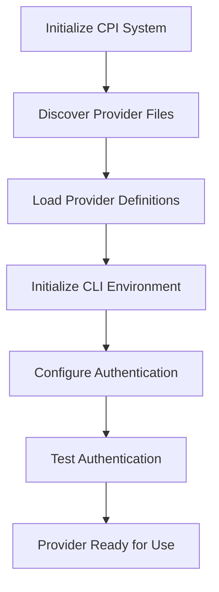

# Cloud Provider Interface (CPI) Standardization

## 1. Introduction

This document establishes standards for Cloud Provider Interface (CPI) implementations to ensure consistency across different providers while maintaining flexibility for provider-specific features. By following these standards, developers can create CPI providers that work seamlessly within the ecosystem and offer a predictable experience for users.

The CPI system balances standardization with flexibility. Core operations like creating, listing, and managing workers follow consistent patterns across providers, while allowing for platform-specific extensions and capabilities. This document outlines the minimum requirements for compliance along with optional methods that enhance functionality.

## 2. Required Methods

Every CPI provider must implement the following core methods to be considered compliant with the standard. These methods represent the fundamental operations that all cloud providers support.

### 2.1 Basic Provider Methods

| Method | Description | Required Parameters |
|--------|-------------|---------------------|
| `test_install` | Verifies that the provider's CLI tools are installed and accessible | None |
| `list_workers` | Lists all workers (virtual machines) | Region/zone (if applicable) |
| `create_worker` | Creates a new worker | Name, size/type, image/OS |
| `delete_worker` | Permanently removes a worker | Worker ID |
| `get_worker` | Retrieves details about a specific worker | Worker ID |
| `start_worker` | Powers on a stopped worker | Worker ID |
| `stop_worker` | Powers off a running worker | Worker ID |

### 2.2 Implementation Details

The `test_install` method should run a simple command (typically a version check) to verify that the necessary CLI tools for the provider are installed and accessible. This method helps users identify installation or configuration issues quickly.

```json
"test_install": {
  "command": "cloudco-cli --version",
  "params": [],
  "parse_rules": {
    "type": "object",
    "patterns": {
      "version": {
        "regex": "cloudco-cli version ([\\d\\.]+)",
        "group": 1
      }
    }
  }
}
```

The `list_workers` method should return all workers accessible to the authenticated user, with basic information about each worker. The output should include, at minimum, worker IDs, names, statuses, and types.

```json
"list_workers": {
  "command": "cloudco-cli workers list --region {region} --output json",
  "params": ["region"],
  "parse_rules": {
    "type": "array",
    "separator": "\\n",
    "patterns": {
      "id": {
        "regex": "\"id\":\\s*\"([^\"]+)\"",
        "group": 1
      },
      "name": {
        "regex": "\"name\":\\s*\"([^\"]+)\"",
        "group": 1
      },
      "status": {
        "regex": "\"status\":\\s*\"([^\"]+)\"",
        "group": 1
      },
      "type": {
        "regex": "\"type\":\\s*\"([^\"]+)\"",
        "group": 1
      }
    }
  }
}
```

The `create_worker` method provisions a new worker with the specified parameters. At minimum, it should support specifying the worker name, size/type, and image/OS. The method should return the worker ID and initial status.

```json
"create_worker": {
  "command": "cloudco-cli workers create --name {name} --type {type} --image {image} --region {region}",
  "params": ["name", "type", "image", "region"],
  "parse_rules": {
    "type": "properties",
    "patterns": {
      "id": {
        "regex": "\"id\":\\s*\"([^\"]+)\"",
        "group": 1
      },
      "name": {
        "regex": "\"name\":\\s*\"([^\"]+)\"",
        "group": 1
      },
      "status": {
        "regex": "\"status\":\\s*\"([^\"]+)\"",
        "group": 1
      }
    }
  }
}
```

The `delete_worker` method permanently removes a specified worker. This operation is typically irreversible, so implementations should include appropriate warnings in their documentation.

```json
"delete_worker": {
  "command": "cloudco-cli workers delete {worker_id}",
  "params": ["worker_id"],
  "parse_rules": {
    "type": "object",
    "patterns": {
      "success": {
        "regex": ".*",
        "transform": "boolean"
      }
    }
  }
}
```

The `get_worker` method retrieves detailed information about a specific worker, including its current status, specifications, and network configuration.

```json
"get_worker": {
  "command": "cloudco-cli workers describe {worker_id}",
  "params": ["worker_id"],
  "parse_rules": {
    "type": "properties",
    "patterns": {
      "id": {
        "regex": "\"id\":\\s*\"([^\"]+)\"",
        "group": 1
      },
      "name": {
        "regex": "\"name\":\\s*\"([^\"]+)\"",
        "group": 1
      },
      "status": {
        "regex": "\"status\":\\s*\"([^\"]+)\"",
        "group": 1
      },
      "type": {
        "regex": "\"type\":\\s*\"([^\"]+)\"",
        "group": 1
      },
      "ip_address": {
        "regex": "\"ip\":\\s*\"([^\"]+)\"",
        "group": 1,
        "optional": true
      }
    }
  }
}
```

The `start_worker` and `stop_worker` methods control the power state of a worker. These operations should be idempotent—calling start on an already running worker should not cause an error.

```json
"start_worker": {
  "command": "cloudco-cli workers start {worker_id}",
  "params": ["worker_id"],
  "parse_rules": {
    "type": "object",
    "patterns": {
      "success": {
        "regex": ".*",
        "transform": "boolean"
      }
    }
  }
}
```

## 3. Optional Methods

While the required methods provide basic functionality, optional methods enhance the CPI provider with additional capabilities. Implementing these methods allows for more sophisticated management operations.

### 3.1 Enhanced Worker Management

| Method | Description | Parameters |
|--------|-------------|------------|
| `reboot_worker` | Restarts a running worker | Worker ID |
| `resize_worker` | Changes a worker's size/type | Worker ID, new size/type |
| `rename_worker` | Changes a worker's name | Worker ID, new name |
| `update_worker` | Updates worker metadata or tags | Worker ID, metadata/tags |
| `has_worker` | Checks if a worker exists | Worker ID |

### 3.2 Storage Management

| Method | Description | Parameters |
|--------|-------------|------------|
| `list_disks` | Lists storage volumes | Region/zone (if applicable) |
| `create_disk` | Creates a new storage volume | Name, size, type |
| `delete_disk` | Removes a storage volume | Disk ID |
| `attach_disk` | Attaches a volume to a worker | Worker ID, disk ID |
| `detach_disk` | Detaches a volume from a worker | Worker ID, disk ID |
| `resize_disk` | Changes a volume's size | Disk ID, new size |
| `has_disk` | Checks if a disk exists | Disk ID |

### 3.3 Image Management

| Method | Description | Parameters |
|--------|-------------|------------|
| `list_images` | Lists available OS images | Region/zone (if applicable) |
| `create_snapshot` | Creates a worker snapshot | Worker ID, snapshot name |
| `list_snapshots` | Lists available snapshots | Worker ID (optional) |
| `delete_snapshot` | Removes a snapshot | Snapshot ID |
| `has_snapshot` | Checks if a snapshot exists | Snapshot ID |

### 3.4 Network Management

| Method | Description | Parameters |
|--------|-------------|------------|
| `list_networks` | Lists available networks | Region/zone (if applicable) |
| `create_network` | Creates a new network | Name, CIDR range |
| `delete_network` | Removes a network | Network ID |
| `list_subnets` | Lists subnets within a network | Network ID |
| `create_subnet` | Creates a new subnet | Network ID, CIDR range |
| `delete_subnet` | Removes a subnet | Subnet ID |
| `list_firewall_rules` | Lists firewall rules | Network ID (optional) |
| `create_firewall_rule` | Creates a new firewall rule | Direction, protocol, ports, etc. |
| `delete_firewall_rule` | Removes a firewall rule | Rule ID |

### 3.5 Authentication and Account Management

| Method | Description | Parameters |
|--------|-------------|------------|
| `configure_auth` | Configures authentication credentials | API key, token, credentials file, etc. |
| `test_auth` | Tests if current authentication is valid | None |
| `get_account_info` | Retrieves information about the current account | None |
| `list_credentials` | Lists available credentials | Credential type (optional) |
| `create_credential` | Creates a new credential | Credential name, type, permissions |
| `delete_credential` | Removes a credential | Credential ID |
| `rotate_credential` | Rotates/regenerates a credential | Credential ID |
| `set_default_project` | Sets the default project or organization | Project ID |
| `list_projects` | Lists available projects or organizations | None |

### 3.6 CLI Setup and Initialization

| Method | Description | Parameters |
|--------|-------------|------------|
| `initialize_cli` | Sets up the CLI environment | Installation path, version |
| `setup_environment` | Configures environment variables | Variable names and values |
| `update_cli` | Updates the CLI to the latest version | Version (optional) |
| `validate_prerequisites` | Checks if all prerequisites are met | None |
| `install_plugin` | Installs a CLI plugin | Plugin name, version |

### 3.7 Metadata and Infrastructure

| Method | Description | Parameters |
|--------|-------------|------------|
| `list_regions` | Lists available regions/locations | None |
| `list_zones` | Lists zones within a region | Region |
| `list_worker_types` | Lists available worker types/sizes | Region/zone (if applicable) |
| `get_pricing` | Retrieves pricing information | Resource type, size |
| `get_quota` | Retrieves account resource quotas | Resource type |

## 4. Example CPI Implementation for "CloudCo"

Below is an example implementation for a fictional cloud provider called "CloudCo" that meets the minimum CPI requirements while also implementing some optional methods, including authentication and CLI initialization.

### 4.1 Provider Definition

```json
{
  "name": "cloudco",
  "type": "command",
  "default_settings": {
    "region": "us-central",
    "worker_type": "standard-2",
    "image": "ubuntu-20-04",
    "network": "default",
    "cli_path": "/usr/local/bin/cloudco-cli"
  },
  "actions": {
    "initialize_cli": { ... },
    "configure_auth": { ... },
    "test_auth": { ... },
    "test_install": { ... },
    "list_workers": { ... },
    "create_worker": { ... },
    "delete_worker": { ... },
    "get_worker": { ... },
    "start_worker": { ... },
    "stop_worker": { ... },
    "reboot_worker": { ... },
    "list_disks": { ... },
    "create_disk": { ... },
    "attach_disk": { ... },
    "list_regions": { ... },
    "get_account_info": { ... }
  }
}
```

### 4.2 Required Method: Create Worker

```json
"create_worker": {
  "command": "cloudco-cli worker create --name {name} --type {worker_type} --image {image} --region {region} --network {network}",
  "params": [
    "name",
    "worker_type",
    "image",
    "region",
    "network"
  ],
  "parse_rules": {
    "type": "properties",
    "patterns": {
      "id": {
        "regex": "Worker ID:\\s+([a-z0-9-]+)",
        "group": 1
      },
      "name": {
        "regex": "Name:\\s+([^\\n]+)",
        "group": 1
      },
      "ip_address": {
        "regex": "IP Address:\\s+([0-9\\.]+)",
        "group": 1,
        "optional": true
      },
      "status": {
        "regex": "Status:\\s+(\\w+)",
        "group": 1
      }
    }
  }
}
```

### 4.3 Authentication Method: Configure Auth

```json
"configure_auth": {
  "command": "cloudco-cli auth configure --api-key {api_key} --project {project_id}",
  "params": [
    "api_key",
    "project_id"
  ],
  "parse_rules": {
    "type": "object",
    "patterns": {
      "success": {
        "regex": "Authentication configured successfully",
        "transform": "boolean"
      },
      "account_id": {
        "regex": "Account ID:\\s+([a-z0-9-]+)",
        "group": 1,
        "optional": true
      },
      "username": {
        "regex": "Username:\\s+([^\\n]+)",
        "group": 1,
        "optional": true
      }
    }
  }
}
```

### 4.4 CLI Setup Method: Initialize CLI

```json
"initialize_cli": {
  "command": "bash -c 'if ! command -v {cli_path} &> /dev/null; then curl -sSL https://downloads.cloudco.io/cli/install.sh | bash -s -- --version {cli_version} --install-dir $(dirname {cli_path}); fi'",
  "params": [
    "cli_path",
    "cli_version"
  ],
  "parse_rules": {
    "type": "object",
    "patterns": {
      "success": {
        "regex": "Installation complete|already installed",
        "transform": "boolean"
      },
      "version": {
        "regex": "Installed version:\\s+([\\d\\.]+)",
        "group": 1,
        "optional": true
      }
    }
  }
}
```

### 4.5 Account Method: Get Account Info

```json
"get_account_info": {
  "command": "cloudco-cli account info --format detailed",
  "params": [],
  "parse_rules": {
    "type": "properties",
    "patterns": {
      "account_id": {
        "regex": "Account ID:\\s+([a-z0-9-]+)",
        "group": 1
      },
      "name": {
        "regex": "Account Name:\\s+([^\\n]+)",
        "group": 1
      },
      "plan": {
        "regex": "Plan:\\s+([^\\n]+)",
        "group": 1
      },
      "credit_balance": {
        "regex": "Credit Balance:\\s+\\$([\\d\\.]+)",
        "group": 1,
        "transform": "number",
        "optional": true
      },
      "active_workers": {
        "regex": "Active Workers:\\s+(\\d+)",
        "group": 1,
        "transform": "number"
      },
      "total_storage_gb": {
        "regex": "Total Storage:\\s+(\\d+)\\s*GB",
        "group": 1,
        "transform": "number"
      }
    }
  }
}
```

### 4.6 Optional Method: Create Disk

```json
"create_disk": {
  "command": "cloudco-cli disk create --name {disk_name} --size {size_gb} --type {disk_type} --region {region}",
  "params": [
    "disk_name",
    "size_gb",
    "disk_type",
    "region"
  ],
  "parse_rules": {
    "type": "properties",
    "patterns": {
      "id": {
        "regex": "Disk ID:\\s+([a-z0-9-]+)",
        "group": 1
      },
      "name": {
        "regex": "Name:\\s+([^\\n]+)",
        "group": 1
      },
      "size": {
        "regex": "Size:\\s+(\\d+)\\s*GB",
        "group": 1,
        "transform": "number"
      },
      "type": {
        "regex": "Type:\\s+(\\w+)",
        "group": 1
      }
    }
  }
}
```

## 5. Method Naming Conventions

To maintain consistency across providers, CPI implementations should follow these naming conventions:

### 5.1 Core Resource Operations

- `list_[resources]` - For retrieving collections of resources
- `create_[resource]` - For creating a new resource
- `delete_[resource]` - For removing a resource
- `get_[resource]` - For retrieving details about a specific resource
- `has_[resource]` - For checking if a resource exists

### 5.2 Worker State Operations

- `start_worker` - For powering on a worker
- `stop_worker` - For powering off a worker
- `reboot_worker` - For restarting a worker
- `suspend_worker` - For suspending a worker (pause state)
- `resume_worker` - For resuming a suspended worker

### 5.3 Resource Modification

- `update_[resource]` - For updating resource properties
- `resize_[resource]` - For changing resource size
- `rename_[resource]` - For changing resource name
- `tag_[resource]` - For adding tags to a resource
- `untag_[resource]` - For removing tags from a resource

### 5.4 Attachment Operations

- `attach_[resource]` - For connecting resources (e.g., disk to worker)
- `detach_[resource]` - For disconnecting resources

## 6. Standardization Guidelines

### 6.1 Status Standardization

Status values should be normalized across providers to ensure consistent behavior. The following standard statuses should be used:

| Standard Status | Description |
|-----------------|-------------|
| `running` | Worker is active and running |
| `stopped` | Worker is powered off but still exists |
| `starting` | Worker is in the process of powering on |
| `stopping` | Worker is in the process of powering off |
| `provisioning` | Worker is being created/configured |
| `terminating` | Worker is being deleted |
| `error` | Worker is in an error state |
| `suspended` | Worker is paused/suspended |

### 6.2 Authentication Status Standardization

For authentication methods, standardize status reporting:

| Standard Status | Description |
|-----------------|-------------|
| `authenticated` | Authentication is valid and active |
| `unauthenticated` | No authentication configured |
| `expired` | Authentication has expired |
| `invalid` | Authentication credentials are invalid |
| `insufficient_permissions` | Authenticated but missing required permissions |

Provider-specific statuses should be mapped to these standard values when possible. If a provider status doesn't map cleanly to a standard status, providers can include both the raw status and the mapped status in their output.

## 7. Parameter Standardization

To promote consistency, CPI implementations should use standardized parameter names where applicable:

| Parameter | Description |
|-----------|-------------|
| `worker_id` | Identifier for a worker |
| `name` | Resource name |
| `region` | Geographic region |
| `zone` | Availability zone within a region |
| `worker_type` | Type/size of worker |
| `image` | OS image identifier |
| `disk_id` | Identifier for a disk/volume |
| `disk_type` | Type of storage (SSD, HDD, etc.) |
| `size_gb` | Size in gigabytes |
| `network` | Network identifier |
| `subnet` | Subnet identifier |
| `ip_address` | IP address |

## 8. CPI Lifecycle and Initialization Process

The CPI system follows a defined lifecycle that starts with CLI initialization and ends with resource management. Understanding this flow helps implementers build robust providers.

### 8.1 Standard Initialization Sequence



### 8.2 Recommended Initialization Implementation

When implementing a new CPI provider, follow this sequence for initialization:

1. **CLI Setup**: Ensure the CLI tools are installed and properly configured
   ```json
   "initialize_cli": {
     "command": "...",
     "params": ["cli_path", "cli_version"],
     "parse_rules": { ... }
   }
   ```

2. **Authentication Configuration**: Set up credentials for accessing the cloud provider
   ```json
   "configure_auth": {
     "command": "...",
     "params": ["api_key", "project_id"],
     "parse_rules": { ... }
   }
   ```

3. **Authentication Validation**: Verify that authentication is working properly
   ```json
   "test_auth": {
     "command": "...",
     "params": [],
     "parse_rules": { ... }
   }
   ```

4. **Installation Testing**: Verify that the CLI is installed and accessible
   ```json
   "test_install": {
     "command": "...",
     "params": [],
     "parse_rules": { ... }
   }
   ```

This sequence ensures that the CPI provider is properly set up before any resource management commands are executed.