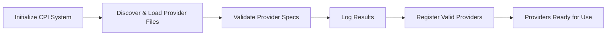

# Cloud Provider Interface (CPI) Specification

## 1. Introduction

The Cloud Provider Interface (CPI) system provides a unified way to interact with different cloud and virtualization platforms through a consistent API. Rather than writing custom code for each provider, developers can leverage the CPI's abstraction layer, which translates standardized commands into provider-specific actions. This specification outlines how the system works, the structure of provider definitions, and patterns for effective implementation and usage.

## 2. Core Architecture

The CPI framework uses a modular design to separate concerns and maintain flexibility. At its heart, the system translates high-level requests into provider-specific commands, executes those commands, and transforms their outputs into structured data.

### 2.1 System Components

The CPI system relies on several interconnected components to function. The Provider Registry serves as the central hub for managing available provider implementations, while the Executor handles command execution with proper parameter substitution. Command outputs flow through the Parser, which extracts structured data according to defined rules. A Validator ensures all provider definitions adhere to the required schema. The Error Handler creates uniform error representations across different providers, and the Logger captures detailed information for troubleshooting and auditing.

### 2.2 Initialization Flow

When a CPI system initializes, it goes through several important stages to discover, validate, and register providers. This process ensures that only valid providers are available for use.



## 3. Provider Definition Schema

### 3.1 Provider File Structure

Each provider is defined in a JSON file with the following top-level structure:

```json
{
  "name": "provider_name",
  "type": "command",
  "default_settings": {
    "setting1": "default_value1",
    "setting2": "default_value2"
  },
  "actions": {
    "action1": { ... },
    "action2": { ... }
  }
}
```

| Field | Description | Required |
|-------|-------------|----------|
| `name` | Unique provider identifier | Yes |
| `type` | Provider type (e.g., command, virt, cloud, container) | Yes |
| `default_settings` | Default parameters for actions | No |
| `actions` | Collection of available actions | Yes |

### 3.2 Action Definition

Each action defines a command to execute and how to parse its output:

```json
"action_name": {
  "command": "executable {param1} --option {param2}",
  "params": ["param1", "param2"],
  "pre_exec": [ ... ],
  "post_exec": [ ... ],
  "parse_rules": { ... }
}
```

| Field | Description | Required |
|-------|-------------|----------|
| `command` | Command template with parameter placeholders | Yes |
| `params` | List of required parameters | No |
| `pre_exec` | Actions to execute before the main command | No |
| `post_exec` | Actions to execute after the main command | No |
| `parse_rules` | Rules for parsing the command output | Yes |

## 4. Parameter Handling

### 4.1 Parameter Substitution

Parameters are referenced in command templates using curly braces:

```
"command": "aws ec2 describe-instances --region {region} --output json"
```

### 4.2 Parameter Resolution

Parameters are resolved in the following order:

1. User-provided parameters specific to the action call
2. Provider's default settings
3. If parameter is not found, an error is raised (for required parameters)

### 4.3 Optional Parameters

Parameters can be constructed conditionally by using separate parameters:

```json
"ssh_key_param": "--ssh-key {ssh_key}"
```

This allows parameters to be included only when needed.

## 5. Parse Rules

Converting command-line output into structured data is one of the CPI's most powerful features. Parse rules define how to extract meaningful information from raw command outputs, whether they're formatted as JSON, tabular data, or unstructured text.

### 5.1 Parse Rule Types

The CPI supports three parsing strategies to handle different output formats:

#### 5.1.1 Object Parse Rules

The object parser extracts a single cohesive entity with multiple attributes. This works well for commands that return information about a specific resource, like a VM instance or storage volume. Each field is extracted using its own regex pattern:

```json
"parse_rules": {
  "type": "object",
  "patterns": {
    "id": {
      "regex": "Instance ID: ([\\w-]+)",
      "group": 1
    },
    "status": {
      "regex": "Status: (\\w+)",
      "group": 1
    }
  }
}
```

#### 5.1.2 Array Parse Rules

When dealing with lists of items, the array parser shines. It splits output by a defined separator (often newlines) and applies extraction patterns to each segment. This works perfectly for commands that list resources like VMs, storage volumes, or network interfaces:

```json
"parse_rules": {
  "type": "array",
  "separator": "\\n",
  "patterns": {
    "id": {
      "regex": "^(\\d+)",
      "group": 1,
      "transform": "number"
    },
    "name": {
      "regex": "^\\d+\\s+([^\\s]+)",
      "group": 1
    }
  }
}
```

#### 5.1.3 Properties Parse Rules

For more complex outputs with nested structures, the properties parser provides additional capabilities. Beyond basic property extraction, it can handle arrays of sub-objects and related patterns. This parser type excels at extracting detailed configuration information:

```json
"parse_rules": {
  "type": "properties",
  "patterns": {
    "id": {
      "regex": "ID: (\\d+)",
      "group": 1,
      "transform": "number"
    }
  },
  "array_patterns": {
    "network_adapters": {
      "prefix": "nic",
      "index": "\\d+",
      "object": {
        "type": {
          "regex": "^nic(\\d+)=\"(.*)\"$",
          "group": 2
        }
      }
    }
  },
  "related_patterns": { ... }
}
```

### 5.2 Pattern Specification

Each pattern consists of:

| Field | Description | Required |
|-------|-------------|----------|
| `regex` | Regular expression to match the desired data | Yes |
| `group` | Capture group index in the regex (default: 0) | No |
| `transform` | Value transformation: "boolean", "number" | No |
| `optional` | Whether the pattern is optional (default: false) | No |
| `match_value` | Reference to another value for comparison | No |

### 5.3 Value Transformation

Values can be transformed using:

- `boolean`: Converts extracted value to boolean
- `number`: Converts extracted value to number

## 6. Execution Workflow

### 6.1 Command Execution Process

The command execution flow represents how CPI processes a request from preparation to completion. Each request goes through a well-defined lifecycle that includes parameter preparation, command execution, output parsing, and result delivery.


### 6.2 Error Handling

Robust error handling makes the CPI system reliable and debuggable. All errors are captured in a standardized `CpiError` type, which provides consistent error reporting across different providers and operations.

When things go wrong during provider initialization or command execution, the CPI system returns meaningful errors that help diagnose and fix issues. Provider errors might indicate that a necessary cloud CLI tool isn't installed. Action errors often point to missing parameters or permissions problems. Parsing errors typically suggest that command output doesn't match the expected format, which might happen after a provider API change.

The system defines several error categories including `ProviderNotFound` when a requested provider isn't available, `ActionNotFound` when trying to use an undefined action, `MissingParameter` when required inputs are missing, and `ExecutionFailed` when a command doesn't complete successfully. Other error types handle parsing issues (`ParseError`), path problems (`InvalidPath`), specification errors (`InvalidCpiFormat`), provider loading failures (`NoProvidersLoaded`), I/O problems (`IoError`), JSON handling errors (`SerdeError`), regular expression issues (`RegexError`), and command timeouts (`Timeout`).

## 7. Provider Ecosystem

The CPI system boasts a rich ecosystem of providers covering major cloud platforms and virtualization technologies. This diversity allows applications to work with multiple infrastructure providers without code changes.

For public cloud environments, the CPI includes providers for AWS, Azure, and Google Cloud Platform, covering the biggest players in the market. It also supports popular alternative cloud providers like DigitalOcean, Linode, Vultr, OVH Cloud, Hetzner Cloud, Oracle Cloud, Scaleway, UpCloud, and DeTee. Each provider implements the common interface while respecting the unique characteristics of its underlying platform.

The system extends beyond public clouds to virtualization technologies. Users can manage KVM and QEMU virtual machines with the same API they use for cloud resources. Similarly, providers for Proxmox, VMware ESXi, and VirtualBox (with specific implementations for both Windows and Linux) bring enterprise and desktop virtualization platforms into the fold.

## 8. Working with the CPI System

### 8.1 Integration Examples

Working with the CPI system is straightforward once you understand the basic patterns. After initialization, your application can discover available providers, examine their capabilities, and execute actions with appropriate parameters. The following Rust example demonstrates a typical usage flow:

```rust
// Initialize the CPI system
let cpi = cpi::initialize()?;

// List available providers
let providers = cpi.get_providers();
println!("Available providers: {:?}", providers);

// Execute an action
let params = HashMap::new();
params.insert("region".to_string(), "us-east-1".into());

let result = cpi.execute("aws", "list_instances", params)?;
println!("Result: {:?}", result);
```

This pattern works identically across providers, allowing your code to remain consistent regardless of which cloud platform you're targeting. The CPI system handles the translation between your standardized requests and provider-specific commands.

### 8.2 Provider Definition Example

The AWS provider illustrates how provider definitions map cloud-specific commands to the CPI framework. Even this simple example shows the power of parameter substitution and output parsing:

```json
{
  "name": "aws",
  "type": "command",
  "default_settings": {
    "region": "us-east-1"
  },
  "actions": {
    "list_instances": {
      "command": "aws ec2 describe-instances --region {region} --output json",
      "params": ["region"],
      "parse_rules": {
        "type": "object",
        "patterns": {
          "output": {
            "regex": "(.*)",
            "group": 1
          }
        }
      }
    }
  }
}
```

The provider defines a default region while allowing users to override it. The `list_instances` action translates to the appropriate AWS CLI command with parameter substitution for the region. A simple parsing rule captures the entire output, which is already in JSON format from the AWS CLI.


## 9. Provider Implementation Guidelines

Creating a new CPI provider requires careful planning and attention to detail. Start by choosing descriptive, consistent names for your provider and its actions. Names should reflect the services they represent and follow established patterns from existing providers. Document all parameters thoroughly, explaining their purpose, format, and any default values or constraints.

Error handling deserves special attention in provider implementations. Validate inputs before executing commands to catch issues early, and handle execution errors with clear, actionable messages. When crafting parse rules, anticipate variations in command output formats to make your provider robust against minor changes in the underlying tools.

Default settings improve usability by reducing the number of parameters users must specify. Include sensible defaults for common parameters while allowing overrides for special cases. Every provider should include a `test_install` action to verify that the necessary tools are available and correctly configured. This simple diagnostic helps users troubleshoot setup issues.

Authentication mechanisms should align with the underlying service's standards. For cloud providers, this typically involves environment variables or configuration files in standard locations. Document the minimum required versions of any underlying tools to help users avoid compatibility problems.