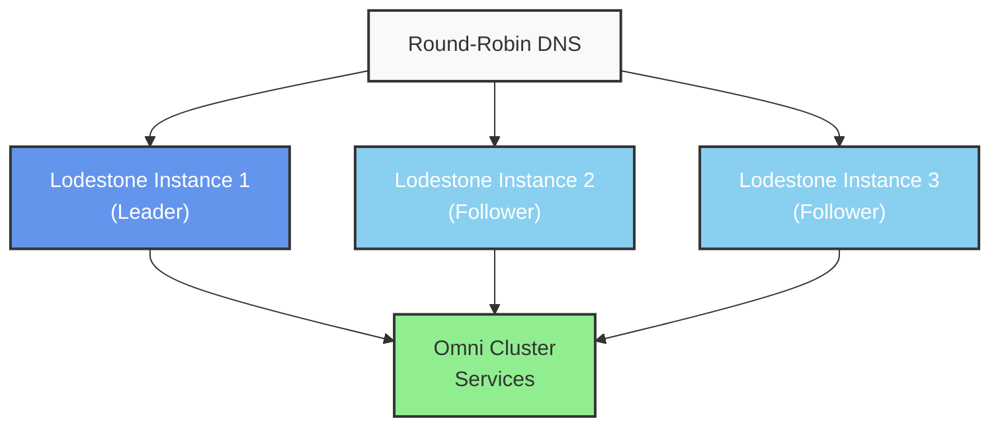

# Lodestone Usage Guide: Omni's Service Discovery and Routing System

## Table of Contents
- [Overview](#overview)
- [Architecture](#architecture)
- [Deployment Model](#deployment-model)
- [Configuration](#configuration)
- [Service Registration](#service-registration)
- [Service Discovery](#service-discovery)
- [Routing Capabilities](#routing-capabilities)
- [High Availability](#high-availability)
- [Security](#security)
- [Monitoring and Management](#monitoring-and-management)
- [Integration with Omni](#integration-with-omni)
- [Troubleshooting](#troubleshooting)
- [Best Practices](#best-practices)

## Overview

Lodestone serves as Omni's internal service discovery and routing system, providing a critical infrastructure component that manages network traffic routing, load balancing, and service registration across the Omni cluster. Written in Rust for performance and reliability, Lodestone maintains a distributed registry of all available services and intelligently routes client requests to the appropriate service instances.

At its core, Lodestone provides four essential capabilities:

1. **Service Discovery** - Maintains a real-time registry of all services running in the Omni environment
2. **Intelligent Routing** - Directs traffic to appropriate service instances based on availability and load
3. **Load Balancing** - Distributes requests across multiple instances of the same service
4. **High Availability** - Uses Raft consensus to maintain reliable operation even during node failures

Lodestone plays a pivotal role in Omni's infrastructure by enabling dynamic service management without manual configuration. As services come online, they register with Lodestone, making themselves immediately available to other components in the system. This self-registering behavior is key to Omni's self-managing architecture.

## Architecture

Lodestone operates as a cluster of instances deployed at the edge of your Omni network. The architecture consists of the following components:

**Service Registry** - The central data store containing information about all registered services, including their addresses, health status, and metadata. This registry is distributed across all Lodestone instances and kept in sync through the Raft consensus protocol.

**Routing Engine** - Processes incoming requests and determines which service instance should handle each request based on routing rules, load balancing algorithms, and service health.

**Consensus Module** - Implements the Raft protocol to maintain consistent state across the Lodestone cluster, handling leader election and data replication to ensure all nodes have the same view of registered services.

**Health Checker** - Actively monitors the health of registered services, automatically removing unhealthy instances from the routing table.

**API Server** - Provides RESTful endpoints for service registration, deregistration, queries, and cluster management.

All of these components work together to provide a highly available, centralized routing layer that all network traffic passes through before reaching specific services within the Omni environment.

## Deployment Model

In Omni's infrastructure, Lodestone instances are deployed in a specific pattern to maximize reliability and performance:

1. **Edge Deployment** - Lodestone instances are positioned at the network edge, serving as the entry point for all incoming traffic to the Omni cluster.

2. **Round-Robin DNS** - Multiple Lodestone instances are registered behind a single DNS name using round-robin DNS. This distributes initial client connections across all available instances.

3. **Raft Cluster** - All Lodestone instances form a Raft consensus cluster, with one node acting as the leader while others serve as followers. The leader handles write operations to the service registry, while all nodes (including followers) can serve read requests and route traffic.

A typical production deployment consists of at least three Lodestone instances to provide fault tolerance in the Raft cluster. The Lodestone instances are typically deployed across different physical nodes to protect against hardware failures.



### Why do it this way?

While DNS-based load balancing provides a simple entry point, DNS alone would be insufficient for Omni's service discovery needs. DNS propagation delays (often minutes to hours depending on TTL settings and client caching) would make service registration and deregistration far too slow for a dynamic microservices environment.

Lodestone overcomes this limitation by handling real-time service discovery internally, with the DNS round-robin serving only as the stable entry point to the Lodestone cluster itself. When services start, stop, or change within the Omni ecosystem, Lodestone immediately updates its routing tables without waiting for DNS propagation, enabling sub-second service discovery and failure handling that would be impossible with DNS alone.

This deployment model ensures that:
- There is no single point of failure in the routing layer
- Traffic can be dynamically rerouted if a Lodestone instance fails
- The service registry remains consistent across all instances
- Load is distributed across all available Lodestone instances

## Configuration

Configuring Lodestone for use within Omni involves setting up both the individual instances and the cluster as a whole. Configuration is managed through TOML files located in the `config/` directory.

### Basic Configuration

A standard Lodestone configuration includes the following sections:

```toml
[server]
host = "0.0.0.0"  # Listen on all interfaces
port = 8080       # HTTP API port
proxy_port = 8443 # HTTPS port for proxied traffic

[security]
jwt_secret = "your-secret-key"       # Used for API authentication
cert_path = "certs/server.crt"       # TLS certificate
key_path = "certs/server.key"        # TLS private key
client_auth = false                  # Whether to require client certificates

[raft]
node_id = 1                          # Unique ID for this node
data_dir = "data"                    # Directory for Raft state
peers = ["10.0.1.2:8081", "10.0.1.3:8081"] # Other cluster members
election_timeout = 1000              # Milliseconds
heartbeat_interval = 100             # Milliseconds

[routing]
default_timeout = 30000              # Request timeout in milliseconds
max_connections = 10000              # Maximum concurrent connections
circuit_breaker_threshold = 5        # Failures before circuit opens
circuit_breaker_reset = 30000        # Time before retry in milliseconds
```

### Cluster Configuration

To set up a Lodestone cluster, each instance needs to be aware of the others. This is configured in the `[raft]` section's `peers` setting. Each instance should have a unique `node_id` and list all other instances as peers.

For example, a three-node cluster would have configurations like:

**Node 1:**
```toml
[raft]
node_id = 1
peers = ["10.0.1.2:8081", "10.0.1.3:8081"]
```

**Node 2:**
```toml
[raft]
node_id = 2
peers = ["10.0.1.1:8081", "10.0.1.3:8081"]
```

**Node 3:**
```toml
[raft]
node_id = 3
peers = ["10.0.1.1:8081", "10.0.1.2:8081"]
```

### Omni Integration Configuration

For integration with the broader Omni environment, additional configuration is needed:

```toml
[omni]
orchestrator_endpoints = ["https://orchestrator-1:8443", "https://orchestrator-2:8443"]
authentication_enabled = true
token_refresh_interval = 3600  # Seconds
service_sync_interval = 60     # Seconds
```

This configuration establishes the connection between Lodestone and Omni Orchestrators, allowing for automated service registration based on deployed applications.

## Service Registration

Services can be registered with Lodestone in several ways:

### 1. Automatic Registration via Omni

In most cases, services deployed through Omni are automatically registered with Lodestone. When an application is deployed via the Omni Orchestrator, it generates a service registration event that is sent to Lodestone. This registration includes:

- Service name and ID
- Service endpoints (host and port)
- Health check configuration
- Metadata (including version, environment, etc.)

This automated registration ensures that newly deployed services are immediately available for discovery and routing.

### 2. Manual Registration via API

Services can also be manually registered using Lodestone's REST API:

```bash
curl -X POST https://lodestone.cluster:8080/services \
  -H "Authorization: Bearer $JWT_TOKEN" \
  -H "Content-Type: application/json" \
  -d '{
    "name": "my-service",
    "id": "my-service-1",
    "address": "10.0.2.15",
    "port": 8000,
    "health_check": {
      "path": "/health",
      "interval": 10,
      "timeout": 2,
      "healthy_threshold": 2,
      "unhealthy_threshold": 3
    },
    "metadata": {
      "version": "1.0.0",
      "environment": "production"
    }
  }'
```

### 3. Registration via Configuration

For static services that are always present, registration can be included in the Lodestone configuration:

```toml
[[services]]
name = "core-api"
id = "core-api-1"
address = "10.0.3.10"
port = 9000
health_check = { path = "/health", interval = 15, timeout = 3 }
metadata = { version = "2.1.0", critical = "true" }
```

This approach is typically used for foundational services that need to be available even during system initialization.

### Service Deregistration

Services are deregistered from Lodestone in three ways:

1. **Explicit deregistration** - Services can call the deregistration API when shutting down gracefully:
   ```bash
   curl -X DELETE https://lodestone.cluster:8080/services/my-service-1 \
     -H "Authorization: Bearer $JWT_TOKEN"
   ```

2. **Health check failure** - If a service fails its health checks consistently, it is automatically deregistered.

3. **TTL expiration** - Services can register with a time-to-live value, after which they are automatically deregistered if not renewed.

## Service Discovery

Once services are registered with Lodestone, they can be discovered by other applications and components within the Omni environment.

### Discovery Methods

Lodestone supports several methods for service discovery:

#### 1. DNS-Based Discovery

Lodestone provides DNS SRV records for registered services, allowing clients to discover services using standard DNS lookups:

```bash
dig SRV _my-service._tcp.service.omni.local
```

This returns DNS records pointing to the available instances of `my-service`.

#### 2. HTTP API Discovery

Services can be discovered programmatically via the Lodestone API:

```bash
curl https://lodestone.cluster:8080/services?name=my-service \
  -H "Authorization: Bearer $JWT_TOKEN"
```

This returns a JSON array of all registered instances of `my-service` with their details.

#### 3. Client-Side Service Discovery

Applications can implement client-side service discovery by querying Lodestone's API directly and maintaining a local cache of service information. The Lodestone client libraries (available for multiple languages) simplify this approach:

```rust
use lodestone_client::ServiceDiscovery;

let client = ServiceDiscovery::new("https://lodestone.cluster:8080", "jwt_token");
let service = client.discover("my-service").await?;
let endpoint = format!("http://{}:{}", service.address, service.port);
```

#### 4. Transparent Proxy Discovery

The most common approach in Omni is transparent proxy discovery, where clients simply connect to the service name through Lodestone, which automatically routes the request to an appropriate instance:

```bash
curl https://my-service.service.omni.local/api/resource
```

This request is received by Lodestone, which looks up available instances of `my-service` and forwards the request to one of them based on load balancing rules.

### Filtering and Selection

When discovering services, clients can filter based on various criteria:

- **Tags/Metadata** - Select services with specific tags or metadata values
- **Version** - Filter for specific service versions
- **Health Status** - Only discover healthy service instances
- **Datacenter/Region** - Select services in specific locations

For example:

```bash
curl "https://lodestone.cluster:8080/services?name=my-service&metadata.version=1.0.0&healthy=true" \
  -H "Authorization: Bearer $JWT_TOKEN"
```

## Routing Capabilities

Lodestone's routing layer sits between clients and services, intelligently directing traffic based on various rules and conditions.

### Load Balancing

Lodestone supports multiple load balancing algorithms:

- **Round Robin** - Distributes requests evenly across all service instances in rotation
- **Least Connection** - Routes to the instance with the fewest active connections
- **Response Time** - Prefers instances with faster response times
- **Consistent Hash** - Routes requests with the same key to the same instance (useful for caching)
- **Weighted Round Robin** - Allows some instances to receive proportionally more traffic

The default algorithm is Round Robin, but this can be configured globally or per-service:

```toml
[routing]
default_load_balancer = "round_robin"

[[services]]
name = "stateful-service"
load_balancer = "consistent_hash"
hash_on = "header:X-User-ID"
```

### Circuit Breaking

Lodestone implements the circuit breaker pattern to prevent cascading failures:

1. When a service instance fails repeatedly (exceeding the `circuit_breaker_threshold`), the circuit "opens" and no further requests are sent to that instance
2. After the `circuit_breaker_reset` period, a single test request is sent
3. If successful, the circuit "closes" and normal routing resumes; if not, the circuit remains open

This protects against routing traffic to failing instances and allows time for automatic or manual recovery.

### Path-Based Routing

Services can register for specific path prefixes, allowing Lodestone to route based on the request URL:

```json
{
  "name": "user-service",
  "id": "user-service-1",
  "address": "10.0.2.20",
  "port": 8001,
  "paths": ["/api/users", "/api/profiles"]
}
```

With this configuration, requests to `/api/users/*` or `/api/profiles/*` would be routed to the user-service.

### Header-Based Routing

Routing can also be based on HTTP headers, enabling scenarios like canary deployments or A/B testing:

```json
{
  "name": "payment-service",
  "id": "payment-service-v2",
  "address": "10.0.2.25",
  "port": 8002,
  "header_rules": [
    {"name": "X-Version", "value": "2.0", "operator": "contains"}
  ]
}
```

This configuration routes requests with `X-Version: 2.0` header to the v2 instance of the payment service.

### WebSocket Support

Lodestone fully supports WebSocket connections, maintaining persistent connections between clients and services:

```json
{
  "name": "realtime-updates",
  "id": "realtime-1",
  "address": "10.0.2.30",
  "port": 8003,
  "protocols": ["http", "websocket"]
}
```

WebSocket connections are load balanced on initial connection, then maintained with the same service instance for the duration of the session.

## High Availability

Lodestone's high availability model is built around the Raft consensus algorithm, ensuring that the service registry remains consistent and available even during node failures.

### Raft Consensus

The Lodestone cluster elects a leader through the Raft protocol. The leader handles all write operations to the service registry, while both the leader and followers can serve read operations. If the leader fails, a new election automatically selects a replacement leader from the remaining nodes.

Key Raft parameters that affect availability:

- `election_timeout` - How long a follower waits without hearing from the leader before initiating an election
- `heartbeat_interval` - How frequently the leader sends heartbeats to followers
- `commit_timeout` - Maximum time before a change must be committed to a majority of nodes

These parameters can be tuned based on network conditions and reliability requirements.

### State Persistence

Raft state is persisted to disk in the directory specified by `data_dir`, allowing nodes to recover their state after a restart. This includes:

- The complete service registry
- Raft log entries
- Cluster membership information

Regular backups of this data directory are recommended as part of operation procedures.

### Node Recovery

When a Lodestone node fails and restarts, it goes through these recovery steps:

1. Load persisted state from disk
2. Connect to other cluster members
3. Catch up on any missed registry changes
4. Resume serving requests (either as a follower or potentially as the leader)

This process is automatic and requires no manual intervention under normal circumstances.

### Monitoring Raft Status

The Raft cluster status can be monitored through the Lodestone API:

```bash
curl https://lodestone.cluster:8080/cluster/status \
  -H "Authorization: Bearer $JWT_TOKEN"
```

This returns information about the current leader, the state of all nodes, and replication status.

## Security

Lodestone implements several security features to protect service communication:

### TLS Encryption

All communication to and from Lodestone is encrypted using TLS. This includes:

- Client to Lodestone connections
- Lodestone to service connections
- Intra-cluster communication between Lodestone instances

TLS certificates are configured in the `[security]` section:

```toml
[security]
cert_path = "certs/server.crt"
key_path = "certs/server.key"
ca_cert_path = "certs/ca.crt"  # For verifying client certificates
```

In production, these certificates should be issued by a trusted certificate authority and regularly rotated.

### Authentication

Lodestone supports multiple authentication methods:

1. **JWT Authentication** - For API access and service registration
2. **TLS Client Certificates** - For mutual TLS authentication
3. **API Keys** - For programmatic access

JWT authentication is configured with:

```toml
[security]
jwt_secret = "your-secret-key"
jwt_issuer = "omni.auth"
jwt_audience = "lodestone.api"
```

For integration with Omni's authentication system, additional configuration is needed:

```toml
[security.omni_auth]
enabled = true
auth_endpoint = "https://orchestrator:8443/auth"
service_account = "lodestone-proxy"
service_account_key = "key-file-path"
```

### Authorization

Lodestone implements role-based access control (RBAC) for its API:

```toml
[security.rbac]
enabled = true
default_policy = "deny"

[[security.rbac.roles]]
name = "admin"
permissions = ["service:read", "service:write", "cluster:read", "cluster:write"]

[[security.rbac.roles]]
name = "service-registrar"
permissions = ["service:write", "service:read"]

[[security.rbac.assignments]]
subject = "system:service-account:orchestrator"
role = "admin"
```

This configuration controls which identities can perform various operations on the Lodestone API.

### Rate Limiting

To protect against abuse, Lodestone implements rate limiting:

```toml
[security.rate_limit]
enabled = true
requests_per_minute = 600  # Default limit
burst = 30                 # Allow short bursts above the limit

[[security.rate_limit.overrides]]
cidr = "10.0.0.0/8"        # Internal network
requests_per_minute = 1200 # Higher limit for internal services
```

Rate limits are applied both to the API and to proxied traffic.

## Monitoring and Management

Effective operation of Lodestone requires proper monitoring and management tools.

### Metrics Exposition

Lodestone exposes metrics in Prometheus format at the `/metrics` endpoint:

```bash
curl https://lodestone.cluster:8080/metrics
```

Key metrics include:

- `lodestone_requests_total` - Total number of requests processed
- `lodestone_request_duration_seconds` - Request latency histogram
- `lodestone_services_registered` - Number of registered services
- `lodestone_raft_term` - Current Raft term
- `lodestone_raft_leader_changes` - Number of leader elections
- `lodestone_circuit_breaker_open` - Count of open circuit breakers

These metrics can be scraped by Prometheus and visualized in Grafana or integrated with Omni's monitoring system.

### Health Checks

Lodestone provides multiple health check endpoints:

- `/health` - Basic health check for the Lodestone instance
- `/health/ready` - Readiness check (is the instance ready to serve traffic)
- `/health/live` - Liveness check (is the instance running)
- `/cluster/health` - Health status of the entire Lodestone cluster

Example health check:

```bash
curl https://lodestone.cluster:8080/health
```

Response:
```json
{
  "status": "healthy",
  "version": "0.1.1",
  "node_id": 1,
  "is_leader": true,
  "uptime_seconds": 86400
}
```

### Logging

Lodestone uses structured logging to facilitate log analysis. Log levels can be configured in the configuration file:

```toml
[logging]
level = "info"  # One of: trace, debug, info, warn, error
format = "json" # Either "json" or "text"
output = "file" # Either "stdout" or "file"
file_path = "logs/lodestone.log"
```

Important events that are logged include:
- Service registrations and deregistrations
- Routing failures
- Circuit breaker state changes
- Leader elections
- Authentication failures

### Management API

Lodestone provides a management API for administrative operations:

```bash
# Force a leadership transfer
curl -X POST https://lodestone.cluster:8080/cluster/transfer-leadership \
  -H "Authorization: Bearer $JWT_TOKEN" \
  -d '{"target_node_id": 2}'

# Add a new node to the cluster
curl -X POST https://lodestone.cluster:8080/cluster/members \
  -H "Authorization: Bearer $JWT_TOKEN" \
  -d '{"node_id": 4, "address": "10.0.1.4:8081"}'

# Remove a node from the cluster
curl -X DELETE https://lodestone.cluster:8080/cluster/members/3 \
  -H "Authorization: Bearer $JWT_TOKEN"
```

These operations should be used cautiously, as they affect the stability of the Lodestone cluster.

## Integration with Omni

Lodestone is tightly integrated with the broader Omni platform, serving as the service discovery and routing layer for the entire system.

### Orchestrator Integration

The Omni Orchestrator automatically registers services with Lodestone when applications are deployed. This integration works through:

1. The Orchestrator creates a service definition based on the deployed application
2. It calls Lodestone's registration API to add the service to the registry
3. It configures the application to use Lodestone for its own service discovery needs

This creates a self-reinforcing ecosystem where all components use Lodestone for discovery and are registered with Lodestone for others to discover them.

### Director Integration

Omni Directors use Lodestone to locate and communicate with the Orchestrators and with each other. This creates the circularity that enables Omni's self-managing architecture:

1. Directors are configured with a Lodestone endpoint during initialization
2. They query Lodestone to find Orchestrators
3. Orchestrators, running as applications, register themselves with Lodestone
4. This allows Directors to find and communicate with Orchestrators
5. Orchestrators then manage Directors through the connectivity established

### Agent Integration

Omni Agents also integrate with Lodestone for service registration:

1. When an Agent starts a container, it can register the container's services with Lodestone
2. It monitors container health and updates Lodestone accordingly
3. When containers stop, it deregisters the services

### Dashboard Integration

The OmniDashboard provides a graphical interface for viewing and managing Lodestone's service registry:

1. Navigate to **Networking > Service Registry** in the dashboard
2. View all registered services and their instances
3. Check the health status of services
4. Manually register or deregister services if needed
5. View routing statistics and performance metrics

## Troubleshooting

Common issues with Lodestone and their resolution:

### Network Partition Recovery

Lodestone's Raft implementation is designed to prevent true split-brain scenarios. A split-brain condition (where multiple leaders exist simultaneously) is only possible if nodes are completely isolated from each other by a network partition. Even in this case, due to Raft's consensus requirements, only the partition containing a majority of nodes can elect a leader and continue to accept writes.

When network connectivity is restored after a partition:

1. The Raft protocol automatically reconciles the cluster state
2. Nodes that were in the minority partition will discover the true leader
3. These nodes will automatically roll back any conflicting changes and synchronize with the leader's state
4. The cluster will resume normal operation without manual intervention

You can monitor this self-healing process through the API:

```bash
curl https://lodestone.cluster:8080/cluster/status
```

This will show the current leader, term number, and synchronization status of all nodes. During recovery, you may temporarily see some nodes in a "syncing" state as they catch up with the leader's log.

### Service Registration Failures

If services fail to register, check:

1. Network connectivity between the service and Lodestone
2. Authentication credentials (JWT token validity)
3. Raft cluster health (is the leader available?)
4. Lodestone logs for specific error messages

Common resolution:
```bash
# Check if Lodestone is accepting registrations
curl https://lodestone.cluster:8080/health/ready

# View recent registration attempts in the logs
tail -f logs/lodestone.log | grep "service registration"
```

### Routing Failures

If requests are not being routed correctly:

1. Verify the service is registered and healthy:
   ```bash
   curl https://lodestone.cluster:8080/services?name=my-service
   ```

2. Check for circuit breaker activation:
   ```bash
   curl https://lodestone.cluster:8080/circuit-breakers
   ```

3. Verify load balancer configuration:
   ```bash
   curl https://lodestone.cluster:8080/services/my-service/configuration
   ```

4. Use trace routing to see the path of requests:
   ```bash
   curl https://lodestone.cluster:8080/trace \
     -H "X-Trace-ID: test-123" \
     -d '{"destination": "my-service"}'
   ```

### Cluster State Recovery

If the Lodestone cluster enters an unhealthy state:

1. Back up the data directory from a healthy node:
   ```bash
   tar -czf lodestone-data-backup.tar.gz data/
   ```

2. Stop all Lodestone instances:
   ```bash
   systemctl stop lodestone
   ```

3. Restore the data directory to all nodes from the backup
4. Restart the nodes in sequence, starting with the previously healthy node:
   ```bash
   systemctl start lodestone
   ```

5. Verify cluster health:
   ```bash
   curl https://lodestone.cluster:8080/cluster/health
   ```

## Best Practices

Recommended operational practices for Lodestone in Omni environments:

### Deployment Recommendations

1. **Always deploy at least three instances** to maintain Raft consensus even if one node fails
2. **Distribute instances across failure domains** (different physical servers, racks, or availability zones)
3. **Use round-robin DNS** to distribute incoming traffic across all instances
4. **Configure appropriate resource limits** based on expected traffic (typically 2-4 CPU cores and 4-8GB RAM per instance)
5. **Isolate the Raft communication network** from general traffic for stability

### Security Recommendations

1. **Generate unique JWT secrets** for each environment (development, staging, production)
2. **Use TLS certificates from a trusted CA** rather than self-signed certificates
3. **Implement network-level access controls** to limit access to Lodestone's API ports
4. **Rotate credentials regularly** (JWT secrets, certificates, API keys)
5. **Apply the principle of least privilege** when configuring RBAC roles

### Performance Optimization

1. **Tune Raft parameters** based on network characteristics:
   - Lower heartbeat interval for faster leader election in stable networks
   - Higher heartbeat interval to reduce overhead in high-latency networks

2. **Configure appropriate health check intervals**:
   - More frequent for critical services (5-10 seconds)
   - Less frequent for stable background services (30-60 seconds)

3. **Enable response caching** for frequently accessed, slowly-changing services:
   ```toml
   [[services]]
   name = "product-catalog"
   cache_ttl = 300  # Cache responses for 5 minutes
   ```

4. **Use connection pooling** for backend services to reduce connection establishment overhead

### Monitoring Recommendations

1. **Set up alerts** for critical conditions:
   - Leader elections (may indicate node instability)
   - Service deregistrations (especially for critical services)
   - High error rates in routing
   - Circuit breaker activations

2. **Monitor Raft metrics** closely:
   - Log growth rate
   - Commitment latency
   - Term changes

3. **Track service health over time** to identify deteriorating services before they fail completely

4. **Establish performance baselines** during normal operation to more easily identify abnormal behavior

### Backup and Recovery

1. **Regularly back up the data directory** containing Raft state
2. **Practice recovery procedures** to ensure familiarity with the process
3. **Document recovery runbooks** for different failure scenarios
4. **Test leader election** by periodically taking down the current leader
5. **Maintain configuration backups** separate from the data directory

By following these recommendations, you can ensure that Lodestone provides reliable service discovery and routing for your Omni environment, maintaining high availability even during partial system failures.
