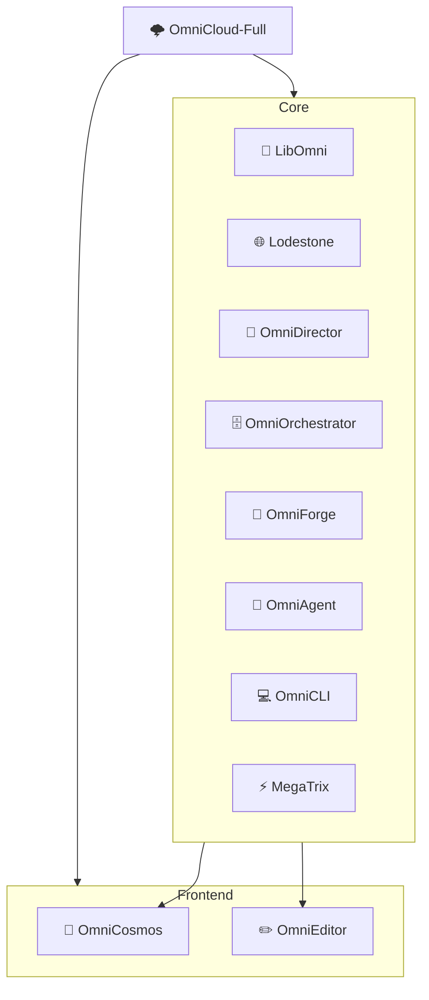

# 🌩️ OmniCloud-Full

<div align="center">

**A distributed cloud platform built with independent, composable services**

[](LICENSE)
[](https://www.rust-lang.org)
[](Makefile)

*Monorepo convenience with polyrepo flexibility*

</div>

---

## 📋 Table of Contents

<table>
<tr>
<td width="33%">

**🏗️ Architecture**
- [What is OmniCloud?](#-what-is-omnicloud)
- [Project Structure](#-project-structure) 
- [Component Architecture](#-component-architecture)

</td>
<td width="33%">

**⚡ Development**
- [Getting Started](#-getting-started)
- [Development Workflow](#-development-workflow)
- [Build System](#-build-system)

</td>
<td width="33%">

**🚀 Deployment**
- [Docker & Deployment](#-docker-and-deployment)
- [Documentation](#-documentation)
- [Contributing](#-contributing)

</td>
</tr>
</table>

---

## 🌟 What is OmniCloud?

> *"The best of both worlds: monorepo convenience with polyrepo flexibility"*

OmniCloud takes a unique approach to building distributed systems. Instead of cramming everything into a traditional monorepo, we've created something that **feels** like a monorepo but isn't locked into that pattern.



Each major component lives in its own Git repository. This means teams can work independently, release on their own schedules, and external users can pick and choose only the parts they need. But when you're developing, it all comes together seamlessly through Git submodules and a Rust workspace.

**The result?** You get the development convenience of a monorepo with the flexibility of independent repositories. No vendor lock-in, no massive builds when you only changed one line, and no merge conflicts across unrelated components.

---

## 🚀 Getting Started

<div align="center">

### Prerequisites Checklist

| Tool | Version | Purpose |
|------|---------|---------|
| 🦀 **Rust** | 1.70+ | Core platform language |
| 🐳 **Docker** | Latest | Containerization |
| 📦 **Node.js** | 18+ | Frontend services |
| 💧 **Elixir** | 1.14+ | MegaTrix component |
| 🔧 **Make** | Any | Build automation |

</div>

### ⚡ Quick Setup

```bash
# 📥 Clone with all submodules
git clone --recursive https://github.com/OmniCloudOrg/OmniCloud-Full.git
cd OmniCloud-Full

# 🔍 Check your environment
make check-env

# 🛠️ Initialize development environment  
make dev-setup

# 🏗️ Build everything
make build

# 🚀 Start all services
make docker-up
```

<div align="center">

**🎉 That's it! Everything should be running locally now.**

*Run `make test` to verify everything works correctly.*

</div>

---

## 🏗️ Project Structure

<div align="center">

*Our structure reflects our philosophy: **independence with coordination***

</div>

```
🌩️ OmniCloud-Full/
├── 📦 crates/                    # Core Rust components (Git submodules)
│   ├── 🔧 LibOmni/              # Shared library foundation
│   ├── 🌐 Lodestone/            # Networking & communication
│   ├── 🎯 OmniDirector/         # Orchestration engine
│   ├── 🗄️ OmniOrchestrator/     # Database & job scheduling
│   ├── 🔨 OmniForge/            # Build & deployment automation
│   ├── 🤖 OmniAgent/            # Distributed agent system
│   ├── 💻 OmniCLI/              # Command-line interface
│   └── ⚡ MegaTrix/             # Rust/Elixir hybrid
├── 🌐 services/                  # Additional services
│   ├── 🌌 OmniCosmos/           # Next.js dashboard
│   └── ✏️ OmniEditor/           # Web-based code editor
├── 📚 Notes/                     # Documentation hub
├── 🐳 docker/                   # Container configurations
├── 🧪 tests/                    # Integration testing
├── 🛠️ Makefile                  # Cross-platform build system
└── 🦀 Cargo.toml               # Rust workspace config
```

<details>
<summary><strong>💡 Why This Structure?</strong></summary>

Each directory under `crates/` and `services/` is actually a **separate Git repository**. This setup lets you work on individual components without touching the others, while still providing unified tooling when you need it.

Think of it as having your cake and eating it too! 🍰

</details>

---

## ⚡ Development Workflow

<div align="center">

### 🔄 Daily Development Cycle

</div>

Daily development is straightforward and productive:

1. **🏗️ Build Everything**: `make build` compiles all components
2. **🧪 Test Suite**: `make test` runs comprehensive tests  
3. **🚀 Local Services**: `make docker-up` starts everything locally

When you want to work on a specific component, you have two approaches:

<table>
<tr>
<td width="50%">

**🎯 Targeted Development**
```bash
# Build specific components
make build-director
make test-forge
make build-cosmos
```

</td>
<td width="50%">

**🔧 Direct Development**
```bash
# Work directly in component
cd crates/OmniDirector
cargo build
cargo test
git checkout -b feature/awesome
```

</td>
</tr>
</table>

The workspace configuration means that when you're doing cross-component development, everything builds together using shared dependencies and the same target directory. **It's the best of both worlds.**

---

## 🛠️ Build System

<div align="center">

*Cross-platform build automation that just works™*

</div>

Our Makefile handles the complexity of building across multiple languages and platforms. It automatically detects whether you're on Windows, Linux, or macOS and uses the appropriate commands.

### 🌟 Essential Commands

<div align="center">

| Command | Action | Description |
|---------|--------|-------------|
| `make` | 🏗️ | Default build (debug mode) |
| `make release` | ⚡ | Optimized production build |
| `make test` | 🧪 | Complete test suite |
| `make clean` | 🧹 | Remove build artifacts |
| `make docker-up` | 🚀 | Start all services |

</div>

### 🎯 Component-Specific Commands

Each major component has its own build targets:

```bash
make build-director     # 🎯 OmniDirector orchestration
make build-forge        # 🔨 OmniForge automation  
make test-agent         # 🤖 OmniAgent testing
make build-cosmos       # 🌌 OmniCosmos frontend
```

### ✨ Development Quality

<div align="center">

**Before committing code:**

🎨 `make format` → 🔍 `make lint` → 🧪 `make test`

*The CI system expects these to pass!*

</div>

### 🌍 Cross-Platform Support

The build system works **identically** on Windows, Linux, and macOS:
- **Windows**: Uses `cmd.exe` for consistency
- **Unix systems**: Standard shell commands
- **You**: Shouldn't notice any difference! 🎉

---

## 🏛️ Component Architecture

<div align="center">

### 🧠 The OmniCloud Ecosystem

*Each component serves a specific purpose in our distributed architecture*

</div>

### 🔧 Core Infrastructure

**🔧 LibOmni** serves as the foundation library that all other components depend on. It's the only shared workspace dependency, which keeps individual repositories buildable on their own.

**🌐 Lodestone** handles networking and communication between services. Think of it as the nervous system that connects everything together.

### 🎯 Orchestration Layer

**🎯 OmniDirector** is the brain of the operation. It manages Cloud Provider Interfaces (CPIs), handles extensions, and manages deployment templates. This is where most of the orchestration logic lives.

**🗄️ OmniOrchestrator** provides the persistent state management and job scheduling. While Director handles the logic, Orchestrator handles the data and execution.

### 🔨 Build and Deployment

**🔨 OmniForge** automates the build and deployment pipeline. It can build applications in multiple languages, create container images, and handle the deployment process.

### 💻 User Interfaces

**💻 OmniCLI** provides a command-line interface for developers and operators. It's designed to be scriptable and handles all the operations you'd expect from a cloud platform CLI.

### 🤖 Distributed Systems

**🤖 OmniAgent** runs on remote nodes and handles distributed execution. It's designed for edge computing scenarios where you need code running closer to users or data.

### ⚡ Special Cases

**⚡ MegaTrix** is our hybrid Rust/Elixir component. Because it spans multiple language ecosystems, it's excluded from the main workspace. Use the make commands or work directly in its directory.

---

## 🌐 Frontend Services

<div align="center">

### Modern Web Interfaces Built with Next.js

</div>

**🌌 OmniCosmos** is the main web dashboard built with Next.js. It provides real-time monitoring and management capabilities through a user-friendly interface.

**✏️ OmniEditor** offers web-based code editing capabilities. It's designed to work with the broader OmniCloud ecosystem for integrated development workflows.

Both frontend services use standard Node.js tooling:

```bash
# 🏗️ Build frontend services
make build-cosmos
make build-editor

# 🔧 Or develop directly
cd services/OmniCosmos
npm install
npm run dev          # Development server
npm run build        # Production build
```

---

## 🐳 Docker and Deployment

<div align="center">

### From Development to Production

*Seamless deployment across all environments*

</div>

The Docker setup is designed for both development and production use. `make docker-up` starts everything locally using docker-compose, while the deployment targets handle production environments.

<table>
<tr>
<td width="33%" align="center">

**🧪 Development**
```bash
make deploy-dev
```
*Fast iteration*

</td>
<td width="33%" align="center">

**🎭 Staging**  
```bash
make deploy-staging
```
*Pre-production testing*

</td>
<td width="33%" align="center">

**🚀 Production**
```bash
make deploy-prod
```
*Live deployment*

</td>
</tr>
</table>

### 🗄️ Database Operations

Database operations are streamlined:
- **🔧 Initialize**: `make db-init` for schema setup
- **💾 Backup**: `make backup` for data protection

---

## 📚 Documentation

<div align="center">

### Knowledge Hub

*Everything you need to know, organized and accessible*

</div>

Comprehensive documentation lives in the `Notes/` directory:

| Directory | Purpose | Contents |
|-----------|---------|----------|
| 📘 `Notes/CLI/` | Command Reference | Usage examples and guides |
| 👩‍💻 `Notes/DevGuides/` | Development | Workflows and best practices |
| 🏛️ `Notes/administration/` | Operations | Deployment and scaling |
| 🔌 `Notes/integration/` | Integration | CPI development guides |
| 📖 `Notes/usage/` | End Users | Platform usage documentation |

### 📖 Generate API Documentation

```bash
make docs
# 📖 Documentation available at: target/doc/index.html
```

---

## 🤝 Contributing

<div align="center">

### Join the OmniCloud Community

*Contributing works at two levels*

</div>

**🎯 Component-Level Changes**: Work directly in individual component repositories for focused improvements.

**🌐 Cross-Component Changes**: Use this workspace to coordinate updates that span multiple components.

Each component repository remains fully independent. External users can depend on individual components without pulling in the entire platform. This architectural decision means components must build and test successfully on their own.

### ✨ Code Quality Standards

<div align="center">

**Quality Pipeline**

🎨 Format → 🔍 Lint → 🧪 Test → 🚀 Integration

```bash
make format      # Consistent formatting
make lint        # Catch common issues  
make test        # Unit test suite
make test-full   # Integration testing
```

</div>

---

## 🔧 Troubleshooting

<div align="center">

### Common Solutions

*Most issues have quick fixes*

</div>

| Problem | Solution | Command |
|---------|----------|---------|
| 🏗️ **Build Issues** | Clean rebuild | `make clean-all && make build` |
| 🌍 **Environment** | Check setup | `make check-env` |
| 🐳 **Docker Problems** | Reset containers | `make docker-down && make docker-build && make docker-up` |
| 🗄️ **Database Issues** | Reinitialize | `make db-init` |

<details>
<summary><strong>🆘 Still Having Issues?</strong></summary>

1. Check the `Notes/` directory for detailed troubleshooting guides
2. Run `make help` for a complete command reference
3. File an issue in the appropriate component repository
4. Join our community discussions for cross-component topics

</details>

---

<div align="center">

## 🌟 Built with ❤️ by the OmniCloud Team

**Licensed under MIT**

[](https://github.com/OmniCloudOrg)
[](LICENSE)

*Ready to build the future of cloud platforms? Start with `make build` and let's go! 🚀*

</div>